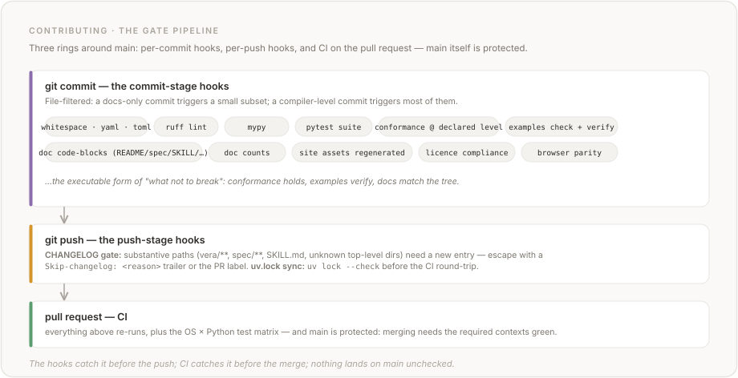

# Contributing to Vera

Thank you for your interest in contributing to Vera. This document provides guidelines and information for contributors.

## How to Contribute

### Reporting Issues

If you find a bug, inconsistency in the specification, or have a feature suggestion:

1. Check the [existing issues](https://github.com/aallan/vera/issues) to see if it has already been reported.
2. If not, [open a new issue](https://github.com/aallan/vera/issues/new/choose) using the appropriate template.
3. Provide as much context as possible, including example Vera code where relevant.

### Specification Contributions

The language specification is in `spec/`. If you want to propose changes:

1. Open an issue first to discuss the change. Language design decisions should be discussed before implementation.
2. Reference the specific spec chapter and section.
3. Explain the rationale for the change, including how it affects the language's goals (checkability, explicitness, one canonical form).
4. Consider the impact on the reference compiler.

### Code Contributions

For contributions to the reference compiler:

1. Fork the repository.
2. Create a feature branch from `main`:
   ```bash
   git checkout -b feature/your-feature-name
   ```
3. Make your changes, following the coding standards below.
4. Add or update tests as appropriate.
5. Ensure all tests pass:
   ```bash
   pytest
   ```
6. Commit your changes with a clear commit message.
7. Push to your fork and open a pull request.

**Note for first-time contributors**: GitHub gates CI on first-time PRs behind a manual maintainer approval (you'll see `action_required` next to the CI check rather than `pending`).  A maintainer will approve the workflow once the PR is reviewed; subsequent pushes to the same PR run CI automatically.  This is a GitHub security feature, not a project-specific gate.

### Built-in functions and types

When adding or modifying built-in functions (registered in `vera/environment.py`):

- **Prelude types are automatic.** `Option<T>`, `Result<T, E>`, `Ordering`, and `UrlParts` are provided by the standard prelude in every program — no explicit `data` declaration is required. User-defined types with the same name shadow the prelude.
- **Follow the naming convention** (spec §9.1.1): `domain_verb` for most functions (e.g. `string_length`, `array_append`), `source_to_target` for conversions (e.g. `int_to_float`), `domain_is_predicate` for boolean tests (e.g. `float_is_nan`). Only math universals (`abs`, `min`, `max`, etc.) are prefix-less.
- **Match the spec.** Type signatures should use the types specified in the language specification (e.g. `NAT` where the spec says `Nat`, not `INT`). Reference the relevant spec chapter and section in your PR description.
- **Add type checker tests** in the matching `tests/test_checker_*.py` phase file — for built-ins, `test_checker_builtins_strings.py` or `test_checker_builtins_collections.py` (shared helpers come from `tests/checker_helpers.py`) — at minimum, one test with correct types and one with a wrong argument type.
- **Add codegen/runtime tests** in the matching `tests/test_codegen_*.py` feature file — for built-ins, e.g. `test_codegen_string_builtins.py` or `test_codegen_numeric.py` (shared helpers come from `tests/codegen_helpers.py`) — cover normal cases, edge cases (empty inputs, zero values), and composition with other built-ins.
- **Update the example** if an existing example demonstrates the feature, or add a new one in `examples/`.

## Development Setup

### Prerequisites

- Python 3.11 or later
- Git
- Node.js 22+ *(optional, for browser runtime parity tests)*

### Installation

```bash
git clone https://github.com/aallan/vera.git
cd vera
python -m venv .venv
source .venv/bin/activate
pip install -e ".[dev]"
pre-commit install
pre-commit install --hook-type pre-push
```

For reproducible installs with hash-pinned versions, use `uv` instead (recommended):

```bash
pip install uv
uv sync --extra dev
pre-commit install
pre-commit install --hook-type pre-push
```

Plain `uv sync` (without `--extra dev`) skips the dev extras and removes pytest, mypy, ruff, and pre-commit from the environment — the `--extra dev` flag is load-bearing.

`uv.lock` is checked in and tracks exact versions with hashes. Run `uv lock --check` to verify
the lockfile is consistent with `pyproject.toml`, or `uv lock` to regenerate it after updating
dependencies. CI enforces that `uv.lock` stays current.

### Pre-commit Hooks

Every push is checked by 30 configured hooks across two stages: 28 are configured at the commit stage (run after `pre-commit install`), and 2 (`check-changelog-updated` and `uv-lock-check`, described below) are configured at the push stage (run after `pre-commit install --hook-type pre-push`). Most commit-stage hooks have per-hook `files:` / `types:` filters — the `python` type-check only runs when Python files are staged; `check_readme_examples.py` only runs when `README.md` or Vera sources change, etc. A plain-text commit touching only one markdown file triggers a small subset; a compiler-level commit triggers most of them.



The **commit-stage** hooks (28, each gated to relevant files) include:

- Trailing whitespace and file endings
- YAML/TOML validity
- Merge conflict markers
- Python debug statements
- Lint with ruff (default rules)
- mypy type checking
- pytest test suite
- All conformance programs hold at their declared level — positives pass; the negatives fail `check` with their `expected_error` E-code
- All `.vera` examples type-check and verify cleanly
- README, EXAMPLES.md, SKILL.md, HTML, and spec code blocks parse correctly
- Documentation counts match live codebase
- Site assets (`docs/llms.txt`, `docs/llms-full.txt`, etc.) regenerated and up-to-date
- License compliance (all dependencies MIT-compatible)
- Browser parity (JS runtime matches Python runtime)

If you modify documentation sources (SKILL.md, AGENTS.md, FAQ.md, `vera/errors.py`, `vera/grammar.lark`, or `docs/index.html`), the `site-assets` hook will regenerate `docs/` files via `scripts/build_site.py`. The CI also runs `scripts/check_site_assets.py` to verify freshness.

### Pre-push hook: CHANGELOG enforcement

A separate `pre-push` hook runs once before each `git push` (not per-commit — which would be too noisy on feature branches). It verifies that any PR touching a non-exempt top-level path adds a new entry to `CHANGELOG.md`. The same check also runs in CI, so pushes without the local hook installed are still caught before merge.

**Classification.** The check is exempt-list based: changes confined to `tests/`, `scripts/`, `.github/`, `docs/`, `examples/`, `editors/`, `assets/`; to any of the root-level doc files (`README.md`, `HISTORY.md`, `ROADMAP.md`, `KNOWN_ISSUES.md`, `FAQ.md`, `CONTRIBUTING.md`, `TESTING.md`, `AGENTS.md`, `CLAUDE.md`, `DE_BRUIJN.md`, `EXAMPLES.md`, `CHANGELOG.md`, `LICENSE`); or to `pyproject.toml`, `uv.lock`, `.pre-commit-config.yaml`, `.coderabbit.yaml`, `.gitignore` skip the requirement. Everything else — `vera/**`, `spec/**`, `SKILL.md`, and any new top-level directory you haven't explicitly added to the exempt list in `scripts/check_changelog_updated.py` — is treated as substantive and needs an entry. The conservative default means contributors get a clear failure rather than a silent bypass when adding a new top-level folder (e.g. `stdlib/` or `runtime/`).

**To enable locally:** `pre-commit install --hook-type pre-push` (part of the install instructions above).

**Escape hatches** for PRs that genuinely don't need a CHANGELOG entry (e.g. fixing a typo in a code comment):

- Include a `Skip-changelog: <reason>` trailer in any commit message on the branch (Git-native — works locally and in CI), or
- Add the `skip-changelog` label to the PR on GitHub (CI-only).

**Configuration:** Override the base ref with `CHANGELOG_CHECK_BASE=<ref>` if you're working on a non-`main` release branch.

### Pre-push hook: uv.lock sync

A second pre-push hook runs `uv lock --check` to confirm `uv.lock` is in sync with `pyproject.toml`. The same check already runs in CI's `lint` job; the local hook catches it before the push so you don't pay the CI round-trip. The common trigger is a version bump in `pyproject.toml` that didn't rerun `uv lock` — the lockfile's project entry drifts and CI fails. Running `uv lock` regenerates the file; re-push.

**To enable locally:** same command as the CHANGELOG hook — `pre-commit install --hook-type pre-push` installs both.

### Running Tests

```bash
pytest                    # run all tests
pytest tests/test_parser.py  # run specific test file
pytest -v                 # verbose output
pytest --cov=vera         # with coverage
VERA_JS_COVERAGE=1 pytest tests/test_browser.py -v  # JS coverage
```

PRs touching `vera/browser/runtime.mjs` have JavaScript coverage tracked by Codecov (via V8's built-in coverage). See [TESTING.md](TESTING.md) for the full testing reference -- coverage data, test helpers, and guidelines for adding tests.  See [ENVIRONMENT.md](ENVIRONMENT.md) for all `VERA_*` environment variables (provider keys, runtime knobs, and debug flags like `VERA_EAGER_GC` for hunting GC-rooting bugs).

**Doc-count gate**: any PR that adds tests will trip `scripts/check_doc_counts.py` if it doesn't also update the test counts in `TESTING.md` (per-file rows + overall total), `ROADMAP.md` (the "Where we are" line), and `README.md` (project-status line).  Run the script locally to see exactly which numbers need updating:

```bash
python scripts/check_doc_counts.py    # reports stale counts with file:field references
```

The script is part of the pre-commit hooks, so a `git push` will catch this before CI does.  The gate exists to keep `TESTING.md` honest about what the suite covers — a regression where a counted test was silently deleted would fail this check.

### Type Checking

```bash
mypy vera/
```

### Validation Scripts

```bash
python scripts/check_conformance.py      # verify all conformance programs
python scripts/check_examples.py         # verify all .vera examples
python scripts/check_spec_examples.py    # verify spec code blocks parse
python scripts/check_readme_examples.py  # verify README code blocks parse
python scripts/check_examples_doc.py     # verify EXAMPLES.md code blocks parse
python scripts/check_skill_examples.py   # verify SKILL.md code blocks parse
python scripts/check_faq_examples.py    # verify FAQ code blocks parse
python scripts/check_html_examples.py   # verify HTML code blocks parse, check, verify
python scripts/check_version_sync.py     # verify version consistency
python scripts/check_doc_counts.py       # verify documentation counts match codebase
```

## Coding Standards

### Python Code (Reference Compiler)

- Follow [PEP 8](https://peps.python.org/pep-0008/).
- Use type hints on all function signatures.
- Use `dataclasses` for AST nodes and other structured data.
- Keep functions small and focused.
- Write docstrings for public functions and classes.
- Format code with `black`.

### Specification Documents

- Use Markdown.
- Use RFC 2119 keywords (MUST, SHOULD, MAY) precisely.
- Include code examples for every construct.
- Code examples must be valid Vera (they will be tested against the parser).
- Use the canonical formatting rules defined in Chapter 1 for all examples.

### Commit Messages

- Use the imperative mood ("Add feature" not "Added feature").
- Keep the first line under 72 characters.
- Reference related issues with `#issue-number`.

### Pull Requests

- Keep pull requests focused on a single change.
- Update relevant documentation and tests.
- Fill in the pull request template.
- Ensure CI passes before requesting review.

## Design Principles to Keep in Mind

When proposing changes, consider whether they align with Vera's design goals:

1. **Does this make code more checkable?** If it introduces ambiguity or makes verification harder, it's probably not right for Vera.
2. **Is there still one canonical form?** If a change introduces multiple ways to express the same thing, it violates a core principle.
3. **Does this help models or humans?** Vera is designed for LLMs. Changes that improve human ergonomics at the cost of machine writability should be carefully evaluated.
4. **Is it explicit?** Implicit behaviour is a non-goal. If something can be made explicit, it should be.

## Project Structure

```
vera/
├── spec/          # Language specification (Markdown)
├── vera/          # Reference compiler (Python)
├── tests/         # Test suite
├── examples/      # Example Vera programs
├── scripts/       # CI and validation scripts
```

## Branch Protection

The `main` branch has the following protections enabled:

- **Pull request required.** All changes to `main` must go through a pull request. No direct pushes.
- **CI must pass.** The test, typecheck, and lint jobs must all pass before merging.
- **No admin bypass.** `enforce_admins` is enabled — the protections apply to the maintainer too, so nothing lands without a passing PR.
- **Review.** No approving-review count is currently required (CI is the gate); stale reviews are dismissed on new pushes, and every PR gets an automated CodeRabbit review.
- **No force pushes.** History on `main` is immutable.

If you are a maintainer setting up branch protection on a fork, configure these rules in **Settings > Branches > Branch protection rules** for the `main` branch.

## Releases

Contributors don't cut releases — the maintainer tags and publishes after merge ([#481](https://github.com/aallan/vera/issues/481) tracks automating that). What your PR needs to contain so a release can happen on top of it:

1. **Bump the version** in `pyproject.toml` and `vera/__init__.py`, and update the version badge in `docs/index.html` (the version appears twice on the badge line — URL and visible text). `scripts/check_version_sync.py` gates the consistency.
2. **Add the `## [X.Y.Z]` section** to `CHANGELOG.md` with its compare-link reference at the bottom, and add the version's one-sentence row to the current stage table in `HISTORY.md`.
3. **Regenerate `uv.lock` and the site assets** (`python scripts/build_site.py`) if dependencies or AI-readable docs changed.

Not every PR is a release: small changes can ride along and ship with the next version bump. If you're unsure whether your change merits one, leave the bump out and say so in the PR description — the maintainer will fold it into the next release.

## Code of Conduct

This project follows the [Contributor Covenant Code of Conduct](CODE_OF_CONDUCT.md). By participating, you are expected to uphold this code.

## License

By contributing to Vera, you agree that your contributions will be licensed under the [MIT License](LICENSE).

## Questions?

If you have questions about contributing, [open an issue](https://github.com/aallan/vera/issues).
