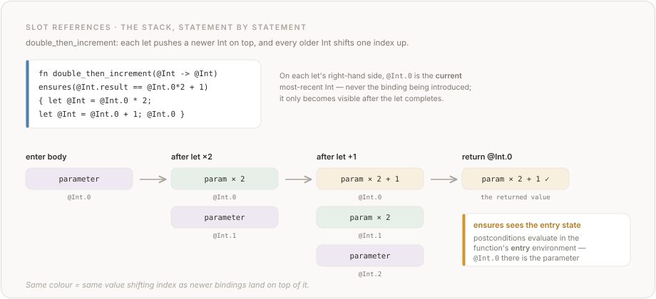
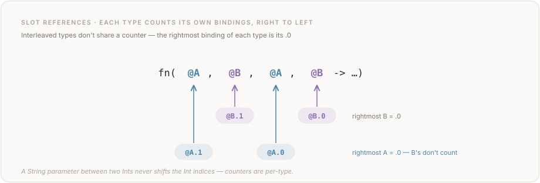

# De Bruijn Indices in Vera

Vera references every binding by **type and positional index** rather than by name. The syntax is `@T.n`, where `T` is the type and `n` is a zero-based count of how many bindings of that type lie between this reference and the target binding. This is a typed variant of *De Bruijn indices* — a classical technique from mathematical logic that replaces variable names with structural positions.

This document covers the idea from first principles, explains Vera's particular variant, works through progressively complex examples, identifies the traps that catch people, and situates the design in the broader literature.

---

## 1. The original idea

Nicolaas Govert de Bruijn introduced nameless representations of lambda terms in 1972 while working on AUTOMATH, an early system for machine-checked mathematics. The problem he was solving was purely mechanical: in the lambda calculus, `λx. λy. x` and `λa. λb. a` are the same function, but syntactically distinct. Any tool that must decide equality between terms must either implement *alpha-equivalence* (renaming up to bound variable names) or use a representation where alpha-equivalent terms are literally identical.

De Bruijn's solution was to replace each variable with a number indicating how many binders lie between the reference and its binding site:

```
λ. λ. 2      -- classical notation: λx. λy. x (refers to the outer binder, 2 steps out)
λ. λ. 1      -- classical notation: λx. λy. y (refers to the inner binder, 1 step out)
```

In this scheme, structurally identical terms are textually identical. Alpha-equivalence collapses to syntactic equality, and no renaming machinery is needed. This made it highly attractive for proof assistants and type-theoretic implementations — Coq, Agda, Isabelle, and Twelf all use De Bruijn indices (or a closely related *locally nameless* variant) in their internal representations.

**Key papers:**

- N.G. de Bruijn. ["Lambda Calculus Notation with Nameless Dummies, a Tool for Automatic Formula Manipulation, with Application to the Church-Rosser Theorem."](https://lawrencecpaulson.github.io/papers/deBruijn-nameless-dummies.pdf) *Indagationes Mathematicae*, 34(5):381–392, 1972. The original paper. Remarkably readable; de Bruijn introduces the concept, works through the Church-Rosser theorem, and discusses notation directly.

- N.G. de Bruijn. ["The Mathematical Language AUTOMATH, its Usage, and Some of its Extensions."](https://automath.win.tue.nl/archive/pdf/aut002.pdf) In *Symposium on Automatic Demonstration*, Lecture Notes in Mathematics 125, Springer, 1970. The context in which the indexing scheme was developed.

- H.P. Barendregt. *The Lambda Calculus: Its Syntax and Semantics.* Revised edition. North-Holland, 1984. The standard reference for lambda calculus theory; covers nameless representations in the context of beta-reduction and substitution.

- B.C. Pierce. *Types and Programming Languages.* MIT Press, 2002. Chapter 6, "Nameless Representation of Terms," gives a clear, self-contained introduction to De Bruijn indices and implements them in OCaml. This is the most accessible treatment for readers coming from a programming language theory background.

- M. Abadi, L. Cardelli, P.-L. Curien, and J.-J. Lévy. ["Explicit Substitutions."](https://inria.hal.science/inria-00075382/document) *Journal of Functional Programming*, 1(4):375–416, 1991. Formalises substitution calculi that build on De Bruijn representations; important theoretical context for why the indexing scheme is well-behaved.

---

## 2. Why surface-syntax De Bruijn indices?

Most languages that use De Bruijn indices use them *internally* — in the core type theory or compilation target — while still presenting named variables to the programmer. The programmer writes `fun x y -> x + y`; the compiler translates to something with indices; the programmer never sees the indices.

Vera makes the indices the *surface syntax*. This is unusual. The justification is specific to Vera's use case: Vera is a language designed for large language models to write, not humans.

### The naming consistency problem

When an LLM generates code, it must maintain consistent names across an entire scope. In a long function, or one generated incrementally across multiple completions, the model may:

- Reuse a name that is already in scope (shadowing without intent)
- Misspell a name (subtle typo that passes the lexer but fails the type checker, or worse, resolves to a different binding in a dynamically typed host)
- Invent a name at the use site that differs from the name at the binding site
- Use the same name for semantically different values in adjacent code

These are not hypothetical failure modes. Empirical studies of LLM code generation have documented naming errors as a consistent category of bug:

- M. Chen et al. ["Evaluating Large Language Models Trained on Code."](https://arxiv.org/pdf/2107.03374) arXiv:2107.03374, 2021. (The Codex paper.) Analysis of HumanEval failures includes a notable fraction of identifier consistency errors.

- J. Austin et al. ["Program Synthesis with Large Language Models."](https://arxiv.org/pdf/2108.07732) arXiv:2108.07732, 2021. Documents failure modes in MBPP benchmarks; naming inconsistencies appear particularly in multi-step problems where variable lifetimes span several operations.

- S. Wang et al. ["How Does Naming Affect LLMs on Code Analysis Tasks?"](https://arxiv.org/pdf/2307.12488) arXiv:2307.12488, 2023. Systematically replaces variable and function names with nonsense or shuffled strings and measures the impact on CodeBERT. Key finding: shuffled names (plausible but wrong) perform *worse* than random gibberish — the model is actively misled by plausible-but-wrong names. Python is hit harder than Java because models compensate using type declarations in statically typed languages.

- C.C. Le, M.V.T. Pham, C.D. Van, H.N. Phan, H.N. Phan, and T.N. Nguyen. ["When Names Disappear."](https://arxiv.org/pdf/2510.03178) arXiv:2510.03178, 2025. Demonstrates that LLMs exploit statistical correlations between identifiers and functionality even on execution prediction tasks that depend only on program structure — what the authors call "identifier leakage." The model appears to understand code when it is pattern-matching on familiar tokens rather than reasoning about program structure.

- **[VeraBench](https://github.com/aallan/vera-bench)** — first empirical results from Vera's own benchmark suite confirm slot ordering as the dominant failure mode. Claude Sonnet 4 achieved 83% run_correct overall in that early snapshot (current results live in the README), but GCD, `div_natural`, and `safe_div` all failed because the model wrote `@Int.0 / @Int.1` with the arguments reversed — `@Int.0` is the *most recent* binding (the divisor), not the first parameter (the dividend). These are exactly the non-commutative operations where De Bruijn ordering matters most.

### The structural alternative

Typed slot references eliminate the naming problem by construction. To reference a value in Vera, the model needs to know two things:

1. What *type* does the value have?
2. How many bindings of that type are *between here and the target*?

Both facts are locally derivable from the types in scope at the current position. The model does not need to remember what name it chose three lines ago. There is no name to misspell, shadow accidentally, or fail to invent consistently. The reference is structurally determined by the program's type context.

The tradeoff is that human readability suffers — `@Int.1 - @Int.0` is harder to skim than `max - min`. Vera accepts this tradeoff explicitly. The language is not designed for humans to read; it is designed for machines to generate correctly and verifiers to check mechanically.

---

## 3. Vera's typed variant

Classic De Bruijn indices count *all* binders, regardless of type. Using 0-based indexing (where the innermost, most recently introduced binder has index 0), in a term like `λInt. λString. λInt. ⋯`:

- The innermost `Int` (third binder, most recent) — index **0**
- The `String` (second binder) — index **1**
- The outermost `Int` (first binder) — index **2**

Vera uses a *type-stratified* variant: the index counts only binders of the **same type**. Each type maintains its own independent counter. For the equivalent Vera function `fn(@Int, @String, @Int -> ...)`:

| Parameter | Type | Position | Index |
|-----------|------|----------|-------|
| First parameter | `Int` | Leftmost | `@Int.1` |
| Second parameter | `String` | Middle | `@String.0` |
| Third parameter | `Int` | Rightmost | `@Int.0` |

The `Int` counter runs independently of the `String` counter. To find `@Int.0`, the model counts `Int`-typed binders inward from the reference, ignoring everything else.

### Why type-stratified?

The key practical benefit is *locality*. To resolve `@Int.0`, the model only needs to track the `Int`-typed part of the binding stack, not the complete binding history. For a function with many parameters of different types, this is a significant reduction in the working set the model must maintain.

It also means that adding or removing a parameter of type `String` never changes the indices for `Int` parameters. The reference `@Int.0` is robust to changes in the non-`Int` part of the signature.

The cost is that type-stratified indices are not standard. Classic De Bruijn indices are well-studied; substitution, shifting, and weakening lemmas are all in the literature. Vera's variant requires analogous machinery adapted to the typed setting, which is straightforward but not pre-existing. The spec's Chapter 3 formalises this machinery for the Vera compiler.

---

## 4. The fundamental rule

> **`@T.0` is always the most recently introduced binding of type `T`.**

This single rule governs all reference resolution. The index grows as you move outward from the reference toward older bindings.

In a function body:
- **Parameters**: bound left-to-right. The *rightmost* parameter of a given type is the most recently introduced, so it is `@T.0`. The next rightmost is `@T.1`, and so on outward.
- **Let bindings**: each `let @T = ...;` pushes a new binding onto the stack. After the `let`, the new binding is `@T.0` and every previous `T`-typed binding shifts up by one.
- **Match arms**: pattern variables introduce bindings for the duration of that arm only.
- **Closures**: the inner function's parameters are innermost; outer parameters are accessible at higher indices.

---

## 5. Worked examples

### 5.1 Single type, multiple parameters

```vera
private fn subtract(@Int, @Int -> @Int)
  requires(true)
  ensures(true)
  effects(pure)
{
  @Int.1 - @Int.0
}
```

Parameters, left-to-right binding:
- First parameter (`@Int.1`) — farther from the reference; introduced first
- Second parameter (`@Int.0`) — nearer to the reference; introduced second

The body computes *first minus second*. Reversing to `@Int.0 - @Int.1` computes *second minus first* — a semantically different function with no compile-time signal that anything is wrong.

**The commutative trap.** For addition this distinction is invisible: `@Int.0 + @Int.1 == @Int.1 + @Int.0`. Many functions are first written with addition, where the index ordering is correct by accident. The error surfaces when the operation is changed to subtraction, division, or comparison, or when the function appears in a context where parameter ordering matters. Always verify the index assignment independently of whether the operation is commutative.

### 5.2 Mixed types

```vera
private fn repeat(@String, @Int -> @String)
  requires(@Int.0 >= 0)
  ensures(true)
  effects(pure)
{
  string_repeat(@String.0, @Int.0)
}
```

Each type has its own counter:
- `@String.0` — the only `String` in scope; the first (and only) parameter of that type
- `@Int.0` — the only `Int` in scope; the second parameter

Adding a second `String` parameter on the left would not change `@Int.0`. It would change `@String.0` to refer to the new (rightmost) `String`, with the original becoming `@String.1`.

### 5.3 Let bindings shift indices

```vera
private fn double_then_increment(@Int -> @Int)
  requires(true)
  ensures(@Int.result == @Int.0 * 2 + 1)
  effects(pure)
{
  let @Int = @Int.0 * 2;
  let @Int = @Int.0 + 1;
  @Int.0
}
```

Trace the binding stack:

| Statement | `@Int.0` | `@Int.1` | `@Int.2` |
|-----------|----------|----------|----------|
| Enter body | parameter | — | — |
| After `let @Int = @Int.0 * 2;` | param × 2 | parameter | — |
| After `let @Int = @Int.0 + 1;` | param × 2 + 1 | param × 2 | parameter |
| Return `@Int.0` | param × 2 + 1 | param × 2 | parameter |



On the right-hand side of each `let`, `@Int.0` refers to the *current* most-recent `Int` — not the one being bound. The binding only becomes visible *after* the `let` completes.

The `ensures` clause uses the pre-let state: `@Int.0` there refers to the parameter, because postconditions are evaluated in the function's entry environment.

### 5.4 Recursive function — the classic pitfall

```vera
private fn power(@Int, @Nat -> @Int)
  requires(true)
  ensures(true)
  decreases(@Nat.0)
  effects(pure)
{
  if @Nat.0 == 0 then {
    1
  } else {
    @Int.0 * power(@Int.0, @Nat.0 - 1)
  }
}
```

Parameters:
- `@Int.0` — first parameter (the base); the only `Int`
- `@Nat.0` — second parameter (the exponent); the only `Nat`

The `decreases(@Nat.0)` termination measure refers to the exponent, which decreases by 1 at each recursive call. The recursive call `power(@Int.0, @Nat.0 - 1)` passes the base unchanged and the decremented exponent.

A common mistake is writing `power(@Nat.0, @Int.0 - 1)` — swapping base and exponent in the recursive call. Because `power` expects `(@Int, @Nat)` but this call supplies `(@Nat, @Int)`, the type checker catches it immediately as a compile-time error: `@Nat.0` is a `Nat` where an `Int` is expected, and `@Int.0 - 1` is an `Int` where a `Nat` is expected. The types differ, so the swap is visible.

The commutative-operations trap is more dangerous with same-type parameters. If the function were `add(@Int, @Int -> @Int)`, swapping `@Int.0` and `@Int.1` in the recursive call would produce no type error — both slots are `Int` — and for a commutative operation like addition the result would still be correct, hiding the index mistake entirely.

### 5.5 Let bindings in a recursive function

```vera
private fn factorial(@Nat -> @Nat)
  requires(true)
  ensures(@Nat.result >= 1)
  decreases(@Nat.0)
  effects(pure)
{
  if @Nat.0 == 0 then {
    1
  } else {
    let @Nat = @Nat.0 - 1;
    @Nat.1 * factorial(@Nat.0)
  }
}
```

In the else branch, after the `let`:

| Binding | Index | Value |
|---------|-------|-------|
| `let @Nat = ...` | `@Nat.0` | parameter − 1 |
| function parameter | `@Nat.1` | original parameter |

`factorial(@Nat.0)` recurses on `n - 1`. `@Nat.1 * ...` multiplies by the original `n`. Writing `@Nat.0 * factorial(@Nat.1)` would multiply by `n - 1` and recurse on `n`, which does not terminate and computes the wrong value.

### 5.6 Closures and captured bindings

```vera
private fn make_adder(@Int -> fn(-> @Int) effects(pure))
  requires(true)
  ensures(true)
  effects(pure)
{
  fn(-> @Int) effects(pure) {
    @Int.0 + 1
  }
}
```

This closure captures the outer parameter. Inside the inner function there are no `Int` parameters of its own, so `@Int.0` refers to the captured outer binding. The inner function adds 1 to the captured integer and returns it.

If the inner function had its own `Int` parameter:

```vera
private fn make_adder(@Int -> fn(@Int -> @Int) effects(pure))
  requires(true)
  ensures(true)
  effects(pure)
{
  fn(@Int -> @Int) effects(pure) {
    @Int.0 + @Int.1
  }
}
```

Inside the inner function:
- `@Int.0` — inner function's parameter (most recently introduced)
- `@Int.1` — outer function's parameter (captured from enclosing scope)

The result is inner + outer. Swapping gives the same result here (addition is commutative), but the distinction matters for non-commutative operations. A closure computing `@Int.1 - @Int.0` subtracts the inner parameter *from* the captured value; `@Int.0 - @Int.1` subtracts the captured value from the inner parameter.

### 5.7 Three parameters of the same type

This is the scenario that produces the most confusion:

```vera
private fn clamp_to_range(@Int, @Int, @Int -> @Int)
  requires(@Int.1 <= @Int.0)
  ensures(@Int.result >= @Int.1 && @Int.result <= @Int.0)
  effects(pure)
{
  if @Int.2 < @Int.1 then {
    @Int.1
  } else {
    if @Int.2 > @Int.0 then {
      @Int.0
    } else {
      @Int.2
    }
  }
}
```

The assignment, right-to-left (most-recent first):

| Index | Parameter position | Semantic role |
|-------|-------------------|---------------|
| `@Int.0` | Third (rightmost) | Maximum (upper bound) |
| `@Int.1` | Second | Minimum (lower bound) |
| `@Int.2` | First (leftmost) | Value to clamp |

A useful mnemonic: read the parameter list right-to-left and assign indices 0, 1, 2, … in that order.

The `requires` clause encodes the precondition that minimum ≤ maximum: `@Int.1 <= @Int.0`. The `ensures` clause bounds the result between them. Reading the indices without the mnemonic, this takes practice; with it, it becomes mechanical.

---

## 6. The commutative operations trap

This deserves a dedicated section because it is the primary source of silent correctness bugs.

For any commutative binary operation `f(a, b) = f(b, a)`, swapping `@T.0` and `@T.1` in the body produces the same result. The program compiles, the tests pass (if they test only the output value), and the contract verifies (if the postcondition is symmetric). The bug is invisible.

The same swap in a non-commutative operation produces a different result. The most common cases:

| Operation | `@Int.0 op @Int.1` | `@Int.1 op @Int.0` |
|-----------|--------------------|--------------------|
| `+` | same | same |
| `*` | same | same |
| `-` | first − second | second − first |
| `/` | first ÷ second | second ÷ first |
| `<` | first < second | second < first |
| `>` | first > second | second > first |
| `string_concat` | first ++ second | second ++ first |

**Recommended practice:** For any function with two or more parameters of the same type, verify the index assignment *before* writing the body, by writing a comment that names each parameter:

```vera
-- @Int.0 = end, @Int.1 = start
private fn range_size(@Int, @Int -> @Int)
  requires(@Int.1 <= @Int.0)
  ensures(@Int.result >= 0)
  effects(pure)
{
  @Int.0 - @Int.1   -- end - start (correct)
}
```

This comment is erased by `vera fmt --write` (the canonical formatter strips comments that are not doc comments), but it is useful while writing the function.

---

## 7. Comparison with related approaches

### 7.1 Classic De Bruijn indices

Classic De Bruijn indices count *all* binders, not just same-type binders. In the lambda term `λInt λString λInt . ⋯`, the outermost (first) `Int` has De Bruijn index 2 (two binders intervene: the `String` and the innermost `Int`), while the innermost (second) `Int` has index 0. Vera's type-stratified variant would assign the outermost `Int` index `@Int.1` (one `Int` binder intervenes), and the innermost `Int` index `@Int.0`.

The type-stratified approach is strictly more convenient for a typed language: the model only needs to track the binding stack for the type it cares about. It is less well-studied theoretically, but the substitution and shifting properties carry over straightforwardly with type annotations.

### 7.2 Locally nameless

The *locally nameless* representation (Aydemir, Charguéraud, Pierce, Pollack, and Weirich, 2008) uses De Bruijn indices for *bound* variables but ordinary names for *free* variables. This simplifies certain metatheoretic proofs (particularly those involving open and close operations on terms). Vera uses a fully nameless representation — there are no free variables in a well-formed Vera program, because all identifiers are either slot references or function names from the global scope.

- B. Aydemir, A. Charguéraud, B.C. Pierce, R. Pollack, and S. Weirich. ["Engineering Formal Metatheory."](https://www.chargueraud.org/research/2007/binders/binders_popl_08.pdf) In *Proceedings of POPL 2008*, pp. 3–15. ACM Press, 2008. The canonical reference for locally nameless representations and their use in mechanised proofs.

### 7.3 The bruijn language

The [bruijn language](https://github.com/marvinborner/bruijn) uses De Bruijn indices as its surface syntax for a pure untyped lambda calculus. This is the closest predecessor to Vera's design choice of exposing indices directly to the programmer. Vera extends the idea to a typed, effectful setting with type-stratified indices and `@T.n` syntax.

### 7.4 Proof assistants

Coq (the Coq Development Team, INRIA) and Isabelle (Nipkow, Paulson, and Wenzel) use De Bruijn indices in their kernel representations. Neither exposes them to the user directly — they maintain bidirectional translation between named and indexed representations. This is the right choice for tools targeting human mathematicians. Vera's choice to expose indices directly reflects the different target audience.

---

## 8. Quick reference

### The mnemonic

**Right-to-left, starting at zero.** Read the parameter list from right to left. The first parameter you encounter (rightmost) is index 0. The second (next to rightmost) is index 1. Continue outward.



<details>
<summary>Text version</summary>

```text
fn(@A, @B, @A, @B -> ...)
        ↑         ↑
     @B.1      @B.0   (rightmost B = 0)

fn(@A, @B, @A, @B -> ...)
    ↑       ↑
 @A.1    @A.0          (rightmost A = 0)
```

</details>

### Let bindings

After `let @T = expr;`, the new binding becomes `@T.0`. Every previous `@T.n` becomes `@T.(n+1)`. The shift applies from the next statement forward.

### Closures

Inside an anonymous function, inner parameters are numbered first. Captured outer bindings continue their outer numbering but are now accessible at higher indices (past the inner parameters of the same type).

### The result reference

`@T.result` is only valid inside `ensures` clauses. It refers to the function's return value. It uses the function's *entry* environment — not the body's final let-extended environment.

---

## 9. Debugging with `--explain-slots`

When you are uncertain which parameter a slot index refers to, run:

```bash
vera check --explain-slots your_file.vera
```

The compiler prints a slot resolution table for every function:

```text
Slot environments (index 0 = last occurrence in signature):

  fn divide(@Int, @Int -> @Int)
    @Int.0  parameter 2 (last @Int)
    @Int.1  parameter 1 (first @Int)

  fn repeat(@String, @Int -> @String)
    @Int.0    parameter 2 (only @Int)
    @String.0  parameter 1 (only @String)
```

**Use this before writing non-commutative operations.** For `fn subtract(@Int, @Int -> @Int)`,
the body `@Int.1 - @Int.0` computes parameter1 − parameter2 (first minus second). The body
`@Int.0 - @Int.1` computes the opposite. The table removes all ambiguity.

The `--json` flag works too: `vera check --explain-slots --json` includes a `slot_environments`
array in the output, useful for programmatic consumption.

**Recommended workflow for any function with duplicate parameter types:**
1. Write the signature.
2. Run `vera check --explain-slots`.
3. Read the table.
4. Write contracts and body using the confirmed indices.

---

## 10. Further reading

The spec chapter on slot references is the authoritative technical reference for how Vera resolves `@T.n`:

- [`spec/03-slot-references.md`](spec/03-slot-references.md) — formal definition, binding sites, scope rules, error cases, ten worked examples including generics, closures, and ADT matching.

For the broader context of why Vera is designed around structural references rather than names:

- [`spec/00-introduction.md`](spec/00-introduction.md) — §0.2 (design goals), §0.4 (prior art including the bruijn language)
- [`FAQ.md`](FAQ.md) — addresses "why no variable names?" directly

For the conformance test that validates correct slot indexing in the compiler:

- [`tests/conformance/ch03_slot_indexing.vera`](tests/conformance/ch03_slot_indexing.vera) — canonical test for De Bruijn ordering, including the non-commutative cases that expose index swap bugs
