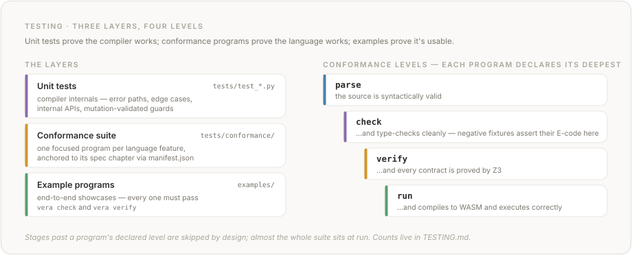

# Testing

This is the single source of truth for Vera's testing infrastructure, coverage data, and test conventions.

## Overview

| Metric | Value |
|--------|-------|
| **Tests** | 6,822 across 104 files (~79,000 lines of test code; 6,733 passed + 26 stress, 63 skipped) |
| **Compiler code coverage** | 95% Python, 61% JavaScript — 91% combined (CI minimum: 80%) |
| **Conformance programs** | 143 programs across 9 spec chapters, validating every language feature |
| **Example programs** | 37, all validated through `vera check` + `vera verify` |
| **Spec code blocks** | 188 parseable blocks from 14 spec chapters: 92 parse, 86 type-check, 85 verify (the rest carry inline `vera:skip` annotations, #538) |
| **README code blocks** | 3 Vera blocks (3 validated, 0 annotated) |
| **FAQ code blocks** | 1 Vera block in FAQ.md (0 validated, 1 annotated snippet) |
| **HTML code blocks** | 4 Vera blocks in docs/index.html (4 validated: parse + check + verify) |
| **Contract verification** | 256 of 280 contracts (91.4%) verified statically (Tier 1) |
| **CI matrix** | 13 combinations (Python 3.11/3.12/3.13 × ubuntu-latest/macos-15/macos-26/windows-latest, plus an advisory ubuntu-24.04-arm × 3.12 cell) + browser parity (Node.js 22) + wheel-availability preflight |

## Running Tests

All commands assume the virtual environment is active (`source .venv/bin/activate`).

```bash
# Test suite
pytest tests/ -v                                     # full suite, verbose
pytest tests/test_codegen_expressions.py             # single file
pytest tests/test_codegen_expressions.py::TestArithmetic  # single class
pytest tests/test_conformance.py -v                  # conformance suite only
pytest tests/ --cov=vera --cov-report=term-missing   # with coverage

# JavaScript coverage (browser runtime)
VERA_JS_COVERAGE=1 pytest tests/test_browser.py -v  # V8 coverage via c8

# GC-rooting diagnostic (forces $gc_collect on every alloc, see ENVIRONMENT.md)
VERA_EAGER_GC=1 pytest tests/test_codegen_closures.py::TestClosureReturnShadowPushBalance -v

# Type checking
mypy vera/                                           # strict mode

# Validation scripts
python scripts/check_conformance.py                  # conformance suite (143 programs, see manifest.json)
python scripts/check_examples.py                     # 37 example programs
python scripts/check_spec_examples.py                # spec code blocks
python scripts/check_readme_examples.py              # README code blocks
python scripts/check_skill_examples.py               # SKILL.md code blocks
python scripts/check_faq_examples.py                 # FAQ.md code blocks
python scripts/check_html_examples.py               # docs/index.html code blocks
python scripts/check_version_sync.py                 # version consistency
python scripts/check_wheel_availability.py           # pre-flight: every runtime dep has wheels for all supported platforms (#691 backstop)
```

## Test Files

| File | Tests | Lines | What it covers |
|------|------:|------:|----------------|
| `test_parser.py` | 131 | 973 | Grammar rules, operator precedence, parse errors |
| `test_ast.py` | 130 | 1,122 | AST transformation, node structure, serialisation, string escape sequences, ability declarations |
| `test_checker_types.py` | 151 | 2045 | Primitive types, literals, binary/unary ops, generics, constructors, refinement types, arrays, tuples, return/match-arm types, byte-arithmetic + integer-literal-range rejection (#420 split), the #898 cross-argument type-argument merge (`eq2(MkErr(5), MkOk("x"))` fully determines `Res<String, Int>` and type-checks; a per-parameter conflict `eq2(MkOk("x"), MkOk(5))` is a clear E205; a determined-non-Eq type still type-checks), the #900/#939 generic-over-zero-size rejection (E206 fires only when the `forall<T>` READS `@T` and `T` erases to no WASM local — bare `Unit` OR a transparent `Future<Unit>` (#939) — in the body (direct return, match scrutinee, nested `let`/`if`) OR in a `requires`/`ensures` clause (#939); a `@T`-unread generic like `firstInt`/`ignore`, a boxed `Option<Unit>`, a `Future<Int>`, and the built-in `async(IO.print(...))` over Unit all stay accepted), and the #945 array-of-zero-size rejection (`Array<Unit>` / a bare `[()]` is E135 at both the type-resolution and array-literal gates — emitted exactly once, the literal gate defers to the annotation when both apply (including a refined `{ @Array<Unit> | p }` annotation, whose `RefinedType` the guard strips via `base_type`), and a zero-size `Array` param reports E135 once via the general exact-duplicate diagnostic dedup (PR #938); `Array<Int>` stays accepted) |
| `test_checker_int_nat.py` | 8 | 153 | #755 — mixed `Int <op> Nat` arithmetic joins to the formal LUB `Int` (not `Nat`); direct `expr_types` observation that `@Int.0 - 2`, `@Int.0 + @Nat.0`, `@Int.0 * @Nat.0`, `@Int.0 / @Nat.0`, and `@Int.0 % @Nat.0` synthesise `Int` (the DIV/MOD pins kill a per-operator `numeric_join` bypass nothing else in the suite catches), with `Nat`/`Nat` → `Nat` and `Int`/`Int` → `Int` guards against over-correction |
| `test_checker_patterns.py` | 59 | 936 | Pattern matching, match-arm typing, exhaustiveness, pattern/match coverage, bidirectional inference, typed holes (#420 split) |
| `test_checker_functions.py` | 68 | 694 | Function signatures, slot references, result refs, calls, control flow, higher-order, where-blocks, expression diagnostics, IO operations, string interpolation (#420 split) |
| `test_checker_effects.py` | 60 | 887 | Effect declarations, abilities, effect subtyping, async effect, handler typing (#420 split) |
| `test_checker_modules.py` | 45 | 975 | Module-call diagnostics, cross-module typing, visibility enforcement, builtin redefinition, parsed module calls (#420 split) |
| `test_checker_errors.py` | 47 | 663 | Error codes, resolution-coverage diagnostics, contracts, error accumulation (#420 split) |
| `test_checker_builtins_collections.py` | 97 | 848 | Map / Set / Decimal / Json / Html / Http / Inference built-in type-checking (#420 split) |
| `test_checker_builtins_strings.py` | 122 | 945 | String / numeric / type-conversion / float-predicate / string-search / markdown / regex built-in type-checking, removed-legacy-name regression (#420 split) |
| `test_obligations.py` | 377 | 1398 | Reified proof obligations + warm `VerificationSession` (#222 Phase A): full-corpus differential oracle (warm session == cold `verify()` on diagnostics, summary, and obligation stream, plus warm-twice determinism, across all 37 examples and every verify/run-level conformance program), summary↔obligation tier-bookkeeping consistency, per-kind unit tests (requires / ensures / decreases / nat_sub / call_pre statuses, counterexamples, error codes), content-key stability + same-text-two-sites span disambiguation, session solver reuse, type-error short-circuit, ADT-registry resync between programs; plus the Phase B incremental suite — identical-source full replay, callee-body-edit replays callers while callee-contract-edit invalidates them, span-shift and ADT-edit conservative invalidation, cross-program isolation, timeout-status never cached (monkeypatched solver), FIFO eviction bound; plus the #727 dedup pin — a violating call in a let RHS records exactly one E501 diagnostic and one call_pre obligation |
| `test_verifier_contracts.py` | 88 | 827 | Z3 verification over the example corpus, trivial/ensures/if-else/let/multi-clause contracts, counterexamples, tier classification, arithmetic, verification summaries, Diverge effect, edge cases, string-length + string-predicate verification (#839 split) |
| `test_verifier_nat_obligations.py` | 62 | 1,291 | **`@Nat` subtraction underflow obligation** (#520 — Path-A discharge via requires/path-conditions/path-aware Z3 refutation, pure-literal exclusion, Int-Int and Nat-Int exemptions) and **`@Nat` binding-site narrowing obligation** (#552/#747/#749 — Tier-1 `value >= 0` at let/call-arg/effect-op-arg/ctor-field/match-bind/destructure narrowing, codegen-guarded `tier3_runtime` classification, the `E504` unguarded-residual warning, walker-recursion pins, `_narrows_into_nat` verifier/codegen soundness parity) (#839 split) |
| `test_verifier_primitive_ops.py` | 39 | 658 | **Primitive-operation safety obligations** (#680) — division/modulo by-zero `E526` and array-index-bounds `E527`, the in-bounds/out-of-bounds two-check with float-exemption, honest Tier-3 for opaque lengths, off-by-one and lower-bound pins, De Bruijn-correct fix hints (#839 split) |
| `test_verifier_calls_modules.py` | 54 | 1,294 | Call-site preconditions (incl. branch-aware), pipe-operator verification, cross-module contracts (#839 split) |
| `test_verifier_adt_decreases.py` | 20 | 637 | Match/ADT verification, decreases measures (incl. ADT decreases), mutual recursion (#839 split) |
| `test_mutual_recursive_sorts_881.py` | 15 | 317 | #881 mutually-recursive `data` declarations — Z3 sort construction for a mutual group (issue repro, 3-cycle, one-base-case pair, Float64-field pair) declared together via `z3.CreateDatatypes` rather than recursing unboundedly into fresh sort creation (the pre-fix raw `RecursionError` on a check-green program); plus the `Tuple`-mediated cases (self-recursion `MkC(Tuple<C, Int>)` and a well-founded mutual pair through a `Tuple` field), where a fresh `Tuple` sort build re-entered the same `RecursionError`; pins non-FP mutual equality (direct and `Tuple`-mediated) as Tier-1 and recursive-FP mutual equality as a loud Tier-3 (#871 interaction), with a mutation-kill that re-raises `RecursionError` when the direct or `Tuple`-mediated group construction is reverted |
| `test_adt_float64_eq_871.py` | 9 | 306 | ADT equality over Float64 fields: per-field fpEQ soundness differentials (NaN, signed zero), multi-constructor recognizer guards, recursive-ADT Tier-3 demotion (#871) |
| `test_adt_ord_reject_921.py` | 40 | 676 | #921 `compare`/ordering on a user ADT is rejected (`E242`) rather than returning a silent wrong result — the `Ord` ability op's bare type variable is now constrained to the §4.5/§9.8.1 orderable primitives (`Int`/`Nat`/`Float64`/`Byte`/`String`); covers simple/recursive/enum ADT rejection, constrained-generic accept vs ADT-instantiation reject, the diagnostic naming the offending type, the `ensures`-position no-traceback pin, primitive `compare` still checks + runs, structural ADT `==` untouched, and a Tier-1 verify + false-`ensures` rejection differential |
| `test_adt_eq_reject_928.py` | 23 | 447 | #928 `==`/`!=`/`eq` on a non-Eq-derivable type is rejected (`E243`) rather than a silent pointer-identity comparison — the equality sibling of #921; covers function-typed `==`/`!=`/`eq()`, `State<Rec>`/composite-with-`Map`-field, direct `Map`/`Array`-field ADT reject (upgraded from a late `E613`); positive controls (Int/String/Bool, `Box`, `List<Int>`, `Option`, `Result`, nested-generic `List<List<Int>>`) still check + compile + run to the correct structural-equality result; plus the **checker↔codegen Eq-derivability differential** (both real predicates over a shared corpus) and codegen ground-truth pins, mutation-validated |
| `test_verifier_refinements.py` | 62 | 1,462 | Refined Bool/String/Float64 param sorts, **refinement-predicate translation + verification** (#746 — Tier-1 discharge at narrowing/return positions, E505 with counterexample, E506 Tier-3 for untranslatable predicates, the R3 already-refined exemption, refined-ADT-sub-pattern arm-fact carry into `@Nat` narrowings and call preconditions, alias-base refined returns, refined returns from match arms) (#839 split) |
| `test_verifier_shadow_audits.py` | 71 | 1,372 | **Per-monomorphization generic verification** (#732 — per-instantiation body verification, collapsed-type-var De Bruijn reindex soundness, one-diagnostic dedup, decreases-only discovery, Tier-3 `E520` residual) and the **#680 shadow/projection audit battery** — 57 differential tests pinning the safe→verified / opaque→Tier-3 / unsafe→loud trichotomy across compound shadows, destructure De Bruijn alignment, opaque match scrutinees, and intra-block scoping; **mutation-validated** (every test flips RED when its target machinery is broken) (#839 split) |
| `test_verifier_mutation_obligations.py` | 38 | 883 | #387 mutation-hardening: obligation-record completeness and projection-helper pins (#839 split) |
| `test_verifier_mutation_gates_smt.py` | 52 | 1,317 | #387 mutation-hardening: the verifier's soundness-gate predicates, generic-instantiation aggregation/meet logic, and SMT translation pins (#839 split) |
| `test_soundness_392.py` | 36 | 584 | #392 audit batches 1–2 — verifier soundness/completeness fixes: signed div/mod truncate toward zero (#799), body `assert(P)` carries a Tier-1 obligation (#800), divisions in contract predicates carry a `div_zero` obligation (#801), and the #804 assume-half of #800's `assert` rule — a prior `assert`/`assume` discharges later obligations (including a later call's precondition) + the postcondition at Tier 1, removing false E501/E503/E500/E505.  Test-first: each fails on the pre-fix verifier |
| `test_int_overflow.py` | 6 | 143 | #798 — `@Int`/`@Nat` arithmetic-overflow obligations (part of the #392 `smt.py` soundness audit): `+`/`-`/`*` on `@Int`/`@Nat` now emit an `int_overflow` obligation (the analog of `nat_sub`/`div_zero`) rather than modelling the operands as Z3's unbounded integers, so a `ensures(@Int.result > @Int.0)` over `@Int.0 + 1` no longer proves a contract the i64/u64 runtime violates under two's-complement wraparound. Unbounded operands leave the obligation undischarged (Tier-3, runtime-guarded); operand bounds that prove the result stays in range discharge it at Tier 1. Test-first: each fails on the pre-fix verifier (no `int_overflow` obligation emitted) |
| `test_int_overflow_codegen.py` | 62 | 716 | #798 Stage 3 — runtime overflow-trap codegen: the codegen emits a guard at *exactly* the `@Int`/`@Nat` `+`/`-`/`*` sites the verifier obligates, so `vera run`/`vera compile` programs trap on overflow instead of silently wrapping at the i64/u64 boundary. #808 wired the guard to the `vera.overflow_trap` host import, so the trap now classifies `kind="overflow"` (carrying the overflow Fix paragraph) rather than the generic `unreachable`; `TestOverflowTrapKind808` pins that, with controls proving the #520 `nat_sub` underflow and #813 `@Nat`→`@Int` widen guards still classify `unreachable`. Test-first: every `*_traps` test fails on the pre-Stage-3 codegen (the op wraps silently → no trap → `execute` returns a value); every `*_no_trap` test passes before and after (safe arithmetic unchanged) |
| `test_int_overflow_differential.py` | 188 | 398 | #798 Stage 3 verifier↔codegen classification differential (cross-component soundness rule): the codegen overflow guard must fire at exactly the sites the verifier obligates *and* classify each site's operand type (`@Int` i64 vs `@Nat` u64) identically — else a Tier-1-clean program traps spuriously or a wrapping op slips through unguarded. Over a corpus exercising all five operand combos plus the literal-left ambiguity (which the pre-fix codegen mis-classified as `@Nat`), asserts the verifier's per-site gated classification equals the codegen's site for site, both sides driven by the same `ast.span_key` |
| `test_nat_int_widening.py` | 26 | 446 | #813 — `@Nat -> @Int` widening coercion obligation (dual of #552 `nat_bind`, part of the #392 soundness audit): a `@Nat` in (i64.MAX, u64.MAX] reinterprets when widened (u64.MAX → -1), so a `nat_to_int_coerce` obligation that the value is `<= i64.MAX` now fires at the return position — provably-in-range → Tier-1, provably-out-of-range (`@Nat.0 >= 2**63`) → loud E530, unbounded → honest Tier-3 (runtime-guarded), with an `@Int -> @Int` control that must not fire. Written test-first (the unbounded case fails on the pre-fix verifier, which proved `ensures(@Int.result >= 0)` yet `widen(u64.MAX)` returns -1). The #813 follow-up adds the explicit `nat_to_int` built-in and heterogeneous `if`/`match` arms with a non-negative-literal alternative |
| `test_int_widening_codegen.py` | 27 | 340 | #813 Stage 3 — runtime `@Nat -> @Int` widening-trap codegen: the codegen emits a guard at *exactly* the `@Nat -> @Int` coercion sites the verifier obligates (return, `let`, call argument), so `vera run`/`vera compile` programs trap when a `@Nat` above i64.MAX would reinterpret to a negative `@Int` instead of silently returning the wrong value. The trap is a bare `unreachable` (shares `_emit_negative_i64_guard` with the #552 nat-bind guard), classified `kind="unreachable"` today (a dedicated widening trap kind is a follow-up). Test-first: every `*_traps` test fails on the pre-Stage-3 codegen (`widen(u64.MAX)` returns -1, no trap); every `*_no_trap` test passes before and after (safe/bounded widen unchanged) |
| `test_int_widening_differential.py` | 19 | 244 | #813 verifier↔codegen behavioural differential (cross-component soundness rule): at every `@Nat -> @Int` coercion site the verifier's `nat_to_int_coerce` classification must AGREE with the runtime — a `tier3` (codegen-guarded) site MUST trap on a `@Nat` above i64.MAX (return / `let` / call-arg / constructor field / ADT sub-pattern / match-bind), while a `tier3_unguarded` (E531) site must NOT trap (the tuple / array / generic-ADT component coercions codegen cannot guard).  Runs BOTH sides on one corpus so the "runtime-guarded" claim is checked against the actual trap — catching a verifier deferral codegen never guards (unsound silent -1) or a spurious trap |
| `test_monomorphize_differential.py` | 28 | 1,156 | #732 differential soundness: the verifier's per-monomorphization instantiation discovery covers every instantiation codegen emits (name coverage + per-generic count), over real generic programs (conformance ch02/ch09, `examples/generics.vera`) plus inline cases for the soundness-critical scenarios — collapsed type vars, **prelude combinator emission** (`option_map`), transitive generics, a generic whose type arg is fixed only by a **where-helper's return** (a `Float64`-returning helper, so the unresolved-var `"Bool"` phantom default cannot mask a miss), a generic whose type arg is fixed only by an **imported constructor** (`id2(MkBox(7))` — the verifier's mono-context must include `_module_constructors`, else it phantom-defaults and misses codegen's `id2<Box>`), a generic whose type arg is fixed only by an **imported function's return** (`id_g(make_int(...))` — the verifier's mono-context must seed `fn_ret_types` from imported functions, else it phantom-defaults and misses codegen's `id_g<Int>`, plus a **private-shadow** case pinning the imported-fn seeding stays unfiltered like codegen since filtering would diverge into a false Tier-1), and a generic reached only through a **contract clause or `where` helper** (codegen must seed Pass 1.5 from the shared node-level walk, not just `decl.body`, or it skips the clone → `CodegenSkip` at run time) — so a missed instantiation (a false Tier-1) is caught. Guards against a vacuous pass when codegen emits nothing, plus a **determinism guard** (`vera compile --wat` is byte-stable across `PYTHONHASHSEED` — the mono worklist sorts its instantiation sets); plus the #899 **call-rewrite↔emitted-clone differential** (`test_call_rewrite_matches_emitted_clones`) — the THIRD consultor the verifier⊇codegen check never exercised: captures every mangled target the WASM call-rewriter (`_resolve_generic_call`) resolves and asserts each is an actually-emitted clone, over user-fn-return-into-generic-arg shapes (a non-generic user fn returning `Option<Decimal>`/`Result<Decimal, String>` in `Option<T>`/`Result<T, _>` position; a scalar-resolving alias `type Age = Int` and a named refinement in bare `@T` position; and a non-generic user fn returning a LITERAL parameterized type `Option<…>`/`Result<…>`/`Box<…>` bound to a bare `@T`, where discovery keys the clone by base name `pick_last$Option` — the base-name key is sound because a bare-`@T` body is representation-polymorphic) — a dangling target is the check-green-then-`run`-drops-`main` desync.  All three consultors (discovery, verifier, call-rewrite) route the user-fn-return clone key through ONE shared `declared_return_clone_key`, so they cannot desync by construction.  The #898 cross-argument merge (`eq2(MkErr(5), MkOk("x"))` — one argument fixes each of a sparse `Res<A, B>`'s two parameters) is in BOTH corpora: a symmetric collapse of the merge trips the inline differential's vacuous-emission guard (codegen emits nothing once the type under-determines), and an asymmetric one-sided merge surfaces in the call-rewrite differential as a dangling bare `eq2$Res` clone |
| `test_codegen_expressions.py` | 89 | 787 | Int/Bool/Float64 literals, slot refs, arithmetic, comparison, boolean logic, unary ops, if/let, function calls, recursion, pipe operator, `CompileResult` surface (#419 split) |
| `test_codegen_calls.py` | 32 | 1,403 | Statement-position unit calls (#556), **WASM tail-call optimization** (#517 — `return_call` emission, 50K- and 1M-iteration stress, structural `return_call`/plain-`call` boundary assertions, **GC-aware TCO for allocating fns** (#549 — `$gc_sp` restore before each `return_call`), postcondition-fallback regression, analyzer unit tests over tail-transparent constructs), pair-typed closure params + captures (#535) (#419 split) |
| `test_codegen_infrastructure.py` | 24 | 456 | Module assembly import/memory conditionals, execute error paths, unsupported-construct skips + node-level E602 reasons (#626), built-in shadowing (#154), typed holes, example round-trips (#419 split) |
| `test_codegen_interpolation.py` | 33 | 1,275 | String interpolation, the E615 loud inference-fallthrough channel (#630) (#419 split) |
| `test_codegen_effects.py` | 85 | 1,852 | State\<T\> host imports, effect handlers, Exn\<E\> handlers (incl. expression-bodied, #475), Async/Future\<T\>, Random effect (#419 split); plus the #841 concurrent-Async battery (`TestConcurrentAsync841`) — fused `async_http_get`/`async_http_post`/`async_await` import pins, sync-import suppression, pure-shape eager pin (no task imports), kind-4 `register_wrapper` structural pin, a generic-fn-with-concrete-Future-return await classification pin (PR #842 review round 2), the behavioural two-gets-overlap test (local `ThreadingHTTPServer`, server-side request-log ordering, no wall-clock), and the #843 indirect-closure Ok-path pin (payload byte-exact through `await(apply_fn(...))`) |
| `test_codegen_data_types.py` | 81 | 1,565 | ADT metadata + constructors, match expressions (incl. nested patterns), tuples (incl. the #902 zero-size `Unit` component in a by-value Tuple / user-ADT layout — construct, match-extract, multi-Unit, Unit in any position, and a side-effecting `Unit`-returning call field `Tuple(IO.print(...), n)` all compile + run), ADT string fields, generic-monomorphization regressions (#604, #767) (#419 split) |
| `test_codegen_structural_eq.py` | 58 | 1370 | Structural `Eq` auto-derivation (#773): String-field ADTs compared by content (distinct `string_concat` allocations), nested-ADT fields compared by value not pointer, 2-level recursion, a recursive generic ADT (`List<Int>` — the self-calling `$eq_` function + deep `List<T>` param substitution), a mutually-recursive ADT pair, `P<String>` wrapping `Box<T>`, `Box<String>` under an `Eq`-constrained generic, type-alias fields (alias-to-Int/String/ADT/refinement + 2-hop chains resolve before Eq dispatch), NaN-field runtime consistency with primitive `==`, Byte fields, loud E613 for `Map`/`Array`/`Set`-field ADTs on the generic path AND for direct `==` (Map-field, Md-builtin, ctor-inferred bare generic, and the always-true `Tuple` placeholder — PR #870 review), the checker↔codegen derivability differential, the #772 constructor-path lockstep probe, and the #898 sparse-multi-type-parameter probe — round 1 (a fully-determined `Res<Int, Int>` derives + compares by value on the ctor path; the under-determined `id1(MkErr(5))` — `A` free — reports the clearer E619 not the misleading E613; the determined-but-non-Eq `Res<Array, Int>` soundness gate stays E613) and round 2 (the cross-argument merge `eq2(MkErr(5), MkOk("x"))` compiles + runs the `Res<String, Int>` clone; a determined-non-Eq cross-arg type is E613; the E619-accuracy split — a recovered non-Eq component `Res<A, Array<Int>>` or a structural non-Eq field `W<A,B>{K(Array<A>,B)}` is E613, an all-known-Eq free-param case stays E619); and the #923 nested-generic direct-`==` probe (a `List<List<Int>>` / 3-level `List<List<List<Int>>>` / `Chain<Pair<Int>>` operand inferred from constructor calls derives + compares by value where the pre-fix one-level type-arg recovery spuriously E613'd; the `eq(...)` builtin form matches; a non-Eq nested component `List<List<Array<Int>>>` stays E613); and the #932 generic-call sibling (the same `List<List<Int>>` / 3-level / `Chain<Pair<Int>>` nesting reached THROUGH an `Eq`-constrained generic call `eq2(@T, @T -> @Bool)` derives + runs where the pre-fix one-level clone-path recovery spuriously E613'd; a non-Eq nested leaf stays E613 — the fix recurses the derivability-name recovery without changing the mangled clone name) |
| `test_composite_postcondition_eq_912.py` | 16 | 492 | Composite (`Box`/`Option`/nested-ADT) `==` in an `ensures` postcondition lowers its runtime check to STRUCTURAL equality, not a pointer compare (#912): true `@T.result == ctor` postconditions run without a spurious `Postcondition violation` trap in both operand orders, the `E500`+runtime-trap negative controls prove a false composite postcondition is still rejected by `vera verify` AND traps, and a Tier-1 verify pin; a function generic over the parameterized ADT itself (`fn id2(@Box<T> -> @Box<T>)`) with a slot-vs-slot postcondition compiles + runs — the free-type-var scalar fallback affects only the DEAD base generic clone, while the reachable monomorphized clone lowers the `==` structurally (pinned by a `rebox` test where a FRESHLY-constructed, structurally-equal, DIFFERENT-pointer result is Tier-1-verified AND runs without trapping, plus a WAT assertion that the reachable mono clone's postcondition uses `call $eq_` not `i32.eq`); a genuinely non-`Eq` contract composite (`Box<Array<Int>>`, `Tuple`) is a clean `E613` not an uncaught crash — mutation-validated (neuter the `ResultRef` arm → left-`@T.result` run tests AND the `rebox`/structural-WAT pins flip RED; neuter the free-type-var routing → the `Box<T>` run tests flip RED via the dead-base-clone `E613`; remove the postcondition backstop → the clean-`E613` tests raise an uncaught exception) |
| `test_contract_predicate_degradation_922.py` | 9 | 250 | A non-`Eq` composite `==` / unsupported `hash`/`show` in a CONTRACT-PREDICATE position degrades to a clean diagnostic, never an uncaught Python traceback (#922): a `Tuple == Tuple` in a `requires` or a `{ @T \| P }` refinement guard is a clean `E613`, a `hash(recursiveADT)` in a `requires`/`ensures` is a clean `E602` (the #912 postcondition backstop caught only `AdtEqNotDerivableError`, not `CodegenSkip`); regression pins that valid contracts (primitive `==`, derivable-ADT `==`, refinements over primitives, primitive postconditions) still compile + run, plus a cross-check that the #912 concrete-`Tuple` postcondition still degrades to `E613` — mutation-validated (neuter each new catch → its repro re-crashes with an uncaught traceback) |
| `test_codegen_arrays.py` | 82 | 1,427 | Byte type, array literals / bounds checking / length / range / concat, construction builtins (#209), compound element types (#132), array utilities (#419 split) |
| `test_codegen_refinements.py` | 72 | 1,208 | Assert/assume, forall/exists quantifiers (incl. WAT inspection), refinement type aliases, **refinement-predicate runtime guards** (#746 — primitive- and `@Array`-base boundary guards, `@Byte`-base i32-width guards incl. `@Byte`-returning fn-call operands + `0..255` range conjoin (#766), tuple-component decomposition at the FFI boundary, generic tuple aliases, infinite-alias E617 fail-closed, refinement-over-tuple unwrapping, zero-size base guard-skip for `@Unit` **and** `@Future<Unit>` (#943)), head-over-refinement shape (#655) (#419 split) |
| `test_codegen_strings.py` | 113 | 1,275 | String literals + IO host bindings, WAT string escaping (unit + end-to-end), String/Array signatures, format expressions, core string ops (length/concat/slice/char codes/repeat), char classification, string utilities (#419 split) |
| `test_codegen_string_builtins.py` | 153 | 1,395 | parse\_nat/float/int/bool (Result-returning), base64, URL encode/decode/parse/join, search/transform builtins (#198), universal to-string (#106) (#419 split) |
| `test_codegen_numeric.py` | 86 | 1,104 | Math builtins (#199), numeric type conversions (#208), Float64 predicates + constants (#212), int64-min / float-carry to-string regressions (#475) (#419 split) |
| `test_codegen_io.py` | 42 | 824 | IO operations (#135: read\_line, read\_file, write\_file, args, exit, get\_env, sleep, time, stderr), Markdown + Regex host bindings (#419 split) |
| `test_codegen_collections.py` | 59 | 888 | Map + Set collections (#62), wrapper-handle bit-31 tagging (#578) (#419 split) |
| `test_codegen_json.py` | 59 | 984 | Json collection, typed accessors (#419 split) |
| `test_codegen_decimal.py` | 57 | 780 | Decimal collection, Decimal monomorphization (#419 split) |
| `test_codegen_host_effects.py` | 57 | 928 | Html/Http/Inference host effects, provider dispatch, postcondition host-import propagation (#823) (#419 split) |
| `test_codegen_nat_guards.py` | 39 | 1,048 | **`@Nat` runtime guards**: subtraction underflow (#520) and binding-site narrowing (#552 let site; #747 tuple-destructure / match-bind / ADT sub-pattern / ctor-field / call-arg sites — `i64.lt_s; unreachable` net, `@Int` targets exempt) (#419 split) |
| `test_codegen_translator_fixes.py` | 27 | 528 | WASM call-translator regression fixes (#475): string/array slice clamps, char-code bounds, URL/base64/parse edge cases, map-array-value rejection (#419 split) |
| `test_codegen_gc_alloc.py` | 39 | 892 | Layout helpers, bump allocator, GC core (#515), shadow-stack overflow, multi-page grow (#487), worklist overflow (#348) (#419 split) |
| `test_codegen_gc_rooting.py` | 38 | 1,575 | Opaque-handle param rooting (#347, #490), host-walker GC rooting (#692), Map host-store reachability (#695), ADT-builder rooting (#743) (#419 split); plus the #841 Future-handle battery (`TestFutureHandleGCRooting841`) — eager-GC survival across an intervening alloc, the operand-stack window (`both(async(A), async(B))` with get/post-distinguished Err text), Phase-2c reclamation of fire-and-forget futures via `host_store_sizes["future"]`, and repeated-await memoization; host-import pair-let rooting (`TestHostImportPairLetRooting846`) — `IO.args` / `IO.read_line` pairs surviving an intervening alloc under eager GC, with `IO.read_file` / `IO.get_env` ADT-path confirmation; and the `_ShadowGuard.push` slot-complete bound (`TestShadowGuardPushBound791`) — partial-headroom / full-window / negative-`sp` rejection and the exact-final-slot accept boundary, constructed directly on a hand-rolled module |
| `test_codegen_gc_reclamation.py` | 21 | 706 | Transient Map/Set/Decimal reclamation (#573; scale trio marked `stress`, #738), bucket occupancy (#706), SameValueZero keys (#743) (#419 split) |
| `test_codegen_contracts.py` | 32 | 570 | Runtime pre/postconditions, contract fail messages, old/new state postconditions |
| `test_codegen_monomorphize.py` | 172 | 3,353 | Generic instantiation, type inference, monomorphization edge cases, ability constraint satisfaction (Eq/Ord/Hash/Show), operation rewriting (eq/compare), show/hash dispatch (incl. structural show/hash for composites, same-base finite nesting, and `_split_param_type` — #911; recursive-ADT show/hash via a generated self-calling helper, deep-list termination + GC-frame `$gc_sp` restore, non-generic mutual recursion — #924), ADT auto-derivation, array operations (slice/map/filter/fold) |
| `test_codegen_closures.py` | 60 | 1,919 | Closure lifting, captured variables, higher-order functions, iterative-builder shadow-stack regressions (#570), closure return-value shadow-push balance for both i32-pair and i32-ADT branches across array_map and array_mapi, plus VERA_EAGER_GC injection self-test (#593), IndexExpr-of-FnCall element-type inference (#614), non-contiguous capture and walker-order miscompiles (#615) |
| `test_codegen_invariant_e699.py` | 4 | 216 | `CodegenInvariantError` raised in a translator surfaces as a structured `[E699]` "internal compiler error" at the `_compile_fn` boundary, not a raw traceback (#657 Track 2), across all four contract-lowering paths — body, closure, precondition, and postcondition (#939 completes the precondition + postcondition nets) |
| `test_codegen_modules.py` | 124 | 2,667 | Cross-module guard rail, cross-module codegen, module-qualified call resolution bypassing a local shadow incl. intra-module siblings, where-fn helpers both directions, unit- and pair-returning calls in statement position, and the @Nat-parameter guard mirrored onto shadowed targets (#814 §8.5.3), name collision detection (E608/E609/E610), fused-async `await` of a cross-module future (#841/#842) and of an indirectly-called closure (#843 — `await(apply_fn(closure, …))` classified by declared return type incl. generic-alias type-arg substitution; unresolvable shapes fail loud via E616 or the #867 WASM-validation trap), transitive module imports (#890 — a `main -> mid -> base` chain and a `main -> {left, right} -> base` diamond compile and run via the real on-disk resolver, while a transitive symbol stays invisible to the top-level importer per §8.6.4), a non-void `ModuleCall` used *directly* as a constructor argument or array-literal element (#905 — its return type is resolved at the field/element site via the shared `_resolve_module_call_wasm_name`, closing a check-green→codegen-crash gap; the non-void sibling of #902's Unit-field fix), and a user-defined function named `show`/`hash` used in a constructor field or array element (#908 — the ability-op width special-case must defer to the user fn's declared return width when the name resolves to a user fn, matching codegen's `not in known_fns` dispatch gate; a genuine unshadowed ability op still uses the special-case width) |
| `test_codegen_coverage.py` | 5 | 244 | Defensive error paths: E600, E601, E605, E606, unknown module calls  |
| `test_execute_characterization.py` | 22 | 467 | Characterization harness pinning `execute()`'s observable contract ahead of the #421 runtime decomposition (#734): every `ExecuteResult` field (`value` int/float/str/heap-pointer/None, `stdout`, `state`, `exit_code`, `stderr`) crossed with the three completion modes — normal return, WASM trap (raises `WasmTrapError` with a classified `kind`, output-before-trap preserved), and interrupt/exit (`IO.exit(n)` → `exit_code` n with `value` None, Ctrl-C → 130) — plus the positional-constructor compatibility shape and `capture_stderr` True-vs-default. **Mutation-validated**: every cell confirmed to flip RED when its target return path in `api.py` is deliberately broken (9 mutations, 0 green-for-the-wrong-reason tests) |
| `test_walker_defensive_branches_597.py` | 21 | 296 | Synthetic-AST tests for the 11 defensive `isinstance` branches added by #597 (`_scan_io_ops` / `_scan_expr_for_handlers` / `_infer_expr_wasm_type` / `_infer_vera_type`) plus the 5 pr-review fixes (#2/#3/#8 — ModuleCall/AnonFn/QualifiedCall return None; dead `is not None` guards on Block/HandleExpr removed) |
| `test_check_walker_coverage_597.py` | 15 | 311 | Unit tests for `scripts/check_walker_coverage.py` parsing logic — Expr subclass extraction, isinstance flattening (incl. tuple form), checklist-block anchoring (incl. CR-3 regression test: `# Foo → bar` outside WALKER_COVERAGE block not counted), section-header tolerance, auto-discovery invariants, end-to-end main exit code |
| `test_diagnostic_fields.py` | 66 | 961 | Unit tests for `scripts/check_diagnostic_fields.py` (#682) — required-field detection, the warning severity rule (no `fix`), spec_ref validity, the codegen structural-exemption registry, the `# diag-fields-exempt` per-call opt-out, the error_code-registration check (#828), a live-tree integration check that all of `vera/` is fully tagged, and the narrowed plumbing-skip (#827: the skip now requires a genuine `self`-receiver helper *method* — a direct class member, not a `@staticmethod`, module-level or nested look-alike — whose **sole own-scope** `Diagnostic` it is, where own-scope means the body and excludes decorators / parameter defaults / annotations; a stray second ctor, or one in a nested `def`, is inspected by all three passes: field presence, `spec_ref` validity, `error_code` registration; each guard and each pass's use of the skip is mutation-pinned separately) |
| `test_stress.py` | 16 | 553 | Scale-dependent regression tests (#596) — `@pytest.mark.stress`, skipped by default.  9 logical tests × eager-GC lane parametrisation = 16 test instances.  10K `array_map`, 5K nested-array `array_map`, 1K-deep tail recursion with allocating arg, 1M-deep tail recursion with allocating arg (#549 GC-aware TCO), 20×20 nested array-fold-of-array-fold, 100K `array_fold`, 10K String allocations, 1K `State<Int>` get/put cycles, 10K `IO.print` calls.  Pins #570 / #515 / #593 / #549 / #487 / #348 / #573 regression coverage |
| `test_string_length_soundness.py` | 15 | 278 | #802 — string_length code-point vs UTF-8 byte soundness: a non-literal `string_length` defers to Tier 3 (the issue's `"é"` probe no longer proves `== 1` at Tier 1), a string-literal length is modeled at its exact UTF-8 byte count (`== 2` for `"é"`), and the boolean predicates `string_contains` / `string_starts_with` / `string_ends_with` stay Tier 1 (sound under UTF-8 self-synchronization), while a predicate over an astral (> U+2FFFF) or lone-surrogate literal defers to Tier 3 (z3.StringVal cannot model those code points) |
| `test_errors.py` | 62 | 657 | Error code registry, diagnostic formatting, serialisation, SourceLocation, and error display sync — the canonical `E001` diagnostic must match each of its mirrors: `README.md`, `docs/index.html`, `spec/00-introduction.md`, `AGENTS.md`'s example `--json` block, and the hardcoded example in `scripts/build_site.py` that generates `docs/index.md` (#829; `AGENTS.md`'s ellipsis-truncated description/rationale are prefix-compared, its `error_code`/`spec_ref`/`fix` exactly) |
| `test_eq_contract_874.py` | 11 |      378 | `eq`/`compare` ability ops in contract position: codegen canonicalization + verifier Tier-1 discharge/counterexample, where-fn contracts, compare Ordering-sort materialization, shadowing guard (#874) |
| `test_formatter.py` | 128 | 1,074 | Comment extraction, interior comment positioning, expression/declaration formatting, match arm block bodies, idempotency, parenthesization, spec rules, ability declarations |
| `test_cli.py` | 247 | 3,703 | CLI commands (check, verify, compile, run, serve, test, fmt, version, quiet), subprocess integration, JSON error paths, runtime traps, arg validation, multi-file resolution, IO exit codes, --explain-slots, `builtins`/`effects`/`errors` introspection dispatch, and a USAGE-completeness guard (every dispatched `cmd_<name>` handler has a help row) |
| `test_introspect.py` | 38 | 192 | `vera builtins/effects/errors --json` registry introspection (#539): the `{schema, items}` envelope, count-equals-registry differential per registry, error-phase derivation, effect/ability `kind` tagging, the parameterised `Exn<T>` effect, and best-effort `since` attribution with full-coverage guards |
| `test_resolver.py` | 20 | 602 | Module resolution, path lookup, parse caching, circular import detection, the E011/E012/E013 diagnostic contract, internal-error isolation (a compiler bug is not masked as E013), and the transitive-closure return of `resolve_imports` (#890 — a diamond yields each reachable module once, direct imports tagged `direct`, the transitive one not) |
| `test_types.py` | 73 | 388 | Type operations: subtyping, effect subtyping, equality, substitution, pretty-printing, canonical names |
| `test_wasm.py` | 24 | 344 | WASM internals: StringPool, WasmSlotEnv, translation edge cases via full pipeline |
| `test_verifier_coverage.py` | 92 | 1,651 | Verifier/SMT coverage gaps: SMT encoding paths, verifier edge cases, defensive branches, **#667 SMT translator coverage for `FloatLit` / `IndexExpr` / `ArrayLit`** (Tier 1 verification of float/array literal/index contract predicates) |
| `test_verifier_sort_name_collision_884.py` | 5 | 203 | **#884 Z3 sort-name collision** — regression pins that lossy type-name mangling can no longer collide two distinct ADT/tuple sorts onto one Z3 datatype (`_get_or_create_adt_sort` / `_get_or_create_tuple_sort` routed through the injective `mangle_type_name`), plus the Array-element reverse-lookup fix (`_get_element_sort_for_array`) |
| `test_verifier_nested_ctor_sort_918.py` | 14 | 441 | **#918 same-ADT self-nested constructor sort selection** — a `Some(Some(x))` body (or nested same-ADT ctor literal in a contract) once resolved the outer ctor to whichever `Option<...>` instantiation was cached (base-name-wins), feeding `sort.constructor(idx)` a wrongly-sorted `DatatypeRef` and crashing Z3 with an uncaught traceback on a `vera check`-green program; the fix translates the ctor call's arguments, recovers each argument's Vera type from its Z3 sort, and unifies against the ctor's declared field types to pin the owning ADT's FULL instantiation. Pins: nested-body + nested-contract verify without crash, a TRUE nested postcondition PROVED at Tier 1 (not blanket-demoted), a FALSE one still disproved (E500 soundness), the #887-trap single-level call-arg staying opaque/clean (on-demand materialisation gate), a different-ADT nesting staying clean, and no Z3-internal exception text leaking as a diagnostic |
| `test_wasm_coverage.py` | 226 | 3,976 | WASM coverage gaps: helpers unit tests, inference branches, closure free-var walking, operator/data/context edge cases |
| `test_tester.py` | 17 | 445 | Contract-driven testing: tier classification, input generation, test execution, skip message content |
| `test_tester_coverage.py` | 35 | 942 | Tester coverage gaps: String/Float64/ADT parameter input generation, Bool/Byte parameters, unsatisfiable preconditions, type expression edge cases, FP model-value extraction (NaN/Inf/signed-zero, #797) |
| `test_markdown.py` | 59 | 393 | Markdown parser: block/inline parsing, rendering, round-trips, edge cases |
| `test_lsp.py` | 94 | 1211 | LSP transport + coordinate layer (#222 Phase C) and language features (#222 Phase D): parametrized code-point↔UTF-16 goldens incl. astral-plane fixtures and surrogate-pair snapping, Span (1-based, exclusive-end) and SourceLocation (0-based col) → LSP Range conversions, point→token-range widening, DocumentStore open/change/close + index invalidation, an in-process handler-drive test, and one stdio end-to-end round-trip against the real `vera lsp` subprocess (initialize → didOpen → shutdown → exit) pinning serverInfo + textDocumentSync capabilities; plus the Phase D feature suite — parse-error single-diagnostic path, type-error verification short-circuit, tier=3 in E520 diagnostic data, per-function tier Hint synthesis (and its suppression for functions with violated obligations), smallest-enclosing-span hover, De Bruijn slot goto (most-recent-parameter jump, out-of-range None, off-slot None), and typed-hole completion (inside/after hole, away-from-hole None); plus the Phase E speculativeEdit suite — identical-text all-unchanged, breaking edit surfaces newly_undischarged (violated nat_sub) with canonical state untouched, strengthening edit surfaces newly_discharged, parse/type errors report ok:false, deleted functions report removed, proof_delta purity; plus the Phase F1 proposeEdit suite — the apply gate (clean and strengthening edits apply, breaking and non-compiling edits refuse), force overriding both gates with the delta still reported, wiring against a structural fake server (apply round-trip with exact full-document replacement range, refuse touches no canonical state, unopened-URI clamp sentinel), and full-document-range goldens (trailing-newline virtual line, UTF-16 end column); plus the Phase F2 strengthenContract suite — splice goldens (first-clause-only replacement with byte-identical remainder, ensures variant, unknown-fn None), the call-site audit pin (tightened precondition refused with newly_undischarged call_pre items, canonical state untouched), provable-ensures strengthening applies, and the three splice-target refusal paths (no analysis, unparseable document, unknown function); plus the Phase F3 addEffect suite — transitive-caller closure goldens (diamond in declaration order, leaf, unknown-fn None, recursion appears once), effect-row rewrite goldens (pure to singleton set, source-preserving append, already-present None, base-name identity blocking State<Int> next to State<Bool>), diamond propagation applying one multi-site candidate with the bystander untouched, mixed append/replace rows with already-satisfied callers skipped, the fully-satisfied no-op shape, and the two refusal paths; plus the #728 instruction-contract suite — the LSP message carries description, rationale, and the Fix: paragraph (also pinning single E501 emission at the LSP surface), and a bare diagnostic maps to the description alone |
| `test_browser.py` | 136 | 3,058 | Browser parity: Python/wasmtime vs Node.js/JS-runtime output equivalence across IO, State, contracts, Markdown, Regex, and all compilable examples |
| `test_conformance.py` | 715 | 124 | Parametrized conformance suite: parse, check, verify, run, format idempotency across 143 programs |
| `test_prelude.py` | 24 | 422 | Prelude injection: Option/Result/array operation detection, combinator shadowing, type aliases, end-to-end compilation |
| `test_checker_apply_fn.py` | 18 | 454 | #854 — `apply_fn` as a checker special form: zero-warning pins (API + CLI `--json` + closures.vera), E201 arity / E202 type / non-function-first-arg errors, E122/E125 effect-row enforcement for applied fn values, E151 redefinition rejection, variadic two-param application, prelude combinator regression pins |
| `test_prelude_diagnostics.py` | 8 | 271 | #851 — prelude combinator skip-warnings: unreferenced-prelude E602/E604 suppression (zero-warning minimal compile, API + CLI `--json`), `<prelude>` origin attribution for referenced-but-skipped combinators (text + `to_dict`), transitive reference scan, and user-fn warning locations pinned unchanged |
| `test_readme.py` | 2 | 79 | README code sample parsing |
| `test_html.py` | 4 | 164 | HTML landing page code samples: parse, check, verify (vera:skip-annotation aware, #538) |
| `test_float64_fp.py` | 9 | 204 | #797 — `@Float64` contracts via Z3's IEEE-754 FloatingPoint sort: unsound relational / reflexive contracts (rounding at 2^53, `NaN`, `Inf`) flip from proved to violated/Tier-3, NaN-guarded contracts still verify at Tier 1, `==`/`!=` use IEEE `fpEQ`/`fpNEQ` (incl. `+0.0 == -0.0`), `%` matches codegen truncated remainder (not `fp.rem`; NaN-by-zero + large-magnitude edges), and `float_is_nan` / `float_is_infinite` / `nan()` / `infinity()` translate to FP predicates / constants. Also guards mixed `@Float64`/`@Int` ordering as a clean E142 (not a Z3 crash). Test-first: each fails on the pre-fix Real-sort verifier |
| `test_float64_builtins_807.py` | 81 | 491 | #807 — Tier-1 modeling of the modelable `@Float64` builtins. `float_clamp` modeled unconditionally as faithful WASM `f64.min(f64.max(v,lo),hi)` (the NaN-propagation soundness guard distinguishes it from a naive `z3.fpMin`/`fpMax`); `int_to_float` / `float_to_int` concrete-gated (symbolic args defer to Tier 3 — Z3's symbolic FP↔Real reasoning returns spurious counterexamples); `float_to_int` domain obligation (E529) for concrete NaN/Inf/out-of-range args. Verify-vs-run differentials confirm each model agrees with wasmtime bit-for-bit (±0, ±inf, NaN, ties, lo>hi, the 2^53 rounding boundary, i64 max, and the trap cases) |
| `test_build_site.py` | 25 | 341 | Site-asset tooling — `_abs_links` rewriting (relative links, fenced-block immunity incl. inline backticks and tilde fences, http/https/fragment pass-through, Vera effect syntax not mis-parsed), `build_site` `<lastmod>` stability (preserve/refresh keyed on URL-structure change), `check_site_assets` sitemap staleness (missing / date-only-clean / structural-stale), and the #538 leak guard (vera:skip fence annotations stripped from generated `docs/SKILL.md` / `docs/llms-full.txt`, with a non-vacuous precondition that the source carries annotations) |
| `test_check_changelog_updated.py` | 68 | 711 | `check_changelog_updated.py` unit + end-to-end tests: file classification (incl. file-style exact-match vs directory-style prefix-match), CHANGELOG diff parsing with `[Unreleased]` section tracking, bare-heading rejection, and full-file context (regression test for bullets far below the heading), `Skip-changelog:` trailer detection, temp-repo integration covering substantive/exempt/label/trailer paths, and `GIT_*`-env hermeticity of the temp-repo fixtures (regression for the pre-commit-hook env leak) |
| `test_check_doc_counts.py` | 17 | 174 | `check_doc_counts.py` planning-document checks: KNOWN_ISSUES refactoring line counts (±10% tolerance band incl. the exact-boundary case, drift detection, empty-file citation, hyphenated paths, missing file/section/rows, the #419 empty-section sentinel + its cannot-mask-a-malformed-table dual) and HISTORY version-row format (issue-link limit, ` — ` separator rejection, dateless-row and prose exemption, line-number reporting) |
| `test_check_explicit_encoding.py` | 54 | 254 | `check_explicit_encoding.py` gate (#645): flags text-mode `open()` / `read_text()` / `write_text()` **and** `subprocess.run/Popen/check_output(..., text=True)` captures missing an `encoding="utf-8"` literal (rejects non-literal / non-UTF-8 values), skips binary/bytes-mode calls, honours the `# encoding-exempt` opt-out, and asserts the shipped repo is clean |
| `test_check_limitations_sync.py` | 6 | 107 | `check_limitations_sync.py` section extraction: table-rows-only issue harvesting, prose-link exemption, bounding at the next second-level heading, `None` for absent or sub-level headings so renamed sections fail loudly |
| `test_doc_annotations.py` | 23 | 340 | `scripts/doc_annotations.py` — the inline `vera:skip-<stage>` fence-annotation reader and shared `run_parse_only_gate` used by the doc-block gates ([#538](https://github.com/aallan/vera/issues/538)): markdown/HTML scanning (annotation attached to the following fence / `<pre>`, stacked directives), hard problems (malformed, dangling incl. EOF, duplicate-stage, unknown-stage, unterminated fence / unclosed `<pre>`; prose mentions without comment syntax are fine), the gate round-trip semantics via `evaluate_block` (unannotated failure fails, annotated failure skips, annotated PASS is a stale annotation, skip-check still runs parse first and stops the pipeline), unsupported-stage detection for parse-only gates, and `strip_annotations` (annotation lines removed, other HTML comments survive) |
| `test_doc_builtin_shadowing.py` | 8 | 107 | `check_doc_builtin_shadowing.py` gate ([#819](https://github.com/aallan/vera/issues/819)): reject-set membership (opaque built-ins in, overridable combinators out), top-level + `where`-block `fn <builtin>` definitions flagged, non-built-in / overridable / prose-mention ignored, and the shipped docs are currently clean |
| `test_runtime_traps.py` | 69 | 2,761 | Runtime trap categorisation (#516 Stage 1), stdout/stderr-on-trap preservation (#522), `IO.print` live tee (#543), and trap source backtrace (#516 Stage 2): `_classify_trap` per-`kind` mapping (`divide_by_zero`/`out_of_bounds`/`stack_exhausted`/`unreachable`/`overflow`/`contract_violation`/`unknown`), `WasmTrapError` shape + `RuntimeError` substitutability, end-to-end `cmd_run` text + JSON envelopes including `trap_kind`, captured `stdout`, captured `stderr`, JSON-mode "no stderr leak" invariant, cross-stream code-order regression using merged `redirect_stdout`/`redirect_stderr`, the v0.0.123 tee suite (live streaming, write-count + order preservation, JSON-mode tee suppression, trap preservation invariant under tee, per-write flush count, default-execute silence), and the v0.0.124 source-mapping suite — `_resolve_trap_frames` unit tests covering user-fn / built-in / built-in-prefix / monomorphized base-name fallback / unknown-name / no-frames-attribute / leaf-first ordering preservation; end-to-end `cmd_run` text-mode + JSON-mode backtrace including the **leaf-first** ordering invariant; contract-violation backtrace in both text and JSON modes; direct `execute()` `WasmTrapError.frames` attachment; **suppression marker** for collapsed leading runtime-helper frames (mocked `vera.codegen.execute` with synthetic `is_builtin=True` leaf frames so the collapse logic is testable deterministically); source-map population for top-level fns + lifted closures (with span-value assertion against the closure literal's exact line range); and the no-builtin-leakage regression that pins built-in helpers (`alloc` / `gc_collect` / `contract_fail`) NOT being registered in `fn_source_map`; plus the v0.0.125 Stage 3 suite (`#547`) — text-mode `Fix:` block surfacing with position-ordering invariant (Fix appears after the source backtrace), text-mode block suppression for `contract_violation` (no empty header noise), JSON-mode `fix` field always-present (schema stability) including the empty-string case, `_TRAP_FIX_PARAGRAPHS` table-completeness assertion (every kind in the taxonomy has a Fix paragraph entry), and the column-wrap invariant (~76 chars max per line, two-space indent under the `Fix:` heading); plus the UTF-8 hardening suite **`TestHostPrintInvalidUtf8589`** (`#589` / `#592`) — after `#592` centralised the `errors="replace"` invariant into the single `vera.runtime.text.safe_utf8_decode` helper — reached only through a shared `_slice_and_decode` helper (`vera/runtime/heap.py`) that the three WASM-memory string readers (`_read_wasm_string` and `_read_string_export` there, and `vera/wasm/markdown.py::_read_string`) delegate to, with the `host_print` / `host_stderr` / `host_contract_fail` host imports and the String-return extractor in `execute()` routing through those readers rather than decoding inline: one helper unit test pinning the invariant once (invalid bytes → U+FFFD, valid + empty pass through), three wire-real end-to-end tests that drive the **production** readers (`_read_wasm_string` / markdown `_read_string` behind a synthetic-WAT `probe` host import; `_read_string_export` against a real exported memory, also covering its out-of-bounds → `None` pointer-fallback) over a region seeded with invalid UTF-8 — so a strict-decode regression surfaces as a `UnicodeDecodeError` escaping wasmtime's trampoline, and the host imports / extractor are transitively covered — and one synthetic-WAT end-to-end test that imports `vera.print` and calls it with raw invalid UTF-8 bytes to pin the wasmtime-trampoline fact independently (a Python `UnicodeDecodeError` inside a host import escapes as a "python exception" cause iff the host decode is strict); the six pre-`#592` structural source-grep assertions were retired by the centralisation; plus the Ctrl-C-during-host-import suite **`TestHostSleepKeyboardInterrupt`** ([#595](https://github.com/aallan/vera/issues/595) / [#599](https://github.com/aallan/vera/issues/599)) — after the v0.0.160 relocation to a single `except KeyboardInterrupt` handler in `execute()` (enabled by `wasmtime>=45.0.0`'s `except BaseException` trampoline fix): one structural assertion that the four per-host-import `raise _VeraExit(130)` guards are gone and the centralized handler maps to `exit_code=130`, plus four end-to-end tests that compile real Vera programs calling `IO.sleep(...)`, `IO.read_char(())`, a mocked fused `await` ([#841](https://github.com/aallan/vera/issues/841) — `Future.result()` patched to interrupt), and a live in-flight fused `await` (no mocking — `_thread.interrupt_main()` fired only once the server confirms the request arrived, handler then released so the executor teardown has a real worker to wait out; post-[#848](https://github.com/aallan/vera/issues/848) the progress print precedes the `async(...)`, so program order makes its stdout assertion deterministic), raise `KeyboardInterrupt` from inside the blocking call, and assert the program exits with `ExecuteResult.exit_code == 130` (pre-interrupt stdout preserved) instead of a raw Python traceback escaping wasmtime's trampoline |
| `test_serve.py` | 8 | 189 | #305 `vera serve` driver end-to-end: GET/POST echo round-trips (method/path/headers/body cross the host↔guest boundary via `build_request_adt` / `decode_response_adt`), handler status propagation, runtime contract violation → 500 with `trap_kind` JSON, `State<Int>` isolation across requests (instance-per-request pinned), and clean `make_server` validation errors (missing / wrong-signature `handle`), and an eager-GC round-trip pinning the Request builder's shadow-rooting; all on ephemeral ports |
| `test_wasi_target.py` | 217 | 2,118 | #237 WASI Preview 2 target (spec chapter 13): component emission validated live against the real wasmtime host — parse (`Component(engine, wat)`), instantiate (`Linker.add_wasip2()` + `WasiConfig`), and execute (stdout/stderr capture, env, argv incl. a 500-arg GC-pressure stress and a >64 KiB arena-cap trap, preopen file round-trips + errno mapping, stdin incl. UTF-8 multibyte, clocks, random bounds, exit, contract-violation text on WASI stderr, overflow); the family gate (clean diagnostic naming unsupported families, never a silent fallback); the core-emission pin (default `--target wasm` WAT untouched); `cmd_compile`/`cmd_run --target wasi-p2` CLI integration (binary component artifact, `--wat` component text, JSON envelopes, trap-kind classification through the component boundary, exit-code 0/1 degradation, `--fn` rejection); the `execute_wasi_p2` host runner (env passthrough, argv, stderr capture, String-main `wasi:cli/run` fallback); the **dual-target conformance differential** (all 107 run-level conformance programs under both targets, byte-identical stdout/stderr required; nondeterministic-op and family-gated programs skip loudly); a stock-`wasmtime`-CLI smoke test (skips when the CLI is not installed); and the Stage-D **server world** (`world="server"`): incoming-handler emission pins (adapter lift, 32-slot dispatch table, @0.2.0 version pin, no `wasi:cli/run`), #305 handler validation + server family-gate diagnostics (rejected IO ops, non-String map instantiations, unsupported families), the cli-world pin (default emission carries no server machinery), Request/Response layout tripwires, and a stock-`wasmtime serve` smoke battery (host-vs-served differential over a method/path/header/body matrix incl. duplicate-header later-wins, in-guest map-op order parity, `IO.print` console routing, trap→500 with symbolized backtrace + violation text, graceful 500s for forbidden headers and out-of-range status, a 1 MiB GC-stress echo, and an eager-GC shadow-push mutation validation; skips when the CLI is not installed) |

## Conformance Suite

The conformance suite is a collection of 143 small, focused programs in `tests/conformance/` that systematically validate every language feature against the spec. Most programs are self-contained; the module-focused Chapter 8 cases use `import` statements where needed, and `ch07_cross_module_contracts.vera` still depends on `ch07_cross_module_contracts_lib.vera`. Each program tests one feature or a small group of related features.

Simon Willison [argues](https://simonwillison.net/tags/conformance-suites/) that conformance suites are a "huge unlock" for language projects — they transform development from trust-based to verification-based. The conformance suite serves as the definitive specification artifact that any implementation (or agent) can validate against.

### Three-layer testing model

Vera has three distinct test layers, each serving a different purpose:



| Layer | Location | Purpose | What it tests |
|-------|----------|---------|---------------|
| **Unit tests** | `tests/test_*.py` | Test compiler internals | Error paths, edge cases, internal APIs |
| **Conformance suite** | `tests/conformance/` | Spec-anchored feature validation | Every language feature, one program per feature |
| **Example programs** | `examples/` | Showcase programs and demos | End-to-end usage, documentation |

Unit tests verify that the compiler works correctly. Conformance programs verify that the *language* works correctly. Examples demonstrate how to use the language. All three run in CI and pre-commit hooks.

### Test levels

Each conformance program declares the deepest pipeline stage it must pass:

| Level | What it validates | Count |
|-------|-------------------|------:|
| `parse` | Source text is syntactically valid | 0 |
| `check` | Parses and type-checks cleanly | 13 |
| `verify` | Type-checks and all contracts verified by Z3 | 13 |
| `run` | Compiles to WASM and executes correctly | 117 |

Almost all programs are at the `run` level — they compile and execute, producing correct results. Thirteen programs (`ch02_generic_over_unit_rejected`, `ch03_typed_holes`, `ch05_apply_fn_arity`, `ch07_cross_module_contracts_lib`, `ch08_circular_import`, `ch08_cross_module_generic_lib`, `ch08_transitive_module_import_base`, `ch08_visibility_private`, `ch09_builtin_redefinition`, `ch09_eq_non_derivable_rejected`, `ch09_http`, `ch09_inference`, `ch09_ord_adt_rejected`) are at the `check` level. Seven of them — `ch02_generic_over_unit_rejected`, `ch05_apply_fn_arity`, `ch08_circular_import`, `ch08_visibility_private`, `ch09_builtin_redefinition`, `ch09_ord_adt_rejected`, and `ch09_eq_non_derivable_rejected` — are **negative tests** that assert a specific diagnostic (E206, E201, E011, E150, E151, E242, and E243 respectively) via the manifest's `expected_error` field; `ch09_http` and `ch09_inference` are environment-gated (network / API key). Thirteen programs (`ch03_slot_let_chains`, `ch03_slot_noncommutative`, `ch04_nested_option_ctor`, `ch04_primitive_obligations`, `ch05_apply_fn_typing`, `ch06_adt_sort_disambiguation`, `ch07_cross_module_contracts`, `ch07_io_read_char`, `ch07_io_sleep`, `ch07_random_effect`, `ch08_transitive_module_import_mid`, `ch09_http_server`, `ch09_math_builtins`) are at the `verify` level, using Z3-provable contracts.

### Skipped tests

`pytest tests/ -v` skips 27 conformance-stage tests across the two categories below (the suite's remaining skips are platform- or tool-gated and documented beside the tests that declare them):

**Level-limited skips** — the conformance framework only runs tests up to the declared level; stages beyond that level are automatically skipped. These are expected and correct.

| Test | Program | Declared level | Skipped stage | Reason |
|------|---------|---------------|--------------|--------|
| `test_run[ch03_slot_let_chains]` | `ch03_slot_let_chains.vera` | `verify` | `run` | `verify`-level programs don't get a `run` test |
| `test_run[ch03_slot_noncommutative]` | `ch03_slot_noncommutative.vera` | `verify` | `run` | `verify`-level programs don't get a `run` test |
| `test_verify[ch03_typed_holes]` | `ch03_typed_holes.vera` | `check` | `verify` | `check`-level program: verify stage not run |
| `test_run[ch03_typed_holes]` | `ch03_typed_holes.vera` | `check` | `run` | `check`-level program: no standalone `main` |
| `test_run[ch04_primitive_obligations]` | `ch04_primitive_obligations.vera` | `verify` | `run` | `verify`-level programs don't get a `run` test |
| `test_verify[ch05_apply_fn_arity]` | `ch05_apply_fn_arity.vera` | `check` | `verify` | `check`-level negative test (`expected_error: E201`): verify stage not run |
| `test_run[ch05_apply_fn_arity]` | `ch05_apply_fn_arity.vera` | `check` | `run` | `check`-level negative test: no `run` stage |
| `test_run[ch05_apply_fn_typing]` | `ch05_apply_fn_typing.vera` | `verify` | `run` | `verify`-level programs don't get a `run` test |
| `test_run[ch07_cross_module_contracts]` | `ch07_cross_module_contracts.vera` | `verify` | `run` | `verify`-level programs don't get a `run` test |
| `test_verify[ch07_cross_module_contracts_lib]` | `ch07_cross_module_contracts_lib.vera` | `check` | `verify` | `check`-level program: verify stage not run |
| `test_run[ch07_cross_module_contracts_lib]` | `ch07_cross_module_contracts_lib.vera` | `check` | `run` | `check`-level library module: no standalone `main` |
| `test_run[ch07_io_read_char]` | `ch07_io_read_char.vera` | `verify` | `run` | `verify`-level programs don't get a `run` test |
| `test_run[ch07_io_sleep]` | `ch07_io_sleep.vera` | `verify` | `run` | `verify`-level programs don't get a `run` test |
| `test_run[ch07_random_effect]` | `ch07_random_effect.vera` | `verify` | `run` | `verify`-level programs don't get a `run` test |
| `test_verify[ch08_circular_import]` | `ch08_circular_import.vera` | `check` | `verify` | `check`-level negative test (`expected_error: E011`): verify stage not run |
| `test_run[ch08_circular_import]` | `ch08_circular_import.vera` | `check` | `run` | `check`-level negative test: no `run` stage |
| `test_verify[ch08_cross_module_generic_lib]` | `ch08_cross_module_generic_lib.vera` | `check` | `verify` | `check`-level library module: verify stage not run |
| `test_run[ch08_cross_module_generic_lib]` | `ch08_cross_module_generic_lib.vera` | `check` | `run` | `check`-level library module: no standalone `main` |
| `test_verify[ch08_visibility_private]` | `ch08_visibility_private.vera` | `check` | `verify` | `check`-level negative test (`expected_error: E150`): verify stage not run |
| `test_run[ch08_visibility_private]` | `ch08_visibility_private.vera` | `check` | `run` | `check`-level negative test: no `run` stage |
| `test_verify[ch09_builtin_redefinition]` | `ch09_builtin_redefinition.vera` | `check` | `verify` | `check`-level negative test (`expected_error: E151`): verify stage not run |
| `test_run[ch09_builtin_redefinition]` | `ch09_builtin_redefinition.vera` | `check` | `run` | `check`-level negative test: no `run` stage |
| `test_run[ch09_math_builtins]` | `ch09_math_builtins.vera` | `verify` | `run` | `verify`-level programs don't get a `run` test |

**Environment-gated skips** — these programs require network access or a live API key that is not available in CI. They pass `vera check` (type-checking) but cannot be executed.

| Test | Program | Declared level | Skipped stage | Reason |
|------|---------|---------------|--------------|--------|
| `test_verify[ch09_http]` | `ch09_http.vera` | `check` | `verify` | Requires outbound HTTP; unavailable in CI sandbox |
| `test_run[ch09_http]` | `ch09_http.vera` | `check` | `run` | Requires outbound HTTP; unavailable in CI sandbox |
| `test_verify[ch09_inference]` | `ch09_inference.vera` | `check` | `verify` | Requires `VERA_*_API_KEY`; not set in CI |
| `test_run[ch09_inference]` | `ch09_inference.vera` | `check` | `run` | Requires `VERA_*_API_KEY`; not set in CI |

To run the environment-gated tests locally: set `VERA_ANTHROPIC_API_KEY` (or another provider key) and ensure outbound HTTP is available, then `vera run tests/conformance/ch09_http.vera` / `vera run tests/conformance/ch09_inference.vera`.

### Directory structure

```
tests/conformance/
├── manifest.json              # Machine-readable test metadata
├── ch01_int_literals.vera     # Chapter 1: Integer literals
├── ch01_float_literals.vera   # Chapter 1: Float64 literals
├── ch01_string_escapes.vera   # Chapter 1: String escape sequences
├── ...                        # 143 programs total, organized by spec chapter
├── ch07_state_handler.vera    # Chapter 7: State<T> effect handler
├── ch07_exn_handler.vera      # Chapter 7: Exn<E> effect handler
├── ch09_numeric_builtins.vera # Chapter 9: Numeric built-in functions
├── ch09_type_conversions.vera # Chapter 9: Numeric type conversions
├── ch09_markdown.vera         # Chapter 9: Markdown standard library
├── ch09_regex.vera            # Chapter 9: Regular expression matching
├── ch09_decimal.vera          # Chapter 9: Decimal type operations
├── ch09_json.vera             # Chapter 9: JSON standard library
├── ch09_http.vera             # Chapter 9: Http effect (check level)
└── ch09_float_predicates.vera # Chapter 9: Float64 predicates and constants
```

### Manifest

`manifest.json` maps each program to its spec chapter, test level, and feature tags:

```json
{
  "id": "ch04_arithmetic",
  "file": "ch04_arithmetic.vera",
  "chapter": 4,
  "title": "Arithmetic operators",
  "level": "run",
  "spec_ref": "Section 4.1",
  "features": ["add", "sub", "mul", "div", "mod", "unary_neg"]
}
```

The manifest is the machine-readable feature inventory — agents can query it to find which features exist and where they are tested.

### Running the conformance suite

```bash
# Via pytest (parametrized — 465 tests)
pytest tests/test_conformance.py -v

# Via standalone script (used in CI and pre-commit)
python scripts/check_conformance.py
```

The pytest runner (`test_conformance.py`) parametrizes over every manifest entry and runs five checks per program: parse, check, verify, run, and format idempotency.

### Adding a conformance test

1. Write a `.vera` program in `tests/conformance/` following the naming convention `chNN_feature_name.vera`
2. Include a header comment indicating the spec chapter and what the program tests
3. Ensure the program has a `main` function (for `run`-level tests)
4. Format it: `vera fmt --write tests/conformance/your_file.vera`
5. Add an entry to `manifest.json` with the appropriate level and feature tags
6. Run `python scripts/check_conformance.py` to validate

When implementing a new language feature, the conformance program should be written *first* — this is test-driven development against the spec.

## Compiler Code Coverage

Coverage by module, measured by `pytest --cov=vera`:

| Module | Stmts | Miss | Coverage |
|--------|------:|-----:|---------:|
| `wasm/` | 11,130 | 566 | 95% |
| `codegen/` | 3,605 | 239 | 93% |
| `checker/` | 1,223 | 68 | 94% |
| `lsp/` | 492 | 52 | 89% |
| `obligations/` | 188 | 1 | 99% |
| `browser/` | 21 | 0 | 100% |
| `verifier.py` | 702 | 31 | 96% |
| `transform.py` | 617 | 24 | 96% |
| `formatter.py` | 675 | 49 | 93% |
| `ast.py` | 462 | 17 | 96% |
| `smt.py` | 651 | 32 | 95% |
| `markdown.py` | 413 | 54 | 87% |
| `types.py` | 182 | 7 | 96% |
| `errors.py` | 129 | 1 | 99% |
| `environment.py` | 339 | 8 | 98% |
| `cli.py` | 583 | 29 | 95% |
| `parser.py` | 45 | 0 | 100% |
| `resolver.py` | 68 | 2 | 97% |
| `slots.py` | 41 | 5 | 88% |
| `skip.py` | 12 | 3 | 75% |
| `tester.py` | 389 | 3 | 99% |
| `prelude.py` | 187 | 9 | 95% |
| `registration.py` | 18 | 0 | 100% |
| `__init__.py` | 2 | 0 | 100% |
| **Total** | **22,174** | **1,200** | **95%** |

The lowest-coverage files of any size are `vera/lsp/server.py` at 64% (pygls feature-registration glue, exercised end-to-end by editors rather than by unit tests) and `wasm/inference.py` at 80% (deep type-dispatch branches for specific builtin return types).

## Contract Verification Coverage

Vera's verifier classifies each contract into one of three tiers. **Tier 1** contracts are proved correct statically by Z3 — no runtime overhead. **Tier 3** contracts cannot be fully decided by the SMT solver and fall back to runtime assertion checks. The verifier never rejects a valid program; it simply warns when a contract drops to Tier 3.

Across all 37 example programs:

| Metric | Value |
|--------|-------|
| **Tier 1 (static)** | 256 contracts — proved automatically by Z3 |
| **Tier 3 (runtime)** | 24 contracts — verified at runtime via assertion checks |
| **Total** | 280 contracts (91.4% static) |

The 24 remaining Tier 3 contracts and why they cannot be promoted:

| Example | Contract | Reason |
|---------|----------|--------|
| array\_utilities.vera | 4 contracts | Postconditions over array built-in pipelines (filter/sort/fold) outside the decidable fragment |
| async\_futures.vera | 2 contracts | Async/future combinators not in decidable fragment |
| collections.vera | 8 contracts | Collection operations (Map/Set) not modeled in Z3 |
| gc\_pressure.vera | `decreases` in `repeat` | Termination metric not in decidable fragment |
| generics.vera | `ensures(@T.result == @T.0)` | Generic type parameters have no Z3 sort |
| generics.vera | `ensures(@A.result == @A.0)` | Generic type parameters have no Z3 sort |
| html.vera | 2 contracts | Postconditions over Html ADT traversal built-ins not modeled in Z3 |
| increment.vera | `ensures(new(State<Int>) == old(State<Int>) + 1)` | `old`/`new` state modeling not yet implemented |
| json.vera | `decreases` in `sum_hourly` | Termination metric not in decidable fragment |
| string\_utilities.vera | 3 contracts | Postconditions over string-splitting built-ins outside the decidable fragment |

The Tier 1 fragment covers: integer/boolean arithmetic, comparisons, if/else, let bindings, match expressions, ADT constructors, function calls (modular postcondition), `length`, and `decreases` clauses (self-recursive, mutual recursion via where-blocks, Nat and structural ADT measures).

## Language Feature Coverage

How Vera language features (by spec chapter) map to test files and example programs:

| Spec chapter | Feature | Test files | Conformance | Examples |
|-------------|---------|-----------|-------------|----------|
| Ch 1: Lexical | Literals (Int, Float64, Bool, Byte, String) | test_ast, test_codegen_* | ch01_int_literals, ch01_float_literals, ch01_bool_literals, ch01_byte_literals | most examples |
| Ch 1: Lexical | String escape sequences (`\n`, `\t`, `\\`, `\"`, `\r`, `\0`, `\u{XXXX}`) | test_ast, test_codegen_* | ch01_string_escapes | io_operations, file_io |
| Ch 1: Lexical | Comments | test_parser | ch01_comments | — |
| Ch 2: Types | Int, Nat, Bool, String, Float64, Byte, Unit | test_codegen_*, test_checker_* | ch02_builtin_types | most examples |
| Ch 2: Types | ADTs (algebraic data types), Option, Result | test_codegen_*, test_checker_* | ch02_adt_basic, ch02_adt_recursive, ch02_option_result | pattern_matching, list_ops |
| Ch 2: Types | Refinement types | test_codegen_*, test_verifier_* | ch02_refinement_types | refinement_types, safe_divide |
| Ch 2: Types | Generics (`forall<T>`) | test_codegen_monomorphize, test_checker_* | ch02_generics | generics |
| Ch 3: Slots | `@T.n` references, De Bruijn indexing | test_checker_*, test_codegen_* | ch03_slot_basic, ch03_slot_indexing, ch03_slot_result | all 37 examples |
| Ch 4: Expressions | Arithmetic, comparison, boolean, unary ops | test_codegen_*, test_checker_* | ch04_arithmetic, ch04_comparison, ch04_boolean_ops, ch04_int_overflow | factorial, absolute_value |
| Ch 4: Expressions | If/else, let, match, pipe operator | test_codegen_*, test_checker_* | ch04_if_else, ch04_let_binding, ch04_match_basic, ch04_match_nested, ch04_pipe_operator | pattern_matching |
| Ch 4: Expressions | String and array builtins | test_codegen_* | ch04_string_builtins, ch04_array_ops | string_ops |
| Ch 5: Functions | Declarations, recursion, mutual recursion | test_codegen_*, test_checker_* | ch05_basic_function, ch05_recursion, ch05_mutual_recursion | factorial, mutual_recursion |
| Ch 5: Functions | Closures, higher-order functions | test_codegen_closures | ch05_closures | closures |
| Ch 5: Functions | Visibility (`public`/`private`) | test_checker_* | ch05_visibility | modules |
| Ch 6: Contracts | Preconditions (`requires`) | test_codegen_contracts, test_verifier_* | ch06_requires | safe_divide |
| Ch 6: Contracts | Postconditions (`ensures`) | test_codegen_contracts, test_verifier_* | ch06_ensures | absolute_value |
| Ch 6: Contracts | Decreases clauses, assert/assume | test_verifier_*, test_codegen_* | ch06_decreases, ch06_assert_assume | factorial |
| Ch 6: Contracts | Quantifiers (forall, exists) | test_codegen_*, test_verifier_* | ch06_quantifiers | quantifiers |
| Ch 7: Effects | Pure, IO, State\<T\> | test_codegen_*, test_checker_* | ch07_pure, ch07_io, ch07_state_handler | hello_world, increment, io_operations, file_io |
| Ch 7: Effects | Effect handlers (State\<T\>, Exn\<E\>) | test_codegen_*, test_checker_* | ch07_state_handler, ch07_exn_handler | effect_handler |
| Ch 9: Stdlib | Numeric builtins (abs, min, max, floor, ceil, round, sqrt, pow) | test_codegen_*, test_checker_* | ch09_numeric_builtins | — |
| Ch 9: Stdlib | Type conversions (int_to_float, float_to_int, nat_to_int, int_to_nat, byte_to_int, int_to_byte) | test_codegen_*, test_checker_* | ch09_type_conversions | — |
| Ch 9: Stdlib | Float64 predicates (float_is_nan, float_is_infinite, nan, infinity) | test_codegen_*, test_checker_* | ch09_float_predicates | — |
| Ch 7: Effects | Effect subtyping (§7.8), call-site checking | test_types, test_checker_* | — | — |
| Ch 2: Types | Bidirectional type checking (local inference) | test_checker_* | — | — |
| Ch 4: Expressions | Nested constructor patterns in match | test_codegen_* | ch04_match_nested | pattern_matching |
| Ch 8: Modules | Imports, cross-module typing and codegen | test_codegen_modules, test_resolver | — | modules |
| Ch 11: Compilation | Cross-module name collision detection (E608/E609/E610) | test_codegen_modules | — | — |
| Ch 9: Stdlib | Markdown (md_parse, md_render, md_has_heading, md_has_code_block, md_extract_code_blocks) | test_codegen_*, test_markdown | ch09_markdown | markdown |
| Ch 9: Stdlib | Regex (regex_match, regex_find, regex_find_all, regex_replace) | test_codegen_*, test_checker_* | ch09_regex | regex |
| Ch 9: Stdlib | Map, Set, Decimal collections | test_codegen_*, test_checker_* | ch09_map, ch09_set, ch09_decimal, ch09_decimal_generics | collections |
| Ch 9: Stdlib | Json (json_parse, json_stringify, json_get, json_array_get, json_array_length, json_keys, json_has_field, json_type) | test_codegen_*, test_checker_* | ch09_json | json |
| Ch 9: Stdlib | Html (html_parse, html_to_string, html_query, html_text, html_attr) | test_codegen_*, test_checker_* | ch09_html | html |
| Ch 9: Stdlib | Http effect (Http.get, Http.post) | test_codegen_*, test_checker_* | ch09_http | http |
| Ch 9: Stdlib | Async/Future\<T\> effect (async, await, #841 concurrency) | test_checker_effects, test_codegen_effects | ch09_async | — |
| Ch 7: Effects | HttpServer marker effect, `vera serve` (§7.7.5, #305) | test_serve, test_checker_effects | ch09_http_server | http_server |
| Ch 11: Compilation | Contract-driven testing (Z3 input gen + WASM execution) | test_tester, test_cli | — | safe_divide, factorial |
| Ch 12: Runtime | Browser runtime parity (JS host bindings match Python) | test_browser | — | — |
| Ch 13: WASI | WASI Preview 2 target (component emission, wasip2 host runner, dual-target differential); `--world server` wasi:http components (§13.7) | test_wasi_target | run-level suite via the dual-target differential | — |

## Test Helpers

Each test module defines module-level helper functions (no `conftest.py`).  The
three split suites are the exception: the `test_checker_*.py` files (split from
`test_checker.py`, #420) import their shared helpers from
`tests/checker_helpers.py`; the `test_codegen_*.py` feature files (split from
`test_codegen.py`, #419) import theirs — plus the `_IO_PRELUDE` /
`_INLINE_BUILTIN_NAMES` fixture constants — from `tests/codegen_helpers.py`;
and the `test_verifier_*.py` theme files (split from `test_verifier.py`, #839)
import theirs — plus the `EXAMPLES_DIR` / `ALL_EXAMPLES` corpus constants and
the `_MK` source template — from `tests/verifier_helpers.py`.

```python
# test_checker_*.py pattern (helpers from tests/checker_helpers.py):
_check_ok(source)              # assert no type errors
_check_err(source, "match")    # assert at least one error matching substring

# test_verifier_*.py pattern (helpers from tests/verifier_helpers.py):
_verify_ok(source)             # assert no verification errors
_verify_err(source, "match")   # assert at least one verification error
_verify_warn(source, "match")  # assert at least one warning

# test_codegen_*.py pattern (helpers from tests/codegen_helpers.py):
_compile_ok(source)            # assert compilation succeeds
_run(source, fn, args)         # compile + execute, return result
_run_io(source, fn, args)      # compile + execute, return captured stdout
_run_trap(source, fn, args)    # compile + execute, assert WASM trap
```

## Round-Trip Testing

Every one of the 37 example programs in `examples/` is tested through **every pipeline stage** via parametrised tests: parsing, AST transformation, type checking, contract verification, WASM compilation, and execution. If you add a new `.vera` example, it is automatically included in the round-trip suite.

The formatter has **idempotency tests**: `format(format(x)) == format(x)` for all tested programs.

## Stress Tests

Scale-dependent regression tests live in `tests/test_stress.py` (#596).  These exercise Vera programs at sizes where historical bugs (#570 iterative-builder shadow-stack overflow at ~4000 elements, #515 GC self-fault under sustained allocation, #593 Conway's Life corruption at 12×30+) first manifested, plus 2-3x safety margin.

### The 9 initial test programs

Each test compiles a self-contained Vera program, executes it via the in-process API, and asserts on a SPECIFIC observable.  Iteration counts are tuned to the smallest scale where each bug class historically manifested.

Tests marked **[eager-GC]** also run under the `VERA_EAGER_GC=1` lane (see below).

**1. `test_array_map_over_10k_int_array`** **[eager-GC]** — `array_map` over a 10,000-element `Array<Int>`, each element incremented by 1.  Asserts `array_length` of the result == 10000.  Pre-#570 this class of program shadow-stack-overflowed at ~4,000 elements; 10K is a 2.5x safety margin.  Pins the iterative-builder fix and acts as an early-warning for any future regression in shadow-stack hygiene under `array_map`.

**2. `test_array_map_over_5k_nested_bool_array`** **[eager-GC]** — `array_map` over a 5,000-element `Array<Int>` producing a fresh `Array<Bool>` (`[true, false, true]`) per iteration.  Asserts the outer length == 5000.  Tests per-iteration allocation pressure where each closure call allocates and the result must remain rooted across the loop.  Pre-#570 + pre-#515 this class corrupted intermediate roots; the test pins the per-iteration alloc/root hygiene fix.

**3. `test_deep_tail_recursion_with_allocating_arg`** **[eager-GC]** — 1,000-deep tail recursion over `loop(@Int, @Int -> @Int)` where each iteration allocates a fresh `let @Array<Int> = [@Int.0, @Int.1]` before recursing.  Asserts the final accumulator == 2,000 (1,000 × `array_length([_, _])` = 1,000 × 2).  Tests the TCO / GC interaction (#549) — tail-call optimisation must not discard the shadow-stack roots that keep the allocating arg live.  Pre-#549 this body used a string-pool literal (`"stress"`) which doesn't actually trigger `needs_alloc`, so the test passed trivially without exercising the path it documented; switched to a genuine heap allocation in v0.0.154 so the eager-GC lane actually fires on every iteration.

**4. `test_conways_life_grid_alloc_and_count_alive_20x20`** **[eager-GC]** — synthetic regression covering #593 (Life corruption from gen 1+ at 12×30).  Bug is closed; this test pins the fix.  The program builds a 20×20 all-false `Array<Array<Bool>>` via nested `array_map`-of-`array_range`, then runs a single `count_alive` pass — an array-fold over array-fold that walks every cell.  Asserts the count == 0.  This is a **structural-shape** test, not a Life simulation: it does NOT run 100 generations (the original test name implied that; the rename in #669 corrects it).  The structural shape — 400-cell allocation, nested `array_fold` of `array_fold`, captured outer-binding references inside the inner closure — is what matters; the trivially-deterministic outcome (all-false → 0) makes the test fast and unambiguous while still exercising the code paths #593 hit.  (An earlier version of this entry also cited #595 — that was misattributed; #595 is a cleanup-path bug exercised by `TestHostSleepKeyboardInterrupt` in `test_runtime_traps.py`, not by this stress test.)

**5. `test_array_fold_100k_iterations`** — `array_fold` over an `array_range(0, 100000)` summing all values.  Asserts the result == 4,999,950,000 (the closed-form sum of 0..99999).  Tests the fold accumulator across many GC cycles.  Pre-#487 / #348 (worklist + multi-page grow) this class of program ran the heap into multi-page territory and tripped allocation-pressure bugs; the test pins the fixes.  The closed-form assertion catches any regression that silently short-circuits or skips iterations.  *Not in the eager-GC lane* — allocation-pressure target, not GC-rooting; 100K × forced-GC would inflate suite time without strengthening detection.

**6. `test_10k_string_allocations`** **[eager-GC]** — `array_fold` over `array_range(0, 10000)` where each iteration produces a fresh String via `let @String = "\(@Int.0)"` and accumulates `string_length`.  Asserts the total == 38,890 (10 × 1-digit + 90 × 2-digit + 900 × 3-digit + 9000 × 4-digit).  Pre-#573 (wrap-table compaction) and #575 / #576 (host-store reclamation) this class of program would leak handles or self-fault under sustained String allocation; the test pins the fixes.  The digit-count assertion is uniquely sensitive to any short-circuit because it varies non-linearly with iteration count.

**7. `test_state_handler_1k_ops`** **[eager-GC]** — 1,000 `State<Int>` get/put cycles within a single `handle[State<Int>](@Int = 0) { ... } in { ... }` scope, driven by a `count_up(@Int -> @Int)` helper that does `get(()); put(state + 1); count_up(n - 1)`.  Asserts the final state == 1000.  Pins the handler installation + resume continuation plumbing under sustained host-import call rate.  Pre-stage-11 / pre-#535 work, large State-handler programs accumulated captured-frame roots without bound.

**8. `test_10k_io_print_calls`** — 10,000 `IO.print("x\n")` calls in sequence via a `loop(@Int -> @Unit)` helper, with `tee_stdout=True` so the captured output buffer grows in lock-step.  Asserts the captured stdout contains exactly 10,000 `x` characters.  Exercises the `host_print` bridge at sustained rate; tests the in-process stdout-capture buffer's growth and the host-import call path under load.  The character-count assertion (rather than line-count) is robust to subtle buffering variations.  *Not in the eager-GC lane* — host-import target, not GC-rooting; the `host_print` bridge doesn't allocate Vera-heap data.

**9. `test_tco_with_allocation_1m_iterations`** **[eager-GC]** — 1,000,000-deep tail recursion over `loop(@Int, @Int -> @Int)` with a fresh `let @Array<Int> = [_, _]` per iteration.  Asserts the final accumulator == 2,000,000 (1M × 2).  The high-volume companion to #3.  Pre-#549 this depth would have been impossible: 1M plain `call`s blow the WASM call stack at ~30K frames.  Post-#549 the `return_call` + `$gc_sp` restore keeps shadow-stack usage flat, so 1M iterations complete in constant memory in ~190ms in both default and eager-GC modes.  A shadow-stack leak per iteration would trap the overflow guard around 1,300 iterations (16K shadow stack / ~12 bytes per leaked frame); completing all 1M proves the invariant.

### Eager-GC lane

Seven of the nine tests target GC-rooting bug classes (#570 / #515 / #549 / #573 / #593 / captured-frame State handlers).  Each of those runs under **two parameter modes**: default GC and `VERA_EAGER_GC=1`.  The `VERA_EAGER_GC` env var (read at compile time by `vera/codegen/assembly.py`) emits a `call $gc_collect` as the first instruction of the runtime's `$alloc` function, forcing a full GC pass on every allocation.

This converts latent missing-shadow-root bugs from "fires occasionally at scale" to "fires on the very next allocation," so a regression that would normally require thousands of iterations to surface will fail on the first or second iteration under eager GC.  The pattern was used to diagnose #593 originally; the eager lane embeds that diagnostic capability as ongoing regression coverage.

The eager-GC lane is implemented via a `pytest.mark.parametrize("eager_gc", [False, True], ids=["default_gc", "eager_gc"])` decorator + a `monkeypatch` fixture that scopes the env var to the parametrised test instance.  The two non-parametrised tests — `test_array_fold_100k_iterations` (allocation-pressure target, not GC-rooting) and `test_10k_io_print_calls` (host-import target) — would inflate the suite under eager GC without strengthening detection of the relevant bug class.

### Configuration and behaviour

**Default behaviour**: stress tests are skipped from the per-PR pytest run via `addopts = "-m 'not stress'"` in `pyproject.toml`.  Local invocation:

```bash
pytest -m stress                    # all 16 parametrised test instances (9 logical tests × eager-GC lane)
pytest tests/test_stress.py -m stress -v   # full stress suite, verbose
pytest tests/test_stress.py::test_array_map_over_10k_int_array -m stress -v   # both modes of one test
pytest "tests/test_stress.py::test_array_map_over_10k_int_array[eager_gc]" -m stress -v   # one mode only
```

**CI integration**: `.github/workflows/nightly-stress.yml` runs them in three triggers:

1. **Nightly cron** (`0 6 * * *` UTC) — primary safety net, catches drift in a daily window so bisection cost stays small.  **Failures auto-file (or comment on) a tracking issue** with the `stress-regression` label so the regression is visible to anyone watching the issue feed.  See the failure-reporting subsection below.
2. **Path-filtered PRs** touching `vera/codegen/**`, `vera/wasm/**`, `vera/checker/**`, `tests/test_stress.py`, or the workflow file itself — fail-fast for PRs that change code most likely to break stress invariants.  `vera/checker/**` is included because the AST shape it produces flows into codegen — a checker change that subtly alters the AST can break runtime invariants without touching `vera/codegen/` or `vera/wasm/`.  PR failures show on the PR's checks tab; no tracking issue is filed (the PR author already sees the failure).
3. **`workflow_dispatch`** — manual trigger from the Actions tab for local-suspicious commits.  Failures are visible to whoever triggered the run; no tracking issue is filed.

**Failure reporting (cron only)**: when the nightly cron fails, the workflow opens an issue titled "Nightly stress regression on main (tracking)" with the `stress-regression` label, including the commit SHA and the run URL.  If an open issue with that label already exists, the new failure posts a comment on it instead of filing a duplicate — so the issue persists across days of failures until a maintainer manually closes it.  The `stress-regression` label is auto-created on first failure.  This converts cron failures from "visible only to whoever opens the Actions tab" to "visible in the issue feed where Vera work is already triaged."  Implementation uses `actions/github-script@v7` with `issues: write` job-scoped permission.

**Budget**: the full suite completes in well under the 5-minute target — measured at **0.66s in-process** on a developer laptop on 2026-05-13 for all 16 test instances (9 logical × eager-GC lane on 7 of them).  CI cold-start adds workflow setup time on top.  Iteration counts are tuned to the smallest scale where each bug class has historically manifested with ~2-3x safety margin, NOT maximised — the goal is reliable detection of the bug class, not benchmarking.  If this measured figure drifts more than ~2x in either direction, treat it as a signal: either iteration counts have grown without rationale (revisit per the "Adding a stress test" rule 2) or a runtime perf regression has landed.

**Assertion shape**: each test asserts on a SPECIFIC observable (e.g. `array_fold` returning the closed-form sum `4999950000`, `IO.print` producing exactly 10000 `x` characters), not just "completed without crashing".  This catches a future regression where the loop silently short-circuits or skips iterations.

### Adding a stress test

A new stress test should:

1. **Target a specific scale axis** (iteration count, allocation pressure, recursion depth, handler-op rate, etc.) and **name the bug class it guards against** in its docstring.  Reference the issue number(s).
2. **Pick the smallest scale that reliably manifested the bug class historically**, plus ~2-3x safety margin.  Don't maximise — bigger isn't better and inflates the suite.
3. **Assert on a SPECIFIC observable** with a closed-form or otherwise unambiguous expected value.  Avoid "no exception raised" — that passes silently when the loop short-circuits.
4. **Use the `_run` helper** (or a parallel helper for non-pure tests) — it handles tempfile lifecycle, parsing, compilation, error checking, and execution.
5. **Carry `pytestmark = pytest.mark.stress` at module level** (the file already does) so the test is collected only under `pytest -m stress`.
6. **Opt into the eager-GC lane** if the target bug class is GC-rooting-related (shadow-stack, captured-frame, alloc-pressure-root-loss).  Add `@EAGER_GC_PARAMS` above the function, change the signature to `(eager_gc: bool, monkeypatch: pytest.MonkeyPatch)`, and pass both through to `_run(src, eager_gc=eager_gc, monkeypatch=monkeypatch)`.  Skip the lane if the bug class is unrelated to GC rooting (host-import call rate, parser perf) — doubling the test cost without strengthening detection is the wrong trade.

## Mutation Testing

A passing suite is necessary, not sufficient — a green test can pass *for the wrong reason* (the #680 audit found 8 such tests in one 57-test battery; #734 had to mutation-validate its own harness).  Mutation testing checks the checker: it deliberately breaks each line of `vera/` and confirms a test flips RED.  A surviving mutant is a test gap — a **weak test** to strengthen or an **equivalent mutant** to annotate (`# pragma: no mutate`).

The full mechanics — the tool decision (`mutmut`, the `[mutation]` extra, the `[tool.mutmut]` config), the **in-process-oracle caveat** (subprocess suites import the un-mutated package, so they can't kill mutants), resume-after-hard-kill, the Z3-flakiness guardrail, and the survivor-triage workflow — live in the runbook: **[`MUTATION.md`](MUTATION.md)**.

**Baseline — soundness core.**  The first sweep covers `verifier.py`, `smt.py`, `checker/`, and `obligations/`: 10,620 mutants, **80.8% caught**, 2,038 survivors.  The committed score is `mutation-summary.csv` (per-module, diff-able) plus a README badge (`mutation.json`, regenerated by `scripts/mutation_report.py`); the full survivor inventory and per-module chart are attached to [#387](https://github.com/aallan/vera/issues/387).  Soundness-core triage and the whole-`vera/` sweep — deferred behind the [#421](https://github.com/aallan/vera/issues/421) `execute()` decomposition, which otherwise inflates a mutant file mutmut can't index — are tracked there.

Mutation testing runs **locally** for now (the measure-all sweep is multi-day; CI's 6 h job cap can't hold it).  A non-gating on-demand workflow and a diff-scoped PR gate are deferred to a focused follow-up PR — see `MUTATION.md` § CI.

## Test Fixture Conventions

Cross-platform footguns hit by the post-#637 Windows CI rollout (PRs #639/#643/#644/#646).  Each has a workaround that makes the fixture portable across Linux / macOS / Windows.

### Tempfiles handed off to subprocesses must use `delete=False`

Windows can't reopen a file while another handle is still held; if a test fixture writes to a tempfile via `with tempfile.NamedTemporaryFile(delete=True) as f:` and then runs `subprocess.run([..., f.name])` inside the `with` block, the subprocess fails with a `PermissionError` because the parent still holds the handle.  Unix allows concurrent handles so the same fixture works there.

```python
# Wrong — fails on Windows:
with tempfile.NamedTemporaryFile(mode="w", suffix=".vera", delete=True) as f:
    f.write(content)
    f.flush()
    subprocess.run([sys.executable, "-m", "vera.cli", "check", f.name])

# Right — portable:
f = tempfile.NamedTemporaryFile(mode="w", suffix=".vera", delete=False)
try:
    f.write(content)
    f.close()
    subprocess.run([sys.executable, "-m", "vera.cli", "check", f.name])
finally:
    Path(f.name).unlink(missing_ok=True)
```

Surfaced via `tests/test_html.py::TestHtmlCodeSamples` — see PR #646 for the fix.

### Paths embedded into Vera string literals must use POSIX form

Windows tempfile paths look like `C:\Users\runner\AppData\Local\Temp\...`.  Vera's grammar (correctly) rejects `\U` as an invalid string-literal escape, so embedding such a path via f-string interpolation trips `[E009] Invalid escape sequence: \U` at parse time.  Convert to POSIX form before embedding:

```python
# Wrong — fails on Windows:
source = f'IO.read_file("{tmp_path}")'

# Right — portable (Windows file APIs accept forward slashes).
# `Path(tmp_path).as_posix()` works whether `tmp_path` is a str
# (from `tempfile.NamedTemporaryFile().name`) or a `pathlib.Path`
# (from pytest's `tmp_path` fixture).  Don't use `tmp_path.replace`
# — that's `str.replace` on a string but `Path.replace` (the
# rename method!) on a Path, which would silently move the file.
vera_path = Path(tmp_path).as_posix()
source = f'IO.read_file("{vera_path}")'
```

Surfaced via `tests/test_codegen_io.py::TestIOOperations::test_io_read_file_*` — see PR #643 for the fix.

### File I/O without explicit encoding falls back to the locale default

Python's text-mode `open()` / `read_text()` / `write_text()` without an explicit `encoding=` kwarg defaults to `locale.getpreferredencoding()`, which is **cp1252 on en-US Windows**.  Tests that read or write files containing `→` (right arrow), `—` (em-dash), or other non-ASCII characters fail on Windows with `UnicodeEncodeError: 'charmap' codec can't encode '→'` or `UnicodeDecodeError: ... 0x97`.

Every text-mode `open()` / `read_text()` / `write_text()` under `vera/`, `scripts/`, `tests/` — **and** every `subprocess.run/Popen/check_output(..., text=True)` capture and text-mode `tempfile.NamedTemporaryFile` — therefore MUST pass an explicit `encoding="utf-8"`, enforced by `scripts/check_explicit_encoding.py` (pre-commit + CI lint, #645).  The `vera` CLI additionally reconfigures its stdin/stdout/stderr to UTF-8 at startup, so a Vera program reading or printing `→` / `—` is UTF-8 on any locale.  Together these made text I/O locale-independent and let the `PYTHONUTF8=1` CI backstop (#641) be removed.  Use the explicit form (a deliberate non-UTF-8 site can opt out with `# encoding-exempt: <reason>`):

```python
# Implicit — locale-dependent (cp1252 on Windows); rejected by the gate:
text = path.read_text()

# Explicit — works everywhere:
text = path.read_text(encoding="utf-8")
```

Surfaced via ~9 tests across `test_codegen_monomorphize.py`, `test_codegen_closures.py`, `test_html.py`, and the other `test_codegen_*.py` split files — see PR #646 for the CI-side fix.

## Adding Tests

When extending the compiler, add tests following the existing patterns:

1. **New grammar construct:** Add parser tests to `test_parser.py` (positive and negative)
2. **New AST node:** Add transformation tests to `test_ast.py` (check node fields, spans, serialisation)
3. **New type rule:** Add checker tests to the matching `test_checker_*.py` phase file using `_check_ok()`/`_check_err()` (imported from `tests/checker_helpers.py`)
4. **New SMT support:** Add verifier tests to the matching `test_verifier_*.py` theme file using `_verify_ok()`/`_verify_err()` (imported from `tests/verifier_helpers.py`)
5. **New codegen support:** Add compilation tests to the matching `test_codegen_*.py` feature file using `_compile_ok()`/`_run()`/`_run_trap()` (imported from `tests/codegen_helpers.py`)
6. **New example program:** Add to `examples/` -- it is automatically included in round-trip tests
7. **New error pattern:** Add formatting tests to `test_errors.py`
8. **New tester feature:** Add tests to `test_tester.py` using `_test(source)` helper
9. **New host binding:** Add parity tests to `test_browser.py` to ensure the JavaScript runtime stays in sync with the Python runtime

## Validation Scripts

Twenty-one scripts in `scripts/` validate cross-cutting concerns beyond unit tests (one of them — `build_site.py` — generates rather than checks; the doc-block gates share the fence-annotation reader `scripts/doc_annotations.py`, a helper module rather than a gate):

| Script | What it validates |
|--------|-------------------|
| `check_conformance.py` | All 143 conformance entries hold at their declared level (parse/check/verify/run) — positives pass; the negatives fail `check` with their `expected_error` E-code |
| `check_examples.py` | All 37 `.vera` examples pass `vera check` + `vera verify` |
| `check_examples_readme.py` | Every `vera run` command in examples/README.md references an existing file and exported function |
| `check_spec_examples.py` | 164 parseable code blocks from spec chapters: parse, type-check, and verify |
| `check_readme_examples.py` | All Vera code blocks in README.md parse correctly |
| `check_skill_examples.py` | All Vera code blocks in SKILL.md parse correctly |
| `check_faq_examples.py` | All Vera code blocks in FAQ.md parse correctly |
| `check_examples_doc.py` | All Vera code blocks in EXAMPLES.md parse correctly |
| `check_html_examples.py` | All Vera code blocks in docs/index.html pass parse + check + verify |
| `check_site_assets.py` | Generated site assets under `docs/` are up-to-date |
| `check_version_sync.py` | `pyproject.toml`, `vera/__init__.py`, and the docs badge carry the same version |
| `check_doc_counts.py` | Counts cited in the docs match the live codebase, KNOWN_ISSUES refactoring counts within ±10%, HISTORY version-row format |
| `check_limitations_sync.py` | Limitation tables consistent across KNOWN_ISSUES.md, vera/README.md, spec chapters, SKILL.md, and LSP_SERVER.md |
| `check_changelog_updated.py` | CHANGELOG.md gains an entry when substantive files change (`Skip-changelog:` trailer to bypass) |
| `check_walker_coverage.py` | Every walker function in `vera/` covers every `Expr` subclass via `isinstance` dispatch or `# WALKER_COVERAGE:` checklist comment (#597) |
| `check_diagnostic_fields.py` | Every diagnostic in `vera/` carries rationale + spec_ref, and errors also a `fix` (warnings exempt); every `error_code` is registered in `ERROR_CODES` (#828); otherwise a `# diag-fields-exempt` reason (#682) |
| `check_e602_clean.py` | No unexpected E602/E604 silent-skip sites outside the explicit allowlist |
| `check_doc_builtin_shadowing.py` | No documentation example defines a function named after an opaque verifier-modelled built-in (would fail `vera check` with E151); the `spec/09` signature reference is exempt ([#819](https://github.com/aallan/vera/issues/819)) |
| `check_wheel_availability.py` | Every runtime dependency ships wheels for all supported platforms |
| `check_licenses.py` | All installed packages have MIT-compatible licenses |
| `build_site.py` | Regenerates the AI-readable site assets that `check_site_assets.py` verifies |

These run in both pre-commit hooks and CI, so issues are caught locally before they reach the remote.

### Spec validation pipeline

`check_spec_examples.py` pushes spec code blocks through three compiler stages. A block that intentionally fails a stage carries an inline annotation on the line before its fence — `<!-- vera:skip-parse category="..." reason="..." -->` (or `vera:skip-check` / `vera:skip-verify`; see `scripts/doc_annotations.py` and [#538](https://github.com/aallan/vera/issues/538)):

| Stage | Pass | Annotated | Categories |
|-------|-----:|----------:|------------|
| **Parse** | 92 | 96 | FRAGMENT (83), FUTURE (13) |
| **Type-check** | 86 | 6 | INCOMPLETE (5), ILLUSTRATIVE (1) |
| **Verify** | 85 | 1 | ILLUSTRATIVE (1) |

Annotations travel with their fence through spec edits, so there are no line numbers to maintain (this replaced the line-number-keyed allowlist dicts and `fix_allowlists.py` — [#538](https://github.com/aallan/vera/issues/538)/[#606](https://github.com/aallan/vera/issues/606)). Stale-detection is built in: the gate still runs the exempted stage, and an annotated block that passes it fails the gate until the annotation is removed — when a feature lands, the skip surface shrinks. The INCOMPLETE check entries reference functions or types not defined in the block (e.g. `is_sorted` in a data invariant); the ILLUSTRATIVE entries demonstrate syntax with contracts that are intentionally imprecise. The same annotation mechanism (parse stage only) covers SKILL.md, FAQ.md, README.md, and EXAMPLES.md; `check_html_examples.py` reads it from HTML comments before `<pre>` blocks in docs/index.html. `build_site.py` strips the annotations from generated site assets.

## JSON Output Stability

`vera check --json`, `vera verify --json`, and `vera test --json` emit structured JSON for downstream tooling (CI pipelines, IDE plugins, agent feedback loops).  The field set is a public API — see [`spec/00-introduction.md` §0.5.8](../spec/00-introduction.md#058-machine-readable-output---json) for the stability rules.  Tests in `tests/test_cli.py` assert on the documented field set, so a regression that drops a documented field will fail at least one test.

### `vera check --json` / `vera verify --json`

Top-level:

| Field | Type | Description |
|---|---|---|
| `ok` | bool | `true` iff the file passed all checks at the requested stage; the canonical exit-code signal |
| `file` | string | The source file checked (echoes the path argument) |
| `diagnostics` | array | List of error-severity `Diagnostic` objects (see below) |
| `warnings` | array | List of warning-severity `Diagnostic` objects |
| `verification` | object | Only on `vera verify --json` — counts of `tier1_verified`, `tier3_runtime`, `total` |
| `slot_environments` | array | Only when `--explain-slots` is passed — per-function slot tables |

`Diagnostic` shape: `severity`, `description`, `location`, `source_line`, `rationale`, `fix`, `spec_ref`, `error_code` (the `error_code` set is documented in `vera/errors.py::ERROR_CODES`).

### `vera test --json`

Top-level:

| Field | Type | Description |
|---|---|---|
| `ok` | bool | `true` iff `summary.failed == 0` and no verifier errors; the canonical exit-code signal |
| `file` | string | The source file tested |
| `functions` | array | Per-function `FunctionTestResult`: `name`, `category` (one of `"verified"`, `"tested"`, `"failed"`, `"skipped"`), `reason`, `trials_run`, `trials_passed`, `trials_failed`, `failures` |
| `summary` | object | Aggregate counts (see below) |
| `diagnostics` | array | Verifier-error diagnostics that fed into `"failed"` classifications |

`summary` field set:

| Field | Description |
|---|---|
| `verified` | Functions classified Tier 1 (proved by Z3) |
| `tested` | Functions exercised with Z3-generated inputs |
| `passed` | Subset of `tested` where all trials passed |
| `failed` | Verifier-refuted OR Tier-3-tested-with-trial-failures |
| `skipped` | Functions whose inputs can't be Z3-generated (e.g. ADT params) |
| `total_trials` | Sum of trials run across all tested functions |
| `total_passes` | Sum of passing trials |
| `total_failures` | Sum of failing trials |
| `unlisted_errors` | Verifier-error diagnostics whose attributable function isn't in the displayed `functions` list (`--fn` filtering, private helpers).  Added in v0.0.156. |

### Stability contract

Per `spec/00-introduction.md` §0.5.8: fields MAY be added (consumers MUST tolerate unknowns), fields MUST NOT be removed or renamed without a major version bump, and field semantics MUST NOT change.  `ok` is the canonical gate; downstream CI SHOULD read it rather than parse field-by-field.

## Pre-commit Hooks

Every push is checked by 30 configured hooks across two stages: 28 are configured at the commit stage (after `pre-commit install`), and 2 (`check-changelog-updated`, `uv-lock-check`) are configured at the push stage (after `pre-commit install --hook-type pre-push`). Many commit-stage hooks use per-hook `files:` / `types:` filters and only fire when matching files are staged — a docs-only commit triggers a small subset, a compiler-level commit triggers most. Full list:

| Hook | What it does |
|------|-------------|
| `trailing-whitespace` | Strip trailing whitespace |
| `end-of-file-fixer` | Ensure files end with a newline |
| `check-yaml` | Validate YAML syntax |
| `check-toml` | Validate TOML syntax |
| `check-merge-conflict` | Detect conflict markers |
| `check-added-large-files` | Reject files >500 KB |
| `debug-statements` | Detect `pdb`/`ipdb` imports |
| `ruff check .` | Lint Python with ruff (default `F` + `E` rules) |
| `mypy vera/` | Type-check compiler in strict mode |
| `pytest tests/ -q` | Run full test suite |
| `check_conformance.py` | All 143 conformance entries hold at their declared level — positives pass; negatives fail `check` with their `expected_error` E-code |
| `check_examples.py` | All 37 examples pass `vera check` + `vera verify` |
| `check_examples_readme.py` | `vera run` commands in `examples/README.md` reference existing files and exported functions |
| `check_readme_examples.py` | README code blocks parse correctly |
| `check_examples_doc.py` | EXAMPLES.md code blocks parse correctly |
| `check_skill_examples.py` | SKILL.md code blocks parse correctly |
| `check_faq_examples.py` | FAQ.md code blocks parse correctly |
| `check_html_examples.py` | HTML landing page code blocks pass parse + check + verify |
| `check_doc_builtin_shadowing.py` | No doc example defines a function named after an opaque built-in (would fail `vera check` with E151); `spec/09` signature reference exempt ([#819](https://github.com/aallan/vera/issues/819)) |
| `check_e602_clean.py` | No unexpected `[E602]` (body unsupported) / `[E604]` (param unsupported) silent skips outside the explicit allowlist (Layer 1 of [#626](https://github.com/aallan/vera/issues/626)) |
| `check_doc_counts.py` | Counts in docs match live codebase |
| `check_walker_coverage.py` | Every walker function covers every `Expr` subclass via dispatch or checklist comment (#597) |
| `check_diagnostic_fields.py` | Every diagnostic in `vera/` carries rationale + spec_ref, and errors also a `fix` (warnings exempt); every `error_code` is registered in `ERROR_CODES` (#828); otherwise a `# diag-fields-exempt` reason (#682) |
| `explicit-encoding` | Every text-mode `open()` / `read_text()` / `write_text()`, `subprocess.run/Popen/check_output` text capture, and text-mode `tempfile.NamedTemporaryFile` passes `encoding="utf-8"` (#645) |
| `check_limitations_sync.py` | Limitation tables consistent across KNOWN_ISSUES.md, vera/README.md, spec chapters, SKILL.md, and LSP_SERVER.md |
| `check_licenses.py` | All package licenses are MIT-compatible |
| `build_site.py` | Regenerate AI-readable site assets (llms.txt, llms-full.txt, robots.txt, sitemap.xml, index.md) |
| `browser parity` | Browser runtime produces identical output to Python runtime |
| `check-changelog-updated` (pre-push) | CHANGELOG has a new entry when substantive files changed |
| `uv-lock-check` (pre-push) | `uv.lock` is in sync with `pyproject.toml` |

The validation hooks are smart about triggers -- they only run when relevant files change (`.vera`, `vera/**/*.py`, `grammar.lark`, the corresponding Markdown file, or `vera/browser/*` for browser parity). The two pre-push hooks only fire at push time.

## CI Pipeline

GitHub Actions ([`.github/workflows/ci.yml`](.github/workflows/ci.yml)) runs the following nine parallel jobs on every push and pull request to `main` (the test row is split into a baseline variant and a coverage-instrumented variant on the gating cell, sharing the same underlying job definition):

| Job | Matrix / Runner | What it checks |
|-----|----------------|---------------|
| **test** | Python 3.11, 3.12, 3.13 × ubuntu-latest, macos-15, macos-26, windows-latest, plus advisory ubuntu-24.04-arm × 3.12 (13 combos) | `pytest -v` passes on all combinations |
| **test** (coverage) | Python 3.12 x Ubuntu only | `pytest --cov=vera --cov-fail-under=80` |
| **typecheck** | Python 3.12 x Ubuntu | `mypy vera/` clean in strict mode |
| **lint** | Python 3.12 x Ubuntu | `check_changelog_updated.py`, `check_conformance.py`, `check_examples.py`, `check_examples_readme.py`, `check_version_sync.py`, `check_spec_examples.py`, `check_readme_examples.py`, `check_skill_examples.py`, `check_faq_examples.py`, `check_html_examples.py`, `check_e602_clean.py`, `check_doc_builtin_shadowing.py`, `check_diagnostic_fields.py`, `check_site_assets.py`, `check_licenses.py`, `check_doc_counts.py`, `check_limitations_sync.py`, `ruff check --select S vera/` (security rules) |
| **security** | Ubuntu | [Gitleaks](https://github.com/gitleaks/gitleaks-action) secret scanning on full history |
| **dependency-audit** | Python 3.12 x Ubuntu | `pip-audit --skip-editable --ignore-vuln CVE-2026-4539` — checks all installed packages against the OSV vulnerability database (skips the local editable `vera` package; `CVE-2026-4539` suppressed pending a pygments fix release) |
| **wheel-preflight** | Python 3.12 x Ubuntu | `python scripts/check_wheel_availability.py` — verifies every runtime dep has prebuilt wheels for every (platform, python-version) tuple documented in README §Supported platforms; structural backstop for #691-class install regressions |
| **sbom** | Python 3.12 x Ubuntu | `cyclonedx-py environment` — generates a [CycloneDX](https://cyclonedx.org) JSON SBOM of the full installed dependency tree and uploads it as a 90-day CI artifact |
| **browser-parity** | Python 3.12 + Node.js 22 x Ubuntu | `pytest tests/test_browser.py -v` — verifies JS runtime matches Python runtime; collects V8 coverage via `NODE_V8_COVERAGE` and uploads to Codecov |

The coverage threshold of **80%** is enforced in CI. Current coverage is **95% Python, 61% JavaScript (91% combined)** — matching the overview table above. JavaScript coverage for `vera/browser/runtime.mjs` is collected separately using V8's built-in coverage and uploaded to Codecov with the `javascript` flag, independently of the Python `pytest --cov` report.

Each job uses scoped permissions (`contents: read`; the security job additionally has `security-events: write`) and all checkout steps set `persist-credentials: false` to prevent the `GITHUB_TOKEN` from being baked into `.git/config`. Actions without SHA-pinned version refs are tracked in [#390](https://github.com/aallan/vera/issues/390).

## Open CI/Tooling Issues

Tracked improvements to the testing and CI infrastructure:

| Issue | Description |
|-------|-------------|
| [#349](https://github.com/aallan/vera/issues/349) | Improve browser runtime (`runtime.mjs`) test coverage to >80% — JS code is invisible to pytest-cov, blocking codecov/patch on PRs that touch the runtime |

## Opportunities

Testing infrastructure that could be added in the future:

- **Property-based testing** -- `hypothesis` is installed as a dev dependency but not yet used. Could generate random programs to test parser robustness and formatter idempotency at scale.
- **Formatter round-trip invariant** -- verify `parse(format(parse(src))) == parse(src)` for all valid programs, not just the examples.
- **WASM inference.py coverage** -- `wasm/inference.py` at 80% has the most remaining gaps, mostly in deep type-dispatch branches for specific builtin function return types. These branches require very specific expression nesting patterns to reach.
- **Performance benchmarks** -- no benchmark infrastructure exists. Could track compilation time and Z3 verification time across releases.
