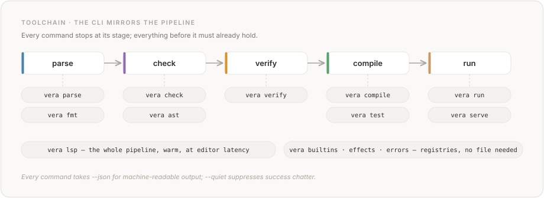

# TOOLCHAIN.md — Driving the Vera toolchain

How to use the `vera` command line to write, check, verify, test, run, and debug
Vera programs — and how to drive the compiler as a source of truth about itself.

This is a **cookbook**: recipes and workflows organised by what you are trying to
do, not an exhaustive flag reference. For the bare command list see the
[README](README.md#key-commands) or `vera` with no arguments. For the
editor/agent surface — the language server and its proof-delta methods — see
[LSP_SERVER.md](LSP_SERVER.md). For the language itself, see [SKILL.md](SKILL.md)
and [spec/](spec/).

---

## The shape of the toolchain

The CLI mirrors the compiler pipeline — one command per stage, each a gate you
can stop at:



<details>
<summary>Text version</summary>

```text
source ──▶ parse ──▶ check ──▶ verify ──▶ compile ──▶ run
            parse     check     verify     compile     run
            fmt       ast                  test        serve
```

</details>

Two commitments from [DESIGN.md](DESIGN.md) shape every command:

1. **Fail loud, with a fix.** A diagnostic *names* the problem, explains *why*,
   and gives a concrete instruction — never a bare status. Every diagnostic
   carries a stable code (`E001`–`E702`) you can pin tooling to.
2. **Two audiences.** Every diagnostic-producing command has a `--json` mode.
   People read the default text; agents consume `--json` in a feedback loop. The
   JSON is the machine contract; the prose is for humans. This is the single
   most important thing to know about the toolchain: **if you are scripting Vera
   from an agent, you almost always want `--json`.**

The thread running through all of it: *the compiler is the authority.* It tells
you what's wrong (`check`/`verify`), what it can prove (`verify --json` tiers),
what inputs break a contract (`test`), and — new in this release — what its own
built-ins, effects, and error codes are (`builtins`/`effects`/`errors --json`).
You should rarely have to guess or hand-maintain a fact the compiler already
knows.

---

## Recipe: write and check

**Type-check a file.**

```bash
vera check file.vera           # human-readable: "OK: ..." or a diagnostic
vera check --json file.vera    # {"ok": true, "diagnostics": [], "warnings": []}
vera check --quiet file.vera   # exit code only, no success chatter
```

`check` is the fast inner-loop gate: parse + type-check, no Z3. Reach for it on
every edit. `typecheck` is an explicit alias.

**Untangle a slot reference.** Vera names bindings by *type and position*
(`@T.n`, De Bruijn — see [DE_BRUIJN.md](DE_BRUIJN.md)), and `@Int.0` is the
*most recent* `@Int`, not the first. When a slot resolves to a parameter you
didn't expect — the classic source of a silent logic bug in a function with two
same-typed parameters — ask the compiler instead of counting on your fingers:

```bash
vera check --explain-slots file.vera   # a table: which @T.n maps to which param
```

This is the first thing to run when a contract "should hold" but doesn't, or a
recursive call behaves backwards.

**Normalise the source.** There is exactly one canonical form; `fmt` enforces it
(pre-commit and CI reject drift).

```bash
vera fmt file.vera             # print canonical form to stdout
vera fmt --write file.vera     # rewrite in place
vera fmt --check file.vera     # exit non-zero if not already canonical (CI mode)
```

---

## Recipe: verify contracts

```bash
vera verify file.vera          # type-check + discharge contracts via Z3
vera verify --json file.vera   # adds a "verification" tier summary
```

Vera verifies in two implemented tiers, at every call site:

- **Tier 1 — Z3 static.** The compiler builds a verification condition and asks
  Z3. `unsat` means the contract holds *for all inputs*. This is the strong
  guarantee: a fully Tier-1 program that compiles is correct by construction.
- **Tier 3 — runtime fallback.** When Z3 returns `unknown` or times out, the
  contract is compiled as a runtime check that traps on violation with the
  contract text.

(Tier 2, Z3-*guided*, is specified in spec/06 but not yet implemented.)

**Debugging "it verified but it still trapped at runtime."** That is Tier 3
doing its job — the contract wasn't *statically* proved, so it became a runtime
guard. `--json` shows you exactly how much fell through:

```bash
vera verify --json file.vera
# {"verification": {"tier1_verified": 12, "tier3_runtime": 1, "total": 13}, ...}
```

A non-zero `tier3_runtime` is your list of "things Z3 couldn't decide." If you
want them at Tier 1, the usual levers are tightening a `requires`, adding a
refinement type, or restructuring so the obligation is decidable arithmetic.

---

## Recipe: test against real inputs

```bash
vera test file.vera            # contract-driven testing
vera test --json file.vera     # machine-readable per-function results
vera test --trials 50 file.vera   # cap trials per function (default 100)
vera test --fn f file.vera     # only the function f
```

`test` is contract-driven, not example-driven: Z3 generates inputs that
*satisfy each function's `requires`*, the compiled WASM runs them, and the real
outputs are checked against `ensures`. It is the empirical counterpart to
`verify` — where `verify` proves, `test` tries to falsify. Run it on the Tier-3
functions `verify --json` flagged: those are the ones a proof didn't cover, so
they're where a generated counterexample is most valuable.

---

## Recipe: run and compile

```bash
vera run file.vera                 # compile + execute main() via wasmtime
vera run file.vera --fn f -- 42    # call f with argument 42 (args after --)
```

Everything after `--` is passed to the function, parsed by type (so `42` becomes
an `@Int`). Use `--fn` to enter at a function other than `main`.

```bash
vera compile file.vera                     # emit a .wasm binary
vera compile -o out.wasm file.vera         # choose the output path
vera compile --wat file.vera               # print human-readable WAT instead
vera compile --target browser file.vera    # emit a browser bundle (wasm + JS + HTML)
```

`--wat` is the window into codegen: when a program runs wrong (not *verifies*
wrong — *runs* wrong), the WAT is the ground truth of what was emitted.
`--target browser` produces a self-contained bundle that runs the same WASM in
the browser runtime.

```bash
vera compile --target wasi-p2 file.vera    # emit a WASI Preview 2 component (experimental)
vera run --target wasi-p2 file.vera        # execute it under the built-in wasip2 host
wasmtime run file.wasm                     # ...or under stock wasmtime, no flags, no Vera bindings
```

`--target wasi-p2` covers the IO and Random host families; any other family is
rejected with a diagnostic naming it. `vera run --target wasi-p2` is the parity
check that the artifact behaves like the core target (same stdout/stderr, same
trap kinds) before handing it to an external host. Divergences inherent to
WASI 0.2 — exit codes collapse to 0/1, no structured trap frames — are in
spec chapter 13.

```bash
vera compile --target wasi-p2 --world server file.vera   # wasi:http server component
wasmtime serve file.wasm                                 # stock wasmtime hosts the handler
```

`--world server` packages the same `handle(Request -> Response)` program
`vera serve` runs natively as a `wasi:http/incoming-handler` component —
one handler, two deployment paths.  `vera run` cannot host it (no
wasi:http in wasmtime-py); the error says so and points here.

Under `wasmtime serve`, handler `IO.print` output is line-buffered by the host: a print with no trailing newline is held until the next newline (and lost on shutdown if none arrives), so terminate each log line with `\n`. The native `vera serve` driver below does not buffer this way.

---

## Recipe: serve verified HTTP handlers

`vera serve` hosts a program's `handle(Request -> Response)` function over HTTP (#305). The accept loop lives in the host — the handler is a total, contract-checked function; no `Diverge` involved.

```bash
vera serve examples/http_server.vera              # default port 8000
vera serve --port 8080 examples/http_server.vera  # explicit port
curl -i http://127.0.0.1:8080/
```

Each request runs on a **fresh module instance**, so `State<T>` cannot leak between requests. A runtime contract violation inside the handler answers **500** with the trap diagnostic as JSON (`trap_kind`, message, frames) — the same envelope `vera run --json` uses. Handler `IO.print` output goes to the server console. Ctrl-C stops the server (exit 130). See spec §9.5.6 for the `Request` / `Response` types and semantics.

## Recipe: inspect a program's structure

```bash
vera parse file.vera           # the parse tree (syntax)
vera ast file.vera             # the typed AST (post type-checking)
vera ast --json file.vera      # the AST as JSON
```

`parse` answers "did the grammar accept this?"; `ast` answers "what did the
type-checker make of it?". Reach for `ast` when a slot or type resolves
surprisingly and `--explain-slots` wasn't enough.

---

## Recipe: ask the compiler about itself

New in this release: three subcommands that make the compiler the source of
truth for its own surface, so a count like "164 built-in functions" is a CLI
call rather than a hand-maintained number that drifts.

```bash
vera builtins --json     # every built-in function   {schema, items[...]}
vera effects  --json     # every effect (incl. parameterised Exn<T>) and ability, kind-tagged
vera errors   --json     # every diagnostic + warning code, with its phase
```

Each emits a uniform `{"schema": "...", "items": [...]}` envelope (the `schema`
field is versioned for forward-compatibility), or an aligned text table without
`--json`. Every item also carries a best-effort **`since`** — the version that
first introduced it (built-in functions, effects, and abilities are
git-attributed; diagnostic codes report `null`) — which is what makes "what
shipped since version 0.0.X" answerable by diffing two dumps. Recipes:

```bash
# How many built-ins are there, really? (the answer the docs should quote)
vera builtins --json | jq '.items | length'

# Does a built-in named `string_split` exist?
vera builtins --json | jq '.items[] | select(.name == "string_split")'

# When did `map_new` land? (the `since` field — best-effort; null for error codes)
vera builtins --json | jq -r '.items[] | select(.name == "map_new") | .since'   # -> 0.0.94

# What operations does the IO effect expose?
vera effects --json | jq '.items[] | select(.name == "IO") | .ops'

# What does E527 mean, and which phase raises it?
vera errors --json | jq '.items[] | select(.code == "E527")'

# Every verification-phase error code
vera errors --json | jq '.items[] | select(.phase == "verify") | .code'
```

Because these are sourced from the live registries (`effects` additionally
surfaces the parameterised `Exn<T>`, recognised specially by the compiler), a
test that asserts `len(builtins --json) == <doc number>` will catch doc drift
the moment it happens — which is the whole point.

---

## Recipe: edit with a language server

For real-time diagnostics, type hover, slot go-to-definition, typed-hole
completion, and the agent-facing proof-delta methods (ask "does this edit still
prove?" without a full re-verify), run the LSP:

```bash
vera lsp                       # serve LSP over stdio (needs the [lsp] extra)
```

The LSP is its own surface with its own guide — see
[LSP_SERVER.md](LSP_SERVER.md). Rule of thumb: the CLI is for batch gates and
scripts; the LSP is for interactive editing and edit-verify-apply loops.

---

## Debugging Vera: a field guide

| Symptom | Reach for | What to look at |
|---|---|---|
| "Contract should hold but doesn't" | `vera check --explain-slots` | which parameter `@T.n` actually resolves to |
| Recursive call behaves backwards | `vera check --explain-slots` | non-commutative slot order (`@T.0` is *most recent*) |
| "Verified, but it trapped at runtime" | `vera verify --json` | a non-zero `tier3_runtime` — it was a runtime guard, not a proof |
| "Z3 can't prove my postcondition" | `vera test --fn f` | a generated counterexample input |
| Wrong *output* (not wrong *proof*) | `vera compile --wat` | the actual emitted instructions |
| "Does feature/built-in X exist?" | `vera builtins --json` / `vera effects --json` | the registry, not your memory |
| "What is error EXXX?" | `vera errors --json \| jq ...` | the code's `title` and `phase` |
| Unexpected reformatting in review | `vera fmt --check` | whether the source was canonical |

---

## The `--json` surface, for agent loops

The intended agent loop is: emit a `.vera` file → `vera check --json` → if not
`ok`, read `diagnostics[].fix` and edit → repeat → `vera verify --json` → act on
the tier summary → `vera test --json` on the Tier-3 remainder.

Every diagnostic-producing command (`check`, `verify`, `compile`, `run`, `test`,
`ast`) speaks `--json`; the introspection commands (`builtins`, `effects`,
`errors`) speak it natively. Diagnostic codes are **stable** (`E001`–`E702`), so
an agent can branch on `error_code` rather than parsing prose. See the
[JSON diagnostics](README.md) section of the README for the diagnostic schema
and [error-code table](spec/), and `vera errors --json` for the live catalogue.

---

## See also

- [LSP_SERVER.md](LSP_SERVER.md) — the language server and proof-delta methods
- [DESIGN.md](DESIGN.md) — why the toolchain is shaped this way
- [WASI.md](WASI.md) — the WASI/component toolchain facts under the server-effects sprint
- [DE_BRUIJN.md](DE_BRUIJN.md) — the `@T.n` slot model `--explain-slots` reports
- [SKILL.md](SKILL.md) — writing Vera: syntax, contracts, effects, common mistakes
- [README.md](README.md) — install, the command list, and the project overview
