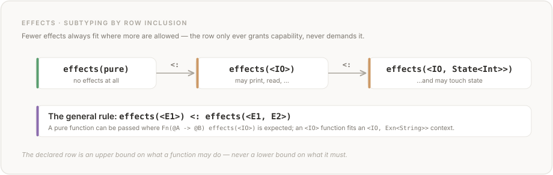

# Chapter 7: Effects

## 7.1 Overview

Vera is pure by default. Functions that interact with the outside world, mutate state, throw exceptions, or perform any operation beyond pure computation must declare these **effects** in their type signature.

The effect system is based on algebraic effects with row polymorphism, inspired by Koka. Effects are:

1. **Declared**: each effect defines a set of operations.
2. **Typed**: function signatures include an effect row listing all effects the function may perform.
3. **Handled**: effects are discharged by handlers that provide implementations for each operation.
4. **Composable**: effect rows combine naturally when functions are composed.

## 7.2 Effect Declarations

An effect is a named set of operations:

```
effect State<T> {
  op get(Unit -> T);
  op put(T -> Unit);
}
```

```
effect Exn<E> {
  op throw(E -> Never);
}
```

```
effect IO {
  op print(String -> Unit);
}
```

```
effect Choice {
  op choose(Bool -> Bool);
}
```

Rules:

1. Effect names MUST begin with an uppercase letter.
2. Effects may be parameterised by type variables.
3. Each operation has a typed signature: parameter types and return type.
4. Operations implicitly have access to the `resume` continuation (see Section 7.5).

## 7.3 Effect Rows

A function's effect declaration specifies an **effect row** — an unordered set of effects:

```
effects(pure)                        -- no effects (empty row)
effects(<IO>)                        -- may perform IO
effects(<IO, State<Int>>)            -- may perform IO and use Int state
effects(<Exn<String>, IO>)           -- may throw String errors and perform IO
```

### 7.3.1 Syntax

- `pure` is a keyword denoting the empty effect row.
- `<Effect1, Effect2, ...>` is an effect row with named effects.
- `<E>` where `E` is a type variable is a polymorphic effect row.
- `<IO, E>` is an effect row containing `IO` plus whatever `E` resolves to.

### 7.3.2 Effect Row Ordering

Effect rows are unordered sets. `<IO, State<Int>>` and `<State<Int>, IO>` are the same effect row. The canonical form (for the one-canonical-form rule) is alphabetical order by effect name.

### 7.3.3 Duplicate Effects

The same effect with different type parameters may appear multiple times:

```
effects(<State<Int>, State<String>>)
```

This means the function uses two independent state cells: one `Int` and one `String`.

The same effect with the same type parameters MUST NOT appear twice (it would be redundant).

## 7.4 Performing Effects

Within a function that declares an effect, operations are called like regular functions:

```
public fn increment(@Unit -> @Unit)
  requires(true)
  ensures(true)
  effects(<State<Int>>)
{
  let @Int = get(());
  put(@Int.0 + 1);
  ()
}
```

```
public fn hello(-> @Unit)
  requires(true)
  ensures(true)
  effects(<IO>)
{
  IO.print("hello, world")
}
```

Effect operations are resolved by the effect declared in the function's effect row. If `get` appears in a function with `effects(<State<Int>>)`, it refers to the `get` operation of `State<Int>`.

**Effect ordering.** Effect operations execute in program order.  The one sanctioned relaxation is `async(e)` (§9.5.4): when `e`'s effect row is commutative — its operations' completions cannot be observably reordered against any other effect in the program — an implementation MAY overlap `e`'s execution with subsequent computation, resolving at the corresponding `await`.  Effects outside that whitelist retain strict program order; the checker warns (`W002`) where this forces eager evaluation, so verified sequential semantics remain literally true for every Tier-1 claim.

### 7.4.1 Ambiguous Operations

If two effects in scope define an operation with the same name, the call is ambiguous and MUST be qualified:

<!-- vera:skip-parse category="FRAGMENT" reason="effect Logger + anonymous fn body" -->
```
effect Logger {
  op put(String -> Unit);
}

fn(@Unit -> @Unit)
  requires(true)
  ensures(true)
  effects(<State<Int>, Logger>)
{
  State.put(42);            -- qualified: State<Int>'s put
  Logger.put("logged");     -- qualified: Logger's put
  ()
}
```

## 7.5 Effect Handlers

An effect handler provides implementations for an effect's operations and discharges the effect from the type:

```
handle[State<Int>](@Int = 0) {
  get(@Unit) -> { resume(@Int.0) },
  put(@Int) -> { resume(()) }
} in {
  body_expression
}
```

### 7.5.1 Handler Syntax

```
handle[EffectName<TypeArgs>](initial_state) {
  operation1(params) -> { handler_body1 },
  operation2(params) -> { handler_body2 }
} in {
  handled_body
}
```

Components:

- `[EffectName<TypeArgs>]`: the effect being handled
- `(initial_state)`: initial value for stateful effects (optional; only for effects that carry state)
- Operation clauses: one per operation in the effect, each providing an implementation as a block
- `resume(value)`: a built-in that continues execution of the handled body with a return value
- `in { ... }`: the body in which the effect is handled

### 7.5.2 Handler Semantics

When an effect operation is performed in the handled body:

1. Execution of the handled body is **suspended**.
2. Control transfers to the corresponding operation clause in the handler.
3. The handler may inspect the operation's arguments and the current state.
4. The handler calls `resume(value)` to continue the handled body, providing the return value of the operation.
5. Optionally, the handler updates its state with `with @T = expr`.

The handler may also choose NOT to call `resume`, which aborts the handled body. This is how exceptions are implemented.


### 7.5.3 Examples

**State handler:**

```
private fn run_stateful(@Unit -> @Int)
  requires(true)
  ensures(true)
  effects(pure)
{
  handle[State<Int>](@Int = 0) {
    get(@Unit) -> { resume(@Int.0) },
    put(@Int) -> { resume(()) }
  } in {
    let @Int = get(());           -- returns 0 (initial state)
    put(@Int.0 + 10);             -- state becomes 10
    let @Int = get(());           -- returns 10
    @Int.0                        -- body evaluates to 10
  }
}
```

The result is `10`. The `handle` expression's type is the type of the handled body (`Int`). The enclosing function's effects are `pure` because the handler discharges `State<Int>`.

**Exception handler:**

```
effect Exn<E> {
  op throw(E -> Never);
}

private fn parse_or_throw(@String -> @Int)
  requires(true)
  ensures(true)
  effects(<Exn<String>>)
{
  match parse_int(@String.0) {
    Ok(@Int) -> @Int.0,
    Err(@String) -> throw(@String.0)
  }
}

private fn safe_parse(@String -> @Option<Int>)
  requires(true)
  ensures(true)
  effects(pure)
{
  handle[Exn<String>] {
    throw(@String) -> { None }    -- do NOT resume; return None
  } in {
    Some(parse_or_throw(@String.0))
  }
}
```

The built-in `parse_int` is a pure function returning `Result<Int, String>` (Chapter 9); `parse_or_throw` converts its `Err` case into a `throw`. If `parse_or_throw` throws, the handler catches it and returns `None`. If parsing succeeds, the body evaluates to `Some(result)`.

Note: when the handler does not call `resume`, the handled body is abandoned. The handler body's expression (`None`) becomes the value of the entire `handle` expression.

**Choice handler (non-determinism):**

<!-- vera:skip-parse category="FUTURE" reason="handle[Choice] multi-shot resume + array_concat" -->
```
private fn all_choices(@Unit -> @Array<Bool>)
  requires(true)
  ensures(true)
  effects(pure)
{
  handle[Choice] {
    choose(@Bool) -> {
      let @Array<Bool> = resume(true);
      let @Array<Bool> = resume(false);
      array_concat(@Array<Bool>.1, @Array<Bool>.0)
    },
  } in {
    let @Bool = choose(true);
    [@Bool.0]
  }
}
```

The handler calls `resume` twice — once with `true`, once with `false` — and concatenates the results. The result is `[true, false]`.

This demonstrates that `resume` is a first-class continuation: it can be called zero, one, or multiple times.

## 7.6 Effect Polymorphism

Functions can be polymorphic over effects:

<!-- vera:skip-parse category="FRAGMENT" reason="fn(A -> B) in param position" -->
```
private forall<A, B> fn option_map(@Option<A>, fn(A -> B) effects(<E>) -> @Option<B>)
  requires(true)
  ensures(true)
  effects(<E>)
{
  match @Option<A>.0 {
    Some(@A) -> Some(apply_fn(@Fn.0, @A.0)),
    None -> None,
  }
}
```

Stored function values are applied with `apply_fn` (Section 11.10.5). The effect variable `E` is unified at each call site. If the passed function is `pure`, then `option_map` is `pure`. If it has `effects(<IO>)`, then `option_map` has `effects(<IO>)`.

### 7.6.1 Effect Row Variables

Effect row variables can appear alongside concrete effects:

<!-- vera:skip-parse category="FRAGMENT" reason="fn(Unit -> A) in param position" -->
```
private forall<A> fn with_logging(fn(Unit -> A) effects(<E>) -> @A)
  requires(true)
  ensures(true)
  effects(<IO, E>)
{
  IO.print("Starting computation");
  let @A = apply_fn(@Fn.0, ());
  IO.print("Finished computation");
  @A.0
}
```

This function always performs `IO` (for the logging), plus whatever effects `E` the argument function has.

## 7.7 Built-in Effects

**Design note.** An alternative implementation targeting memory-constrained environments may wish to introduce an `Alloc` marker effect to distinguish allocating from non-allocating functions. The reference implementation omits this because WASM's managed linear memory makes allocation-tracking uninformative at the type level — nearly every non-trivial function allocates, so the effect would carry little signal.

### 7.7.1 `IO`

The `IO` effect is built-in and provides eleven operations for interacting with the outside world:

| Operation | Signature | Description |
|-----------|-----------|-------------|
| `print` | `String -> Unit` | Write a UTF-8 string to stdout |
| `read_line` | `Unit -> String` | Read a line from stdin |
| `read_char` | `Unit -> Result<String, String>` | Read one character from stdin (raw mode on TTY); `Err("EOF")` when stdin closes |
| `read_file` | `String -> Result<String, String>` | Read entire file as UTF-8 |
| `write_file` | `String, String -> Result<Unit, String>` | Write string to file |
| `args` | `Unit -> Array<String>` | Get command-line arguments |
| `exit` | `Int -> Never` | Exit process with status code |
| `get_env` | `String -> Option<String>` | Look up environment variable |
| `sleep` | `Nat -> Unit` | Pause execution for N milliseconds |
| `time` | `Unit -> Nat` | Current Unix time in milliseconds |
| `stderr` | `String -> Unit` | Write a UTF-8 string to stderr |

IO operations are handled by the runtime (see Chapter 12, Section 12.4.1). Programs do not need to declare `effect IO { ... }` — the operations are available automatically when `effects(<IO>)` is specified. See Chapter 9, Section 9.5.1 for detailed documentation and examples.

### 7.7.2 `Exn<E>`

```
effect Exn<E> {
  op throw(E -> Never);
}
```

Exception effect. The `throw` operation never resumes (its return type is `Never`).

### 7.7.3 `Diverge`

<!-- vera:skip-parse category="FRAGMENT" reason="effect Diverge {} — no operations" -->
```
effect Diverge {}
```

The `Diverge` effect has no operations. Declaring `effects(<Diverge>)` means the function may not terminate. Functions without `Diverge` in their effect row MUST be proven to terminate (via `decreases` clauses on recursion).

### 7.7.4 `Random`

```
effect Random {
  op random_int(Int, Int -> Int);
  op random_float(Unit -> Float64);
  op random_bool(Unit -> Bool);
}
```

The `Random` effect models non-deterministic value generation. Functions that draw random values must declare `effects(<Random>)`, making the non-determinism visible in the type signature so callers can audit which functions can produce different outputs across calls.

| Operation | Signature | Description |
|-----------|-----------|-------------|
| `random_int` | `Int, Int -> Int` | Random integer in inclusive range `[low, high]` (caller ensures `low <= high`) |
| `random_float` | `Unit -> Float64` | Uniform random in `[0.0, 1.0)` |
| `random_bool` | `Unit -> Bool` | Coin flip |

Like `IO`, `Random` is built-in — no `effect Random { ... }` declaration is needed. Random results are unconstrained in Z3 (no useful axioms beyond the explicit range bound on `random_int`); contracts that depend on specific random values fall to runtime checking. Operations are host-backed (see Chapter 12, Section 12.4.5). No determinism / seeding API is offered yet — handler-based seeding via `handle[Random]` is future work.

### 7.7.5 `HttpServer`

<!-- vera:skip-parse category="FRAGMENT" reason="effect HttpServer {} — no operations (#305)" -->
```
effect HttpServer {}
```

The `HttpServer` effect has no operations — it is a marker (#305, since v0.0.193).  Declaring `effects(<HttpServer>)` marks a function as an HTTP request handler: a **total**, contract-checked function `handle(Request -> Response)` (§9.5.6).  The accept loop lives in the host `vera serve` driver, not in the program, so handlers do not need `Diverge` — termination-checked request handling is a feature, and per-request effects (`State<T>`, `Exn<E>`) compose inside the handler's row as usual.

### 7.7.6 `Async`

<!-- vera:skip-parse category="FRAGMENT" reason="effect Async {} — no operations" -->
```
effect Async {}
```

The `Async` effect has no operations — it is a marker. Declaring `effects(<Async>)` enables the built-in generic functions `async(expr)` and `await(future)`, making concurrency explicit and trackable in the effect row. See Chapter 9, Section 9.5.4 for the operation signatures, the `Future<T>` type, and the concurrency semantics (#841).

## 7.8 Effect Subtyping

A function with fewer effects can be used where more effects are expected:

```
effects(pure) <: effects(<IO>)
effects(<IO>) <: effects(<IO, State<Int>>)
```

In general, `effects(<E1>)` is a subtype of `effects(<E1, E2>)`. A function that performs no IO can safely be called in a context that allows IO.



This means:
- A `pure` function can be passed where `Fn(@A -> @B) effects(<IO>)` is expected.
- A function with `effects(<IO>)` can be passed where `effects(<IO, Exn<String>>)` is expected.

## 7.9 Effect-Contract Interaction

### 7.9.1 Pure Contracts

Contract predicates (`requires`, `ensures`, `invariant`, `assert`, `assume`) MUST be pure. They MUST NOT perform effects. This is checked by the effect checker.

### 7.9.2 State in Contracts

Since contract predicates must be pure (Section 7.9.1), they cannot call effect operations like `get()` or `put()` directly. Instead, contracts on stateful functions use `old` and `new` to refer to the state before and after the function call:

```
private fn increment_and_return(@Unit -> @Int)
  requires(true)
  ensures(@Int.result == old(State<Int>) && new(State<Int>) == old(State<Int>) + 1)
  effects(<State<Int>>)
{
  let @Int = get(());
  put(@Int.0 + 1);
  @Int.0
}
```

- `old(State<T>)` refers to the state value before the function executes
- `new(State<T>)` refers to the state value after the function executes

These are contract-only syntax forms that do not perform effects.

## 7.10 Effect Composition

When a function calls other functions, the effects compose via row union:

```
private fn foo(@Unit -> @Unit)
  requires(true)
  ensures(true)
  effects(<IO, State<Int>>)
{
  bar();    -- bar has effects(<IO>)
  baz();    -- baz has effects(<State<Int>>)
  ()
}
```

The compiler checks that every effect performed in the body is declared in the function's effect row. If `bar` performs `IO` and `baz` uses `State<Int>`, then `foo` must declare at least `effects(<IO, State<Int>>)`.

The compiler verifies this by computing the union of all effects in the body and checking that it is a subset of the declared effects.

## 7.11 Effect Handlers and Types

The type of a `handle` expression:

```
handle[Effect](state) { ops } in { body }
```

If `body` has type `T` and effects `<Effect, E>`, then the `handle` expression has type `T` (or a modified type if the handler transforms it) and effects `<E>`. The handler discharges `Effect` from the effect row.

Special case: if the handler does not always call `resume`, the return type of the `handle` expression may differ from the body's type. The handler's operation clauses must all return the same type, which becomes the type of the `handle` expression.

```
handle[Exn<String>] {
  throw(@String) -> None,          -- returns Option<Int>
} in {
  Some(risky_computation())        -- body type: Option<Int> with effects <Exn<String>>
}
-- Overall type: Option<Int> with no Exn effect
```
