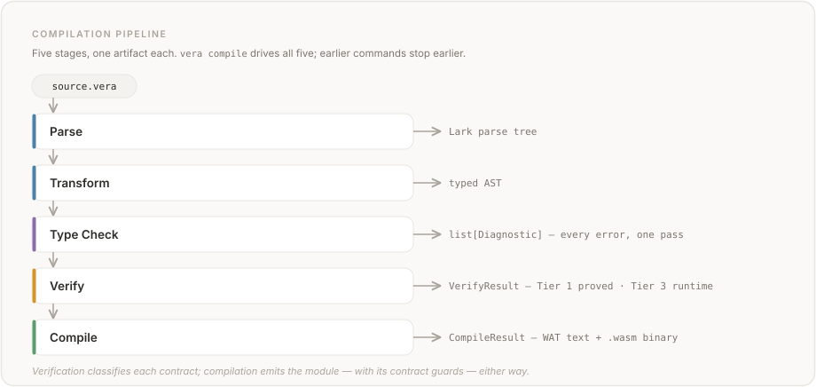
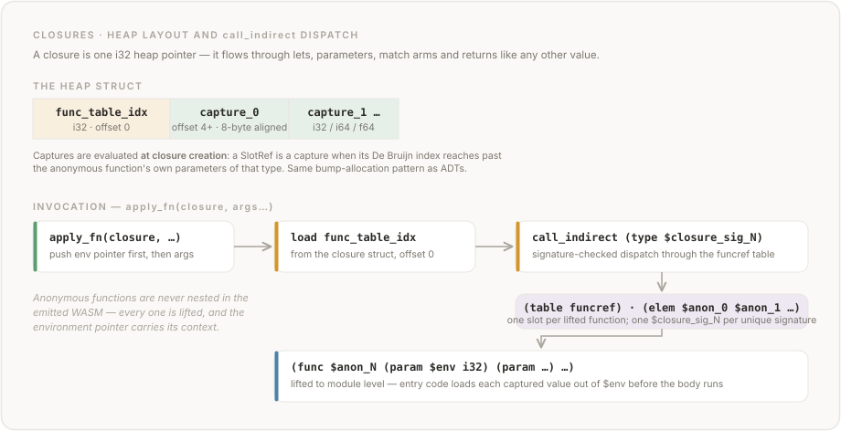

# Chapter 11: Compilation Model

## 11.1 Overview

Vera programs compile to WebAssembly (WASM). The compilation pipeline extends the verification pipeline: after parsing, transformation, type checking, and contract verification, the code generator translates the verified AST into a WASM module.



<details>
<summary>Text version</summary>

```text
Source (.vera)
  │
  ├── Parse        → Lark parse tree
  ├── Transform    → Typed AST
  ├── Type Check   → Diagnostics
  ├── Verify       → VerifyResult (Tier 1/3 classification)
  └── Compile      → CompileResult (WAT text + WASM binary)
```

</details>

The compilation target is a standalone WASM module containing:
- Exported functions (callable from the host or other modules)
- A linear memory segment (for string constants and heap-allocated ADTs)
- Imported host functions (for IO and State\<T\> operations)
- An optional data section (for string literals)

This core module is the canonical compilation target and the default
(`--target wasm`). Two alternative targets package it for other hosts
without changing its emission: `--target browser` wraps it in a
self-contained JS bundle (Section 12.9), and the experimental
`--target wasi-p2` wraps it in a WebAssembly component whose host
imports are implemented over WASI 0.2 interfaces (Chapter 13).

## 11.2 Type Mapping

Vera types map to WASM value types as follows:

| Vera Type | WASM Type | Notes |
|-----------|-----------|-------|
| `Int` | `i64` | 64-bit signed integer |
| `Nat` | `i64` | Non-negativity enforced by contracts, not by WASM type |
| `Bool` | `i32` | `0` = `false`, `1` = `true` |
| `Byte` | `i32` | Unsigned 0-255; uses unsigned comparison ops (`i32.lt_u`, etc.) |
| `Float64` | `f64` | 64-bit IEEE 754 floating point |
| `Unit` | *(none)* | Functions returning `Unit` have no WASM result type |
| `String` | `i32, i32` | Pointer and length pair (UTF-8 bytes in linear memory) |
| `Array<T>` | `i32, i32` | Pointer and length pair (elements in linear memory); see Section 11.13 |
| ADTs | `i32` | Heap pointer to tagged union (see Section 11.6) |
| Function types | `i32` | Heap pointer to closure struct (see Section 11.11) |

Generic type variables are resolved via monomorphization — each concrete instantiation of a `forall<T>` function produces a specialized copy with type variables replaced by concrete types (e.g. `identity$Int`). Type aliases are resolved through their definitions: function type aliases (e.g. `type IntToInt = fn(Int -> Int) effects(pure)`) resolve to `i32` closure pointers, and refinement type aliases (e.g. `type PosInt = { @Int | @Int.0 > 0 }`) resolve to their base WASM type (see Section 11.15). String and Array types compile to `(i32, i32)` pairs in function signatures — each Vera parameter expands to two WASM parameters (pointer and length), and String/Array return types use WASM multi-value return `(result i32 i32)`. Functions using non-compilable types in their signatures are skipped with a warning.

### 11.2.1 Nat as i64

`Nat` and `Int` share the same WASM representation (`i64`). The non-negativity invariant of `Nat` is enforced by the contract system (preconditions, postconditions), not by the WASM type. This avoids the overhead of runtime range checks on every arithmetic operation while maintaining the correctness guarantee through verification.

The one operation that can violate the non-negativity invariant despite well-typed operands is unsigned subtraction (`@Nat - @Nat`). At every such site whose result is statically `@Nat` AND at least one operand has `@Nat` *provenance* (a slot reference, function call returning `@Nat`, or a sub-expression containing one — pure-literal subtractions like `0 - 1` are intentionally exempt because they're commonly consumed at `@Int` positions), the compiler emits a Tier-1 proof obligation `lhs >= rhs` — discharged at Tier 1 when a precondition or path condition proves it, else dropped to Tier 3. The codegen is type-driven, not tier-driven: it emits the guarded subtraction at *every* such site regardless of the verifier's tier (a Tier-1 discharge means the guard provably never fires, but it is still emitted):

```wat
(if (i64.lt_s lhs rhs)
  (then unreachable))   ;; traps with WasmTrapError(kind="unreachable")
(i64.sub lhs rhs)
```

The trap is classified as `kind="unreachable"` rather than a dedicated `kind="underflow"` because the `unreachable` instruction is the lightest-weight trap mechanism and adding a dedicated kind requires new host-import scaffolding (mirroring `vera.contract_fail`); a precise underflow diagnostic via `vera verify` is the recommended path until the dedicated kind lands.

Arithmetic **overflow** of `@Int`/`@Nat` addition, subtraction, and multiplication (`+`/`-`/`*`) is handled the same way ([#798](https://github.com/aallan/vera/issues/798)). Because `Int` and `Nat` share the `i64` representation, these operations wrap under two's-complement arithmetic, so each such site carries a Tier-1 proof obligation that the `result` stays in range — classified at the operands' **common (coerced) arithmetic type** (`@Int` if either operand is `@Int`, else `@Nat`; `@Nat` subtraction is excluded, being the underflow obligation above). The range checked is the **signed** 64-bit range for `@Int` and the **unsigned** 64-bit range for `@Nat` — the shared `i64` interpreted with the operation's signedness. The verifier discharges it three ways: result provably in range → **Tier 1**; provably out of range → a compile error (**E528**) raised *before* codegen; otherwise — dynamic operands — **Tier 3**. As with `@Nat` subtraction, the codegen is type-driven, not tier-driven: it emits the guarded op at every such site regardless of the verifier's tier (a Tier-1 discharge means the guard provably never fires, but it is still emitted). The overflow trap is classified `kind="overflow"`: [#808](https://github.com/aallan/vera/issues/808) wired the guard to a `vera.overflow_trap` host import (mirroring `vera.contract_fail`) that it calls immediately before its `unreachable`, so a dynamic overflow surfaces the dedicated overflow diagnostic and its Fix paragraph rather than the generic `unreachable` kind. (`@Nat` subtraction underflow keeps the bare-`unreachable` net described above — its dedicated kind is tracked separately.) The obligation stays sound because the function traps on overflow before it can return a wrapped value.

Authors lift Tier-3 functions back to Tier 1 by adding `requires lhs >= rhs` clauses. Subtraction sites that do not produce a `Nat`-typed result (e.g., `@Int - @Int`) carry no *underflow* obligation — they may produce negative values, which is well-defined for `Int` (they remain subject to the overflow obligation described above). `@Byte` arithmetic is not currently permitted by the type checker (`Byte` is excluded from `NUMERIC_TYPES` in `vera/types.py`), so the underflow obligation needs no `Byte` extension today; allowing `@Byte` arithmetic with both underflow and overflow guards is tracked speculatively as [#564](https://github.com/aallan/vera/issues/564). The verifier checks the `@Nat >= 0` invariant at subtraction sites (in any position, including a function's return expression) and at binding sites where an `@Int` value narrows into a `@Nat` slot — `let` bindings, call arguments, constructor fields, top-level match binds, and literal-tuple destructures, plus the pure-literal `let @Nat = 0 - 1` case the subtraction obligation defers ([#552](https://github.com/aallan/vera/issues/552)). [#747](https://github.com/aallan/vera/issues/747) extended the narrowing obligation to the projection and instantiation sites — ADT sub-pattern binds (`match opt { Some(@Nat) -> }` on `Option<Int>`), non-literal tuple destructures, generic constructor / effect-operation / function formals instantiated to `@Nat`, and imported ADT constructors — so every narrowing **binding site** is now statically obligated. (A bare `@Int`→`@Nat` narrowing at a function **return** position, or a `@Nat` component of a tuple/constructor built in value position, is not yet obligated — see [#758](https://github.com/aallan/vera/issues/758).) The Tier-3 runtime guard backs every binding site except two — the effect-operation argument, and the generic-instantiated constructor field (which erases to i64 with no per-field guard) — and a tripped guard reports a generic trap rather than the `requires(... >= 0)` fix.  The effect-op guard and the dedicated trap kind are tracked as [#754](https://github.com/aallan/vera/issues/754), the generic constructor field as [#757](https://github.com/aallan/vera/issues/757) (see §11.17).

The **`@Nat`→`@Int` widening** direction carries the dual obligation ([#813](https://github.com/aallan/vera/issues/813)).  Because `Nat` (u64) and `Int` (i64) share the `i64` representation, widening a `@Nat` whose value exceeds `i64.MAX` bit-reinterprets it to a *negative* `@Int` (`u64.MAX` → `-1`), so each `@Nat`→`@Int` coercion site carries a Tier-1 proof obligation that the value is `<= i64.MAX` (`nat_to_int_coerce`).  The verifier discharges it the same three ways: provably in range → **Tier 1**; provably out of range → a compile error (**E530**) before codegen; otherwise — dynamic value — **Tier 3**.  Code generation emits the matching runtime guard (the same `unreachable` net, tripping when the widened i64 reads as negative) at the sites where the source `@Nat` is statically known: the return, `let`, call-argument, concrete `@Int` constructor-field, `@Nat`-field ADT sub-pattern extraction, and match-binding positions.  At the *component* coercion sites code generation cannot guard — a `@Nat` element of a tuple or array literal, a generic-instantiated `@Int` field (e.g. `Some(@Nat.0)` into `Option<Int>`, erased to i64 with no per-field metadata), and tuple destructures — the widening is instead disclosed as an unguarded **E531** warning rather than claiming a runtime check it never emits; guarding those sites is a tracked follow-up.  Unlike the narrowing guard (a no-op on a valid `@Nat`, so safe to apply to every `@Nat` target), the widen guard fires **only** when the source is provably `@Nat` — never a genuine `@Int`, which may be legitimately negative.

### 11.2.2 Unit as Void

Functions with return type `Unit` compile to WASM functions with no result type. The caller does not receive a return value. This matches WASM's native support for void functions and avoids allocating a dummy return value.

### 11.2.3 String Representation

String values are pairs `(ptr: i32, len: i32)` where `ptr` is a byte offset into linear memory and `len` is the length in bytes. String constants are stored in the WASM data section (see Section 11.5).

## 11.3 Expression Compilation

Each AST expression node compiles to a sequence of WASM instructions that leaves the result on the operand stack.

### 11.3.1 Literals

| Expression | WASM Output |
|------------|-------------|
| `IntLit(42)` | `i64.const 42` |
| `FloatLit(3.14)` | `f64.const 3.14` |
| `BoolLit(true)` | `i32.const 1` |
| `BoolLit(false)` | `i32.const 0` |
| `UnitLit` | *(nothing)* |
| `StringLit("hello")` | `i32.const <offset>  i32.const <length>` |

### 11.3.2 Slot References

`SlotRef(@T.n)` compiles to `local.get $N`, where `$N` is the WASM local index corresponding to the De Bruijn reference. The code generator maintains a `WasmSlotEnv` that maps typed De Bruijn indices to WASM local indices, mirroring the `SlotEnv` used by the SMT translation layer.

### 11.3.3 Arithmetic and Comparison

Binary operators compile to their WASM equivalents:

| Operator | Int/Nat (i64) | Float64 (f64) | Bool (i32) |
|----------|---------------|---------------|------------|
| `+` | `i64.add` | `f64.add` | — |
| `-` | `i64.sub` | `f64.sub` | — |
| `*` | `i64.mul` | `f64.mul` | — |
| `/` | `i64.div_s` | `f64.div` | — |
| `%` | `i64.rem_s` | `a - trunc(a/b) * b` | — |
| `==` | `i64.eq` | `f64.eq` | `i32.eq` |
| `!=` | `i64.ne` | `f64.ne` | `i32.ne` |
| `<` | `i64.lt_s` | `f64.lt` | `i32.lt_s` |
| `>` | `i64.gt_s` | `f64.gt` | `i32.gt_s` |
| `<=` | `i64.le_s` | `f64.le` | `i32.le_s` |
| `>=` | `i64.ge_s` | `f64.ge` | `i32.ge_s` |
| `&&` | — | — | `i32.and` |
| `\|\|` | — | — | `i32.or` |

Float64 modulo uses the decomposition `a % b = a - trunc(a / b) * b`, where `trunc` is `f64.trunc` (truncation toward zero). This matches C's `fmod` semantics and is consistent with integer `%` (which uses `i64.rem_s`, also truncated toward zero). WASM has no native `f64.rem` instruction, so the compiler emits a multi-instruction sequence using temporary locals.

`-` on `@Nat` operands compiles to the bare `i64.sub` shown above only at sites exempt from the underflow guard (e.g. pure-literal subtractions). Where the guard applies (a statically-`@Nat` result with `@Nat` operand provenance, §11.2.1), it is emitted regardless of the verifier's tier — the codegen is type-driven, not tier-driven, so a Tier-1 discharge of `lhs >= rhs` means the guard provably never fires, not that the bare `i64.sub` is emitted instead.

Float64 comparisons return `i32` (0 or 1), matching WASM's native comparison semantics.

Unary operators:

| Operator | WASM Output |
|----------|-------------|
| `-` (Int negation) | `i64.const 0  [expr]  i64.sub` |
| `-` (Float64 negation) | `f64.neg` |
| `!` (Boolean not) | `[expr]  i32.eqz` |

The implies operator `==>` is lowered to `(!a) || b`:

```
[left]  i32.eqz  [right]  i32.or
```

### 11.3.4 Comparison Type Awareness

When both operands of a comparison are `Bool` (i32), the compiler uses `i32` comparison instructions instead of `i64`. The operand type is inferred from the AST node type (literals, slot reference type names, result references). This avoids type mismatches in WASM validation.

### 11.3.5 Control Flow

`IfExpr` compiles to a WASM structured `if/else`:

```
[condition]
if (result <type>)
  [then_branch]
else
  [else_branch]
end
```

If both branches have type `Unit`, the `(result ...)` annotation is omitted.

### 11.3.6 Let Bindings and Blocks

`LetStmt` allocates a new WASM local, evaluates the initialiser, and stores it:

```
[initialiser]
local.set $N
```

The new local is registered in the `WasmSlotEnv` so subsequent `SlotRef` nodes resolve to the correct local index.

`Block` compiles each statement sequentially, then compiles the final expression. `ExprStmt` (side-effect statements like `IO.print(...)`) compile the expression and add `drop` if it produces a value.

### 11.3.7 Function Calls

`FnCall(name, args)` compiles to:

```
[arg0] [arg1] ... [argN]
call $name
```

Arguments are evaluated left to right onto the stack, then the function is called. Recursive calls work naturally since WASM supports calling functions by name within the same module.

`QualifiedCall(IO, print, args)` compiles to a call to the corresponding host import:

```
[args]
call $vera.print
```

## 11.4 Function Compilation

### 11.4.1 Compilable Subset

A function is compilable if:

1. All parameter and return types map to WASM types (Section 11.2) — primitives, ADTs, or monomorphized generics
2. The function body uses only supported expression types
3. Effects are `pure`, `<IO>`, or `<State<T>>` where T is a compilable type

Generic (`forall<T>`) functions are compiled via monomorphization: for each concrete call site, a specialized copy is produced with type variables replaced by concrete types.

Functions that fail any of these criteria are skipped with a diagnostic warning. This is analogous to the verifier's Tier 3 classification — the compiler degrades gracefully rather than failing.

### 11.4.2 Two-Pass Compilation

The code generator uses a two-pass approach:

**Pass 1 (Registration):** Walk all declarations and register compilable functions. This makes all function names available for forward references and mutual recursion.

**Pass 2 (Compilation):** For each registered function, compile the body to WASM instructions. Allocate locals, translate the body, and emit the function definition.

### 11.4.3 Where-Block Functions

Functions declared in `where` blocks are compiled as module-level WASM functions alongside the parent function. They are visible to the parent function and to each other (supporting mutual recursion within the where block).

### 11.4.4 Exported Functions

All compiled top-level functions are exported from the WASM module. Where-block functions are internal (not exported).

## 11.5 String Pool

String literals are stored in the WASM data section. A `StringPool` tracks all string constants encountered during compilation and assigns each a unique `(offset, length)` pair.

Identical strings are deduplicated — if the same string literal appears multiple times, it is stored once in the data section and both references share the same offset.

The data section is emitted as:

```wat
(data (i32.const 0) "Hello, World!Goodbye")
```

All strings are concatenated into a single data segment starting at offset 0. Each `StringLit` compiles to `i32.const <offset>  i32.const <length>`, pushing the pointer and length onto the stack.

## 11.6 Linear Memory

The WASM module exports one page (64 KiB) of linear memory as `"memory"`. This memory holds:

- **String constants** (data section, starting at offset 0)
- **Heap-allocated ADTs** (bump-allocated after string data)

A bump allocator manages heap allocation. A mutable global `$heap_ptr` tracks the next free byte (initialized to the first byte after string data). The `$alloc` internal function bump-allocates with 8-byte alignment and returns a pointer to the allocated block. The allocator and heap global are only emitted when the program declares ADT types.

ADT constructors allocate heap blocks containing a tag (i32) followed by field values at computed offsets. Match expressions dispatch on the tag and extract fields at the corresponding offsets.

The memory is exported so the host runtime can read string data for IO operations.

## 11.7 Host Bindings

### 11.7.1 IO

The `IO` effect is implemented via host imports. Each IO operation the program uses generates a corresponding import. The WASM import signatures:

| Operation | Import signature |
|-----------|-----------------|
| `print` | `(import "vera" "print" (func $vera.print (param i32 i32)))` |
| `read_line` | `(import "vera" "read_line" (func $vera.read_line (result i32 i32)))` |
| `read_file` | `(import "vera" "read_file" (func $vera.read_file (param i32 i32) (result i32)))` |
| `write_file` | `(import "vera" "write_file" (func $vera.write_file (param i32 i32 i32 i32) (result i32)))` |
| `args` | `(import "vera" "args" (func $vera.args (result i32 i32)))` |
| `exit` | `(import "vera" "exit" (func $vera.exit (param i64)))` |
| `get_env` | `(import "vera" "get_env" (func $vera.get_env (param i32 i32) (result i32)))` |

Only the operations actually used in the program are imported. Operations that return host-allocated data (`read_line`, `read_file`, `write_file`, `args`, `get_env`) cause the module to export its `$alloc` function so the host can allocate WASM memory.

`IO.exit` emits `unreachable` after the call since the process terminates. Operations returning `Result` or `Option` return an `i32` heap pointer to the ADT; operations returning `String` or `Array<String>` return an `(i32, i32)` pair.

### 11.7.2 State\<T\>

The `State<T>` effect compiles to typed host import pairs for `get` and `put`:

```wat
(import "vera" "state_get_Int" (func $vera.state_get_Int (result i64)))
(import "vera" "state_put_Int" (func $vera.state_put_Int (param i64)))
```

Each concrete `State<T>` type (`State<Int>`, `State<Bool>`, `State<Nat>`, `State<Float64>`) generates a separate pair of imports. The host runtime maintains mutable state cells per type, initialized to zero. Mixed effects (e.g. `effects(<State<Int>, IO>)`) are supported — both sets of imports are emitted.

## 11.8 Runtime Contract Insertion

Contracts that the verifier proved (Tier 1) are omitted from the compiled output — they are statically guaranteed and need no runtime check.

Contracts that the verifier could not prove (Tier 3) are compiled as runtime assertions.

### 11.8.1 Trivial Contract Elimination

Contracts of the form `requires(true)` and `ensures(true)` are detected syntactically and produce no runtime code. These are the most common contracts in practice (used when the programmer has no meaningful precondition or postcondition to state).

### 11.8.2 Precondition Checks

Non-trivial `requires` clauses compile to checks at function entry:

```wat
;; requires(@Int.0 > 0)
local.get $param0
i64.const 0
i64.gt_s
i32.eqz
if
  unreachable    ;; trap: precondition violated
end
```

The precondition expression is compiled to a Boolean value. If it is false (`i32.eqz`), the function traps via `unreachable`.

### 11.8.3 Postcondition Checks

Non-trivial `ensures` clauses compile to checks after the function body:

```wat
;; body computes result
[body]
local.set $result    ;; store result in temp local
;; ensures(@Int.result > 0)
local.get $result
i64.const 0
i64.gt_s
i32.eqz
if
  unreachable    ;; trap: postcondition violated
end
local.get $result    ;; push result back for return
```

The body's return value is stored in a temporary local. The `@T.result` reference in the ensures clause resolves to this local. After the check passes, the result is pushed back onto the stack for return.

### 11.8.4 State Expressions in Postconditions

Postconditions may reference `old(State<T>)` (the state value before the function body) and `new(State<T>)` (the state value after). The compiler handles these by snapshotting state at function entry.

For a function with `ensures(new(State<Int>) == old(State<Int>) + 1)`:

```wat
;; Snapshot old state at function entry (after preconditions)
call $vera.state_get_Int
local.set $old_state    ;; save pre-execution value

;; [function body — may call state_get/state_put]

;; Postcondition check
call $vera.state_get_Int   ;; new(State<Int>) — reads current value
local.get $old_state       ;; old(State<Int>) — reads snapshot
i64.const 1
i64.add
i64.eq
i32.eqz
if
  unreachable              ;; trap: postcondition violated
end
```

`old(State<T>)` resolves to a `local.get` of the saved snapshot. `new(State<T>)` resolves to a fresh `call $vera.state_get_<Type>` that reads the current value. The snapshot local is allocated only when the function's ensures clauses actually reference `old()`.

### 11.8.5 Trap Handling

When a runtime contract check fails, the WASM `unreachable` instruction causes a trap. The host runtime catches the trap and reports it as a contract violation.

## 11.9 CLI Commands

### 11.9.1 `vera compile`

```
vera compile <file.vera>
```

Runs the full pipeline (parse → typecheck → verify → compile) and writes a `.wasm` binary file.

Flags:
- `--wat` — print WAT text to stdout instead of writing binary
- `--json` — JSON output with diagnostics and compilation summary
- `-o <path>` — specify output file path (default: same name with `.wasm` extension)

### 11.9.2 `vera run`

```
vera run <file.vera>
```

Runs the full pipeline through execution. Compiles the program, instantiates it with wasmtime, and calls the entry function.

Flags:
- `--fn <name>` — function to call (default: `main`)
- `--json` — JSON output with result, stdout capture, and diagnostics
- Arguments after `--` are passed to the function (typed: `Int`→integer, `Float64`→decimal, `Bool`→`true`/`false`, `String`→text, `Byte`→integer 0–255)

## 11.10 Closures and Anonymous Functions

Anonymous functions (`AnonFn`) compile to closure values — heap-allocated structs containing a function table index and captured variables.



### 11.10.1 Closure Representation

A closure is an `i32` heap pointer to a struct:

```
offset 0:   func_table_idx (i32) — index into the WASM function table
offset 4+:  capture_0 (type varies, 8-byte aligned)
offset N:   capture_1 ...
```

This follows the same bump-allocation pattern as ADTs (Section 11.6). The single `i32` pointer representation means closures flow through let bindings, function parameters, match arms, and return values without breaking the one-value-per-expression invariant.

### 11.10.2 Function Tables

The WASM module includes a `funcref` table for indirect function calls:

```wat
(type $closure_sig_0 (func (param i32) (param i64) (result i64)))
(table N funcref)
(elem (i32.const 0) func $anon_0 $anon_1 ...)
```

Each closure signature (unique combination of parameter and return types) gets a `$closure_sig_N` type declaration. The table is sized to hold all lifted functions, and the element section maps table indices to function names.

### 11.10.3 Closure Lifting

Anonymous functions are compiled as module-level WASM functions (not nested). Each lifted function has:

- `$env` (i32) as the first parameter — the closure environment pointer
- The original function parameters after `$env`
- Load instructions at the function entry to extract captured values from the environment

```wat
(func $anon_0 (param $env i32) (param $p0 i64) (result i64)
    (local $l2 i64)
    local.get 0          ;; env pointer
    i64.load offset=8    ;; load captured value
    local.set 2          ;; store in capture local
    local.get 1          ;; function parameter
    local.get 2          ;; captured value
    i64.add
)
```

### 11.10.4 Free Variable Capture

The compiler walks the `AnonFn` body to find `SlotRef` nodes that reference outer-scope bindings. A `SlotRef(@T.n)` is a capture if its De Bruijn index `n` is greater than or equal to the number of parameters of that type within the anonymous function.

Captured values are evaluated at closure creation time and stored in the heap environment. Each capture occupies 4 bytes (i32) or 8 bytes (i64, f64), with appropriate alignment.

### 11.10.5 Closure Invocation (apply_fn)

The built-in `apply_fn(closure, args...)` invokes a closure via `call_indirect`:

```wat
local.get <closure>                    ;; save closure pointer
local.set <tmp>
local.get <tmp>                        ;; push env as first arg
[args...]                              ;; push remaining arguments
local.get <tmp>
i32.load offset=0                      ;; load func_table_idx
call_indirect (type $closure_sig_N)    ;; indirect call
```

`apply_fn` is a compiler built-in, not a user-defined function. The checker types it as a special form: the first argument must be function-typed, the remaining arguments are checked against that function type's parameters (E201/E202), the result is the function type's return type, and the applied function's effect row is checked against the caller's declared effects (E122/E125). The code generator recognizes it and emits the appropriate `call_indirect` sequence; redefining `apply_fn` is rejected like any built-in (E151).

## 11.11 Effect Handler Compilation

The `handle[Effect<T>]` expression compiles effect handlers to WASM. Currently, `State<T>` handlers are supported via the existing host import mechanism (Section 11.7.2).

### 11.11.1 State Handler Compilation

A `handle[State<T>](@T = init) { clauses } in { body }` expression compiles to:

1. **Initialize state**: compile `init` expression, call `$vera.state_put_T`
2. **Compile body**: with `get`/`put` mapped to `$vera.state_get_T`/`$vera.state_put_T` host imports
3. **Return body result**: the handle expression evaluates to the body's final expression

```wat
;; handle[State<Int>](@Int = 42) { ... } in { put(get(()) + 1); get(()) }
i64.const 42                ;; init expr
call $vera.state_put_Int    ;; initialize state
call $vera.state_get_Int    ;; get(())
i64.const 1
i64.add
call $vera.state_put_Int    ;; put(get(()) + 1)
call $vera.state_get_Int    ;; get(()) — body result
```

### 11.11.2 Handler Clauses as Specifications

Handler clauses (e.g. `get(@Unit) -> { resume(@Int.0) }`) describe the handler's operational semantics but are not compiled to WASM. The host runtime already implements the correct `get`/`put` behavior. The `resume` calls in handler clauses serve as specifications validated by the type checker.

### 11.11.3 Effect Discharge

A `handle[State<T>]` expression discharges the `State<T>` effect. This means a function can be declared `effects(pure)` and still use `get`/`put` operations within a handler body. The compiler registers the State<T> host imports by scanning the function body for handle expressions, not just the function's declared effects.

### 11.11.4 Exn\<E\> Exception Handlers

`Exn<E>` handlers compile to WASM using the exception handling proposal (`try_table`/`catch`/`throw`). The compiler generates:

1. A `tag` declaration for each unique `Exn<E>` type parameter (e.g. `(tag $exn_Int (param i64))`)
2. `throw` instructions where `throw(value)` is called
3. `try_table`/`catch` blocks wrapping the handler body, with the caught value bound to a local for the handler clause

Cross-function throws work via WASM stack unwinding — no additional codegen is needed for functions that declare `effects(<Exn<E>>)` and call `throw`.

Custom effect handlers (general continuations) are not yet compilable. Functions containing unsupported handler types are skipped with a warning.

## 11.12 Array Compilation

### 11.12.1 Array Representation

Array values, like strings, are `(ptr: i32, len: i32)` pairs. The pointer references a contiguous block of elements in linear memory. The length is the number of elements (not bytes). Empty arrays are represented as `(0, 0)` with no allocation.

Element sizes in linear memory:

| Element Type | Byte Size | Load Op | Store Op |
|-------------|-----------|---------|----------|
| `Byte` | 1 | `i32.load8_u` | `i32.store8` |
| `Bool` | 4 | `i32.load` | `i32.store` |
| `Int` / `Nat` | 8 | `i64.load` | `i64.store` |
| `Float64` | 8 | `f64.load` | `f64.store` |

### 11.12.2 Array Literal Allocation

An array literal `[a, b, c]` compiles to:

1. Compute `total_bytes = n * element_size`
2. `call $alloc` to allocate contiguous memory
3. Store each element at `ptr + i * element_size`
4. Push `(ptr, n)` on the WASM stack

### 11.12.3 Array Indexing

Array indexing `arr[i]` compiles to a bounds-checked element load:

1. Evaluate the array expression to `(ptr, len)`
2. Evaluate the index expression to `i64`, wrap to `i32`
3. Bounds check: `if (u32)idx >= (u32)len then unreachable` (trap)
4. Compute address: `ptr + idx * element_size`
5. Load the element with the type-appropriate instruction

The unsigned comparison `i32.ge_u` handles negative indices (which wrap to large unsigned values and always fail the bounds check).

### 11.12.4 Length

The built-in `array_length(array)` function extracts the length component from the `(ptr, len)` pair and extends it to `i64` (since `array_length` returns `Int`).

### 11.12.5 Array Let Bindings

A `let @Array<T> = expr` binding allocates two WASM locals (ptr and len) and stores both components. The slot environment maps the type name to the ptr local index; the len local is always at `ptr_index + 1`.

### 11.12.6 Scope

Array and String types are compilable both within function bodies (as let bindings, literals, indexing, and `length` calls) and as function parameters and return types. Each Array or String parameter expands to two WASM parameters `(i32, i32)` for the pointer and length, and Array/String return types use WASM multi-value return `(result i32 i32)`.

## 11.13 Quantifier Compilation

Bounded quantifiers (`forall` and `exists`) are compiled as runtime loops that iterate over a finite domain.

### 11.13.1 Loop Structure

`forall(@T, domain, predicate)` compiles to a counted loop over `[0, domain)`:

1. Evaluate `domain` to an `i64` value and save to a limit local
2. Initialize a counter local (`i64`) to 0 and a result local (`i32`) to 1 (true)
3. Emit a WASM `block`/`loop` pair:
   - If `counter >= limit` (`i64.ge_s`), break out of the loop
   - Evaluate the predicate body inline with the counter as the `@T` binding
   - If the predicate returns false, set result to 0 and break (short-circuit)
   - Increment the counter and branch back to loop start
4. Push the result local onto the stack

`exists` uses the same structure but initializes result to 0 (false) and short-circuits on the first true result (setting result to 1).

### 11.13.2 Predicate Inlining

The predicate is always a syntactic anonymous function (`fn(@T -> @Bool) effects(pure) { ... }`). Rather than lifting it as a closure and using `call_indirect`, the compiler inlines the predicate body directly into the loop. The predicate's parameter is pushed into the slot environment as a local bound to the loop counter. This avoids heap allocation and indirect call overhead.

### 11.13.3 Short-Circuit Evaluation

Both quantifiers short-circuit: `forall` exits on the first false result, `exists` exits on the first true result. This matches the logical semantics and avoids unnecessary iterations.

## 11.14 Assert and Assume Compilation

### 11.14.1 Assert

`assert(expr)` compiles to a conditional trap: evaluate the expression, and if it is false (`i32.eqz`), execute `unreachable` (WASM trap). Assert produces no value on the stack (Unit).

### 11.14.2 Assume

`assume(expr)` is a no-op at runtime. The verifier uses assumptions as axioms during contract verification, but at runtime the assumption is not checked. The compiler emits no instructions for `assume`.

## 11.15 Refinement Type Alias Compilation

Refinement type aliases (e.g. `type PosInt = { @Int | @Int.0 > 0 }`) are compiled by resolving through the alias and refinement to the underlying base type. The refinement predicate is a verification-only construct — it constrains the type statically but produces no runtime code.

When the compiler encounters a type alias in a function signature or slot reference, it resolves the alias chain: if the alias target is a `RefinementType`, the compiler recurses into its base type. This continues until a concrete primitive or ADT type is reached. For example:

- `PosInt` → `{ @Int | @Int.0 > 0 }` → `Int` → `i64`
- `Percentage` → `{ @Int | @Int.0 >= 0 && @Int.0 <= 100 }` → `Int` → `i64`
- `NonEmptyArray` → `{ @Array<Int> | array_length(...) > 0 }` → `Array<Int>` → `(i32, i32)` pair

This resolution applies uniformly to parameter types, return types, let bindings, and slot references within function bodies.

## 11.16 Cross-Module Compilation

When a program imports functions from other modules (see Chapter 8 for the module system), the compiler uses a **flattening** strategy: imported function bodies are compiled into the same WASM module as the importing program. This produces a single self-contained `.wasm` binary with no external dependencies beyond host imports (IO, State).

The compilation process:

1. **Registration**: For each resolved module, register all function signatures, ADT layouts, and type aliases. Imported names are injected via `setdefault` so local definitions shadow imports.
2. **Compilation**: After compiling local functions, compile all imported function bodies (including private helpers) as internal (non-exported) WASM functions.
3. **Call desugaring**: `ModuleCall` nodes (e.g. `math.abs(x)`) are desugared to flat `FnCall` nodes (e.g. `abs(x)`) since the imported function exists in the same WASM module.

**Cross-module generics** ([#774](https://github.com/aallan/vera/issues/774)): an imported `public forall<…>` function is *not* compiled verbatim (a generic body has no single WASM representation). Instead the **importer monomorphizes it** at its own call sites — the same Pass-1.5 discovery + emission it runs for its local generics — and emits the concrete clones into its own flat module. A clone whose contract is not statically discharged at its instantiation carries the usual Tier-3 runtime guard, so it is sound at run. This holds for both the bare call form and the module-qualified form (`m::gid(...)`). When a local *non-generic* function shadows the imported generic's bare name (§8.5.2), the bare name keeps resolving to the local; only the module-qualified call reaches the module's generic (its clone is emitted under a distinct `mod$…` name). Code generation and the verifier discover the same instantiation set (a shared monomorphizer), so a cross-module clone is never emitted un-verified.

Imported functions are **not** exported from the WASM module — only the importing program's `public` functions are exports.

**Name collision detection**: If two imported modules define a function (E608), data type (E609), or constructor (E610) with the same name, the compiler reports an error listing both modules. Rename the conflicting declaration in one of the source modules to resolve the collision. Qualified-call disambiguation via name mangling is planned for a future version.

## 11.17 Limitations

The Tier-3 runtime guard for the `@Nat >= 0` narrowing invariant covers every concrete binding site and generic function-formal calls (guarded on the monomorphised callee).  Two binding sites stay unguarded — the effect-operation argument (guard deferred) and the generic-instantiated constructor field (constructor layouts carry no per-field `@Nat` mono metadata) — though both are still obligated statically (a negative is an E503/E504 at compile time).  A tripped guard also reports a generic trap rather than the `requires(... >= 0)` fix.  The effect-op-argument guard and the dedicated trap kind are tracked as [#754](https://github.com/aallan/vera/issues/754).  Separately, the static narrowing obligation does not yet reach a function **return** position or a `@Nat` component built in value position, so `vera verify`-clean is not a no-negative-`@Nat` guarantee for those two shapes — tracked as [#758](https://github.com/aallan/vera/issues/758).
