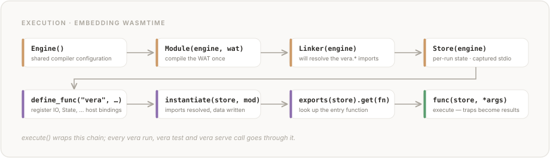
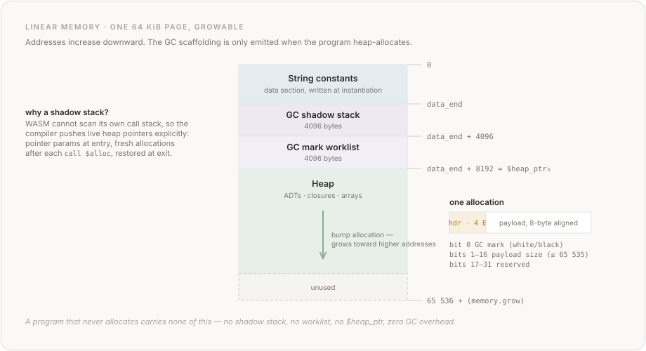

# Chapter 12: Runtime and Execution

## 12.1 Overview

Vera programs compile to WebAssembly (WASM) modules and execute in a host runtime. The reference implementation uses [wasmtime](https://wasmtime.dev/) as the WASM engine. The runtime is responsible for:

- Instantiating compiled WASM modules
- Providing host function implementations for effects (`IO`, `State<T>`)
- Managing linear memory (for string constants, heap-allocated ADTs, and arrays)
- Capturing output and state for the caller
- Handling traps and runtime errors

The runtime is deliberately minimal. It provides only what is needed to execute the compiled WASM — there is no scheduler. IO operations cover standard output (`print`), standard input (`read_line`), file access (`read_file`, `write_file`), command-line arguments (`args`), environment variables (`get_env`), and process exit (`exit`). Memory is managed automatically by a conservative mark-sweep garbage collector compiled into each WASM module (see Section 12.5.4). Future runtime features (networking, async, inference) will extend this model without changing its fundamentals.

## 12.2 WASM Module Structure

A compiled Vera module is a standalone WASM module containing:

### 12.2.1 Exports

Every compilable top-level function is exported by name. The entry point for `vera run` is resolved as follows:

1. If `--fn <name>` is provided, call that function.
2. Otherwise, if a function named `main` exists, call `main`.
3. Otherwise, call the first exported function.

Functions whose parameter or return types have no WASM representation (e.g., `Array<T>` return values, higher-kinded types) are skipped during compilation with a warning — they do not appear in the module's exports. Functions with `String` parameters are supported: the compiler emits a bump allocator and the host CLI allocates string arguments in linear memory before calling the function.

### 12.2.2 Imports

The module imports host functions from the runtime for two distinct reasons. The first is effect operations: `IO.print`, `Http.get`, `State.put`, and so on bind to host-provided implementations. The second is pure host-backed built-ins such as `log`, `sin`, `cos`, `atan2` — these have no WASM instruction equivalent and so are routed through host imports (`vera.log`, `vera.sin`, …) even though the Vera-level functions are pure. Each entry in the table below lists its condition; a module only imports what it actually uses.

| Import | Signature | Condition |
|--------|-----------|-----------|
| `vera.print` | `(i32, i32) -> ()` | Program uses `IO.print` |
| `vera.read_line` | `() -> (i32, i32)` | Program uses `IO.read_line` |
| `vera.read_char` | `() -> (i32)` | Program uses `IO.read_char` |
| `vera.read_file` | `(i32, i32) -> (i32)` | Program uses `IO.read_file` |
| `vera.write_file` | `(i32, i32, i32, i32) -> (i32)` | Program uses `IO.write_file` |
| `vera.args` | `() -> (i32, i32)` | Program uses `IO.args` |
| `vera.exit` | `(i64) -> ()` | Program uses `IO.exit` |
| `vera.get_env` | `(i32, i32) -> (i32)` | Program uses `IO.get_env` |
| `vera.sleep` | `(i64) -> ()` | Program uses `IO.sleep` |
| `vera.time` | `() -> (i64)` | Program uses `IO.time` |
| `vera.stderr` | `(i32, i32) -> ()` | Program uses `IO.stderr` |
| `vera.random_int` | `(i64, i64) -> (i64)` | Program uses `Random.random_int` |
| `vera.random_float` | `() -> (f64)` | Program uses `Random.random_float` |
| `vera.random_bool` | `() -> (i32)` | Program uses `Random.random_bool` |
| `vera.log` | `(f64) -> (f64)` | Program uses `log` |
| `vera.log2` | `(f64) -> (f64)` | Program uses `log2` |
| `vera.log10` | `(f64) -> (f64)` | Program uses `log10` |
| `vera.sin` | `(f64) -> (f64)` | Program uses `sin` |
| `vera.cos` | `(f64) -> (f64)` | Program uses `cos` |
| `vera.tan` | `(f64) -> (f64)` | Program uses `tan` |
| `vera.asin` | `(f64) -> (f64)` | Program uses `asin` |
| `vera.acos` | `(f64) -> (f64)` | Program uses `acos` |
| `vera.atan` | `(f64) -> (f64)` | Program uses `atan` |
| `vera.atan2` | `(f64, f64) -> (f64)` | Program uses `atan2` |
| `vera.state_get_{T}` | `() -> {wasm_t}` | Program uses `State<T>.get` |
| `vera.state_put_{T}` | `({wasm_t}) -> ()` | Program uses `State<T>.put` |
| `vera.contract_fail` | `(i32, i32) -> ()` | Program has runtime contracts |
| `vera.md_parse` | `(i32, i32) -> (i32)` | Program uses `md_parse` |
| `vera.md_render` | `(i32) -> (i32, i32)` | Program uses `md_render` |
| `vera.md_has_heading` | `(i32, i64) -> (i32)` | Program uses `md_has_heading` |
| `vera.md_has_code_block` | `(i32, i32, i32) -> (i32)` | Program uses `md_has_code_block` |
| `vera.md_extract_code_blocks` | `(i32, i32, i32) -> (i32, i32)` | Program uses `md_extract_code_blocks` |

Imports are only emitted when the program actually uses the corresponding host-backed feature — either an effect operation (`IO.*`, `Http.*`, `State.*`, `Random.*`, …) or a pure host-backed built-in (`vera.log`, `vera.sin`, `vera.atan2`, …). A pure program that uses only inlined built-ins (`pi()`, `sign`, `clamp`, arithmetic operators) produces a module with no imports.

### 12.2.3 Linear Memory

The module exports one page (64 KiB) of linear memory as `"memory"`. The host runtime uses this export to read string data for `IO.print` and to write data returned by host functions (e.g., `IO.read_line`, `IO.read_file`).

When the program uses IO operations that return strings or ADTs — `IO.read_line`, `IO.read_file`, `IO.write_file`, `IO.args`, `IO.get_env` — the module also exports the `$alloc` function so the host can allocate memory in the WASM linear memory for return values. The fire-and-forget operations (`IO.print`, `IO.exit`, `IO.sleep`, `IO.time`, `IO.stderr`) don't allocate: `vera.print`, `vera.stderr`, and `vera.sleep` take only primitive parameters and return nothing; `vera.time` returns an `i64` scalar; `vera.exit` traps without returning. Modules that use only these operations don't need `$alloc` exported.

For the memory layout, see Section 12.5.

### 12.2.4 Data Section

String constants are stored in the WASM data section at the start of linear memory (offset 0). The string pool deduplicates identical strings. Each string is stored as raw UTF-8 bytes with no null terminator.

For the string pool implementation, see Chapter 11, Section 11.5.

## 12.3 Host Runtime

### 12.3.1 Wasmtime Integration

The reference runtime uses wasmtime's Python bindings. The execution pipeline is:



<details>
<summary>Text version</summary>

```text
Engine → Module(engine, wat) → Linker(engine) → Store(engine)
  → linker.define_func(...)   [register host functions]
  → linker.instantiate(store, module)
  → instance.exports(store).get(fn_name)
  → func(store, *args)
```

</details>

Each execution creates a fresh engine, module, linker, and store. There is no persistent state between invocations.

### 12.3.2 Module Instantiation

The linker resolves all imports before instantiation. If the module imports a host function that the linker has not defined, instantiation fails with an error.

The linker registers host functions before instantiation:
1. IO host functions — registered for each IO operation the module imports (`vera.print`, `vera.read_line`, `vera.read_file`, `vera.write_file`, `vera.args`, `vera.exit`, `vera.get_env`, `vera.sleep`, `vera.time`, `vera.stderr`).
2. `vera.state_get_{T}` / `vera.state_put_{T}` — registered for each concrete `State<T>` type used by the program.

### 12.3.3 Entry Point Resolution

After instantiation, the runtime resolves the function to call:

1. If `--fn <name>` is specified, look up `name` in the module's exports.
2. Otherwise, look up `main`.
3. Otherwise, use the first export.
4. If no exports exist, raise an error.

Arguments are passed as WASM values. The CLI parses string arguments to integers or floats based on the function's WASM parameter types.

## 12.4 Host Function Bindings

### 12.4.1 IO Operations

The IO effect provides ten host function bindings. Each is imported only when the program uses the corresponding `IO.*` qualified call.

#### 12.4.1.1 IO.print

**Import:** `(import "vera" "print" (func $vera.print (param i32 i32)))`

**Parameters:**
- `ptr` (i32): byte offset into linear memory where the string data begins.
- `len` (i32): length of the string in bytes.

**Behaviour:**
1. Read `len` bytes from linear memory starting at offset `ptr`.
2. Decode the bytes as UTF-8.
3. Write the decoded string to standard output.

The output is captured in a buffer so the caller can inspect it programmatically (e.g., in tests). The `ExecuteResult` returned by `execute()` includes a `stdout` field containing all captured output.

#### 12.4.1.2 IO.read\_line

**Import:** `(import "vera" "read_line" (func $vera.read_line (result i32 i32)))`

**Returns:** `(ptr, len)` — a String pair (byte offset and length).

**Behaviour:**
1. Read one line from standard input (up to and including the newline character).
2. Strip the trailing newline.
3. Call the exported `$alloc` function to allocate memory in the WASM module.
4. Copy the UTF-8 bytes into linear memory.
5. Return the `(ptr, len)` pair.

The `execute()` function accepts an optional `stdin` parameter. If provided, `read_line` reads from that string (via a `StringIO` buffer). If not provided, it reads from the process's standard input.

#### 12.4.1.3 IO.read\_file

**Import:** `(import "vera" "read_file" (func $vera.read_file (param i32 i32) (result i32)))`

**Parameters:**
- `path_ptr` (i32): byte offset of the file path string.
- `path_len` (i32): length of the file path in bytes.

**Returns:** `i32` — a heap pointer to a `Result<String, String>` ADT value.

**Behaviour:**
1. Decode the file path from linear memory.
2. Attempt to read the file contents as UTF-8.
3. On success: construct a `Result.Ok` ADT on the WASM heap containing the file contents as a String (tag=0, str\_ptr, str\_len). Return the heap pointer.
4. On failure: construct a `Result.Err` ADT containing the error message (tag=1, str\_ptr, str\_len). Return the heap pointer.

The host allocates memory via the exported `$alloc` function.

#### 12.4.1.4 IO.write\_file

**Import:** `(import "vera" "write_file" (func $vera.write_file (param i32 i32 i32 i32) (result i32)))`

**Parameters:**
- `path_ptr` (i32): byte offset of the file path string.
- `path_len` (i32): length of the file path in bytes.
- `data_ptr` (i32): byte offset of the content string.
- `data_len` (i32): length of the content in bytes.

**Returns:** `i32` — a heap pointer to a `Result<Unit, String>` ADT value.

**Behaviour:**
1. Decode the file path and content from linear memory.
2. Attempt to write the content to the file.
3. On success: construct a `Result.Ok` ADT with tag=0 (no payload for Unit). Return the heap pointer.
4. On failure: construct a `Result.Err` ADT containing the error message (tag=1, str\_ptr, str\_len). Return the heap pointer.

#### 12.4.1.5 IO.args

**Import:** `(import "vera" "args" (func $vera.args (result i32 i32)))`

**Returns:** `(ptr, count)` — an Array\<String\> pair (pointer to element data and element count).

**Behaviour:**
1. Retrieve the command-line arguments (passed via `execute(cli_args=...)` or from the CLI `--` separator).
2. For each argument string, allocate memory in the WASM module and copy the UTF-8 bytes.
3. Allocate backing storage for the array: `count * 8` bytes (each element is a `(ptr, len)` pair of two i32 values).
4. Return `(backing_ptr, count)`.

#### 12.4.1.6 IO.exit

**Import:** `(import "vera" "exit" (func $vera.exit (param i64)))`

**Parameters:**
- `code` (i64): the exit code.

**Behaviour:**
1. Record the exit code.
2. Raise an exception to halt WASM execution.

The `execute()` function catches this exception and returns an `ExecuteResult` with `exit_code` set to the provided value. The CLI uses this as the process exit code. The WASM instruction sequence for `IO.exit` includes `unreachable` after the call, since the function never returns.

#### 12.4.1.7 IO.get\_env

**Import:** `(import "vera" "get_env" (func $vera.get_env (param i32 i32) (result i32)))`

**Parameters:**
- `name_ptr` (i32): byte offset of the environment variable name.
- `name_len` (i32): length of the name in bytes.

**Returns:** `i32` — a heap pointer to an `Option<String>` ADT value.

**Behaviour:**
1. Decode the variable name from linear memory.
2. Look up the variable in the environment (from `execute(env_vars=...)` or `os.environ`).
3. If found: construct an `Option.Some` ADT containing the value as a String (tag=1, str\_ptr, str\_len). Return the heap pointer.
4. If not found: construct an `Option.None` ADT (tag=0). Return the heap pointer.

#### 12.4.1.8 IO.sleep

**Import:** `(import "vera" "sleep" (func $vera.sleep (param i64)))`

**Parameters:**
- `ms` (i64): duration to pause, in milliseconds. Treated as `Nat` (non-negative).

**Behaviour:**
1. If `ms <= 0`, return immediately.
2. Otherwise, block the current thread for approximately `ms` milliseconds before returning.

Precision is host-dependent. The Python runtime uses `time.sleep(ms / 1000.0)`. The browser runtime busy-waits on `performance.now()` because `Atomics.wait` isn't available on the main thread — long sleeps will block rendering and should be avoided in the browser.

#### 12.4.1.9 IO.time

**Import:** `(import "vera" "time" (func $vera.time (result i64)))`

**Parameters:** none (the `Unit` argument at the Vera level is erased at the WASM boundary).

**Returns:** `i64` — the current Unix timestamp in milliseconds (non-negative, treated as `Nat` at the Vera level).

**Behaviour:** Return `floor(current_time_in_milliseconds_since_1970)`. The Python runtime uses `time.time()`; the browser uses `Date.now()`.

#### 12.4.1.10 IO.stderr

**Import:** `(import "vera" "stderr" (func $vera.stderr (param i32 i32)))`

**Parameters:**
- `ptr` (i32): byte offset of the message in linear memory.
- `len` (i32): length of the message in bytes.

**Behaviour:**
1. Decode `len` bytes from `ptr` as UTF-8.
2. Write the decoded text to the runtime's stderr sink — by default the host's `sys.stderr` (Python) or `console.error`-equivalent buffer (browser). Tests can opt in to capture via `execute(capture_stderr=True)`, which routes writes to `ExecuteResult.stderr`.

No line terminator is added; callers include `\n` if they want one. Mirrors `IO.print` but for the stderr stream.

### 12.4.2 State\<T\>

**Imports:** One pair per concrete state type:

```wat
(import "vera" "state_get_Int" (func $vera.state_get_Int (result i64)))
(import "vera" "state_put_Int" (func $vera.state_put_Int (param i64)))
```

**State cells:** The host runtime maintains one mutable cell per concrete `State<T>` type. Cells are initialized to zero (0 for integers, 0.0 for floats). The `execute()` function accepts an optional `initial_state` parameter to override initial values for testing.

**Type mapping:**
| Vera State Type | WASM Type | Default |
|----------------|-----------|---------|
| `State<Int>` | `i64` | `0` |
| `State<Nat>` | `i64` | `0` |
| `State<Bool>` | `i32` | `0` |
| `State<Byte>` | `i32` | `0` |
| `State<Float64>` | `f64` | `0.0` |

**get:** Returns the current value of the state cell.

**put:** Replaces the value of the state cell with the argument.

Multiple independent state types can coexist — each has its own cell and its own pair of host functions.

### 12.4.3 Contract Violations

**Import:** `(import "vera" "contract_fail" (func $vera.contract_fail (param i32 i32)))`

**Parameters:**
- `ptr` (i32): byte offset into linear memory where the violation message begins.
- `len` (i32): length of the violation message in bytes.

**Behaviour:**
1. Read `len` bytes from linear memory starting at offset `ptr`.
2. Decode the bytes as UTF-8.
3. Store the decoded message for later reporting.

The WASM code always follows a `call $vera.contract_fail` with `unreachable`, causing a WASM trap. The host runtime catches the trap and converts it to an informative error using the stored violation message.

The import is only emitted when the program contains runtime contract assertions (Tier 3 contracts that the verifier could not prove statically). Programs where all contracts are verified at compile time do not import `contract_fail`.

### 12.4.4 Markdown Operations

The Markdown standard library provides five host function bindings for parsing and querying Markdown documents. Each is imported only when the program uses the corresponding builtin function. All five functions are pure — they have no side effects and produce deterministic results.

For the `MdInline` and `MdBlock` ADT definitions, see Section 9.3.5 and Section 9.3.6. For the function specifications, see Section 9.7.3.

#### 12.4.4.1 md\_parse

**Import:** `(import "vera" "md_parse" (func $vera.md_parse (param i32 i32) (result i32)))`

**Parameters:**
- `ptr` (i32): byte offset of the Markdown source string.
- `len` (i32): length of the source string in bytes.

**Returns:** `i32` — a heap pointer to a `Result<MdBlock, String>` ADT value.

**Behaviour:**
1. Decode the Markdown source from linear memory.
2. Parse it into an `MdDocument` AST.
3. On success: construct a `Result.Ok` ADT containing the `MdDocument` tree on the WASM heap. Return the heap pointer.
4. On failure: construct a `Result.Err` ADT containing the error message. Return the heap pointer.

The host allocates all tree nodes (including nested `MdBlock` and `MdInline` values) via the exported `$alloc` function.

#### 12.4.4.2 md\_render

**Import:** `(import "vera" "md_render" (func $vera.md_render (param i32) (result i32 i32)))`

**Parameters:**
- `block_ptr` (i32): heap pointer to an `MdBlock` ADT value.

**Returns:** `(ptr, len)` — a String pair containing the rendered Markdown text.

**Behaviour:**
1. Read the `MdBlock` tree from WASM linear memory by tag dispatch.
2. Render it to canonical Markdown text.
3. Allocate memory for the result string via `$alloc`.
4. Return the `(ptr, len)` pair.

#### 12.4.4.3 md\_has\_heading

**Import:** `(import "vera" "md_has_heading" (func $vera.md_has_heading (param i32 i64) (result i32)))`

**Parameters:**
- `block_ptr` (i32): heap pointer to an `MdBlock` ADT value.
- `level` (i64): the heading level to search for (1–6).

**Returns:** `i32` — 1 if a heading of the given level exists, 0 otherwise.

#### 12.4.4.4 md\_has\_code\_block

**Import:** `(import "vera" "md_has_code_block" (func $vera.md_has_code_block (param i32 i32 i32) (result i32)))`

**Parameters:**
- `block_ptr` (i32): heap pointer to an `MdBlock` ADT value.
- `lang_ptr` (i32): byte offset of the language string.
- `lang_len` (i32): length of the language string in bytes.

**Returns:** `i32` — 1 if a fenced code block with the given language exists, 0 otherwise.

#### 12.4.4.5 md\_extract\_code\_blocks

**Import:** `(import "vera" "md_extract_code_blocks" (func $vera.md_extract_code_blocks (param i32 i32 i32) (result i32 i32)))`

**Parameters:**
- `block_ptr` (i32): heap pointer to an `MdBlock` ADT value.
- `lang_ptr` (i32): byte offset of the language string.
- `lang_len` (i32): length of the language string in bytes.

**Returns:** `(ptr, count)` — an `Array<String>` pair (pointer to element data and element count).

**Behaviour:**
1. Read the `MdBlock` tree from WASM linear memory.
2. Recursively find all fenced code blocks whose language matches the given string.
3. Allocate backing storage for the result array via `$alloc`.
4. Return `(backing_ptr, count)`.

### 12.4.5 Random Operations

The `Random` effect provides three host-backed operations for non-deterministic value generation. None allocate or return heap data, so modules that use only `Random` (alongside e.g. arithmetic) don't need `$alloc` exported.

#### 12.4.5.1 Random.random\_int

**Import:** `(import "vera" "random_int" (func $vera.random_int (param i64 i64) (result i64)))`

**Parameters:**
- `low` (i64): inclusive lower bound.
- `high` (i64): inclusive upper bound.

**Returns:** `i64` — an integer drawn uniformly from `[low, high]`.

**Behaviour:** The Python runtime calls `random.randint(low, high)`; the browser runtime computes `floor(Math.random() * (high - low + 1)) + low`. Caller is required by contract (`requires(@Int.0 <= @Int.1)`) to ensure `low <= high`; the host does not double-check.

#### 12.4.5.2 Random.random\_float

**Import:** `(import "vera" "random_float" (func $vera.random_float (result f64)))`

**Parameters:** none (the `Unit` argument at the Vera level is erased at the WASM boundary).

**Returns:** `f64` — a value in `[0.0, 1.0)`.

**Behaviour:** The Python runtime calls `random.random()`; the browser runtime calls `Math.random()`.

#### 12.4.5.3 Random.random\_bool

**Import:** `(import "vera" "random_bool" (func $vera.random_bool (result i32)))`

**Parameters:** none (Unit erased).

**Returns:** `i32` — `0` or `1`, each with probability ≈ 0.5.

**Behaviour:** Both runtimes derive the bit from a uniform draw (`random.random() < 0.5` and `Math.random() < 0.5` respectively). No determinism / seeding API is offered; a seeding API remains future work.

## 12.5 Memory Model

### 12.5.1 Linear Memory Layout



<details>
<summary>Text version</summary>

```text
┌──────────────────────────────────┐  offset 0
│  String constants (data section) │
├──────────────────────────────────┤  data_end
│  GC shadow stack (4096 bytes)    │
├──────────────────────────────────┤  data_end + 4096
│  GC mark worklist (4096 bytes)   │
├──────────────────────────────────┤  data_end + 8192 = $heap_ptr (initial)
│  Heap-allocated data             │
│  (ADTs, closures, arrays)        │
│  ↓ grows toward higher addresses │
├──────────────────────────────────┤
│  (unused)                        │
└──────────────────────────────────┘  65536+ (64 KiB, growable)
```

</details>

String constants occupy the lowest addresses. The GC shadow stack and mark worklist each occupy 4096 bytes after the string data. The heap grows toward higher addresses from `data_end + 8192`. The GC infrastructure (shadow stack, worklist, and heap offset) is only emitted when the program allocates heap data.

### 12.5.2 Allocator

The heap uses a bump allocator with a free-list overlay. A mutable WASM global `$heap_ptr` tracks the next free byte. Every allocation prepends a 4-byte header before the payload:

```
Header (i32 at ptr - 4):
  bit 0:     GC mark flag (0=white, 1=black)
  bits 1-16: payload size in bytes (max 65535)
  bits 17-31: reserved
```

The internal `$alloc(payload_size)` function:

1. Computes `total = align_up(payload_size + 4, 8)` (header + payload, 8-byte aligned).
2. Searches the free list for a first-fit block with `header.size >= payload_size`. If found, unlinks it and returns the payload pointer.
3. If `heap_ptr + total` exceeds available memory, triggers `$gc_collect` and retries the free list.
4. If still insufficient, calls `memory.grow` to extend linear memory.
5. Stores the header at `heap_ptr`, advances `heap_ptr` by `total`, and returns `heap_ptr_old + 4`.

The allocator, GC infrastructure, and `$heap_ptr` global are only emitted when the program actually allocates heap data (ADTs, closures, or arrays). Programs that perform no allocation incur zero GC overhead.

### 12.5.3 Alignment

All heap allocations are 8-byte aligned. This ensures correct access for all WASM value types:

| WASM Type | Size | Alignment |
|-----------|------|-----------|
| `i32` | 4 bytes | 4 bytes |
| `i64` | 8 bytes | 8 bytes |
| `f64` | 8 bytes | 8 bytes |

8-byte alignment satisfies all requirements.

### 12.5.4 Garbage Collection

The runtime implements a conservative mark-sweep garbage collector entirely in WASM (no host-side GC logic). The GC is triggered automatically when the bump allocator runs out of space.


**Shadow stack.** WASM does not support stack scanning, so the compiler maintains an explicit shadow stack in linear memory. The compiler pushes live heap pointers onto it at function entry (pointer-type parameters), after each `call $alloc` (newly allocated objects), and manages save/restore at function exit. Four globals track the shadow stack and GC state:

| Global | Type | Purpose |
|--------|------|---------|
| `$gc_sp` | `mut i32` | Shadow stack pointer (current top) |
| `$gc_stack_base` | `i32` | Shadow stack base address (`data_end`) |
| `$gc_heap_start` | `i32` | Heap start address (`data_end + 8192`) |
| `$gc_free_head` | `mut i32` | Free list head pointer |

**Collection phases.** The `$gc_collect` function performs three phases:

1. **Clear marks:** Walk the heap linearly from `$gc_heap_start` to `$heap_ptr`, clearing the mark bit in each object header.
2. **Mark:** Seed a worklist from shadow stack entries that point into the heap. Drain the worklist iteratively: for each object, set its mark bit, then conservatively scan every i32-aligned word in the payload. Any word that looks like a valid heap pointer (correct range and alignment) is pushed onto the worklist.
3. **Sweep:** Walk the heap again, linking unmarked objects into the free list for reuse by `$alloc`.

**Conservative scanning.** The collector treats any i32 word whose value falls within the heap range and has correct payload alignment as a potential pointer. This eliminates the need for type descriptors or GC maps. False positives merely retain dead objects (harmless for mark-sweep).

**Memory growth.** If collection does not free enough space, `$alloc` calls `memory.grow` to extend linear memory beyond the initial 64 KiB page. If memory growth fails, the program traps.

## 12.6 Execution Flow

### 12.6.1 Compilation, Instantiation, and Call

The full pipeline from source to result:

```
Source (.vera)
  → parse_file()           Lark parse tree
  → transform()            Typed AST
  → typecheck()            Type diagnostics
  → compile()              CompileResult (WAT + WASM bytes)
  → execute()              ExecuteResult (value + stdout + stderr + state)
```

The `compile()` step produces WAT text and assembles it to WASM bytes via `wasmtime.wat2wasm()`. The `execute()` step instantiates the WASM module and calls the specified function.

### 12.6.2 Argument Passing

Arguments are passed to the WASM function as typed values:

- `Int` / `Nat` arguments → `i64` values
- `Bool` / `Byte` arguments → `i32` values
- `Float64` arguments → `f64` values

The CLI (`vera run file.vera --fn f -- 42 3.14`) parses string arguments to the appropriate types using the function's WASM signature. Integer arguments become `i64`; decimal arguments become `f64`; `true`/`false` (case-insensitive) become `i32` for `Bool` parameters; String arguments are allocated in WASM linear memory and passed as `(ptr, len)` pairs; `Byte` arguments are parsed as integers 0–255.

### 12.6.3 Return Value Extraction

The raw WASM return value is extracted and returned as a Python `int` or `float`:

- `i64` results → Python `int`
- `i32` results → Python `int`
- `f64` results → Python `float`
- Void results (Unit) → `None`

### 12.6.4 Stdout and Stderr Capture

All `IO.print` calls during execution write to an in-memory buffer. The buffer contents are returned in `ExecuteResult.stdout`. This allows programmatic inspection of output without interfering with the host process's stdout.

`IO.stderr` has a parallel capture path, but it's opt-in. By default, `IO.stderr` writes go directly to the host's `sys.stderr` (Python) or equivalent browser sink — this preserves the intuitive CLI behaviour where stderr reaches the terminal's stderr stream. Callers that want to capture stderr for inspection — typically tests — pass `execute(capture_stderr=True)`, which routes writes into an in-memory buffer exposed as `ExecuteResult.stderr`. When the flag is `False` (the default), `ExecuteResult.stderr` is an empty string, preserving the pre-`IO.stderr` shape of the result for backward compatibility.

The CLI prints `ExecuteResult.stdout` to the terminal after execution completes. If the function also returns a value, the value is printed after the captured output.

## 12.7 Error Handling

### 12.7.1 WASM Traps

WASM traps are unrecoverable runtime errors. The following conditions cause traps:

| Condition | WASM Instruction | Source |
|-----------|-----------------|--------|
| Integer division by zero | `i64.div_s` | `/` operator on Int |
| Unreachable code | `unreachable` | `assert` failure, bounds check failure |
| Out-of-bounds memory access | `i64.load`, etc. | Invalid pointer dereference |
| Integer overflow (in `i64.div_s`) | — | `Int.min_value / -1` |

When a trap occurs, the wasmtime engine raises a `WasmtimeError` or `Trap` exception. The CLI reports this as a runtime error and exits with a non-zero status.

### 12.7.2 Runtime Contract Violations

Contracts that the verifier could not prove statically (Tier 3) are compiled as runtime assertions. A failed runtime precondition or postcondition executes `unreachable`, causing a WASM trap.

For the contract insertion strategy, see Chapter 11, Section 11.8.

The `assert` expression also compiles to a conditional trap: if the condition is false, the program traps (see Chapter 11, Section 11.14).

### 12.7.3 Array Bounds Checking

Array index expressions are bounds-checked at runtime. If the index is negative or greater than or equal to the array length, the program traps via `unreachable`.

For the bounds checking implementation, see Chapter 11, Section 11.12.

## 12.8 Limitations

| Limitation | Issue |
|-----------|-------|
| Browser runtime: `IO.sleep` busy-waits on the main thread (freezing the tab for the sleep duration), because the current implementation uses `performance.now()` polling rather than yielding to the event loop.  Documented in §12.9.3.  Fix path: implement against the WebAssembly JavaScript Promise Integration (JSPI) proposal so the WASM call suspends on a `setTimeout` continuation; Asyncify is the fallback for browsers without JSPI. | [#609](https://github.com/aallan/vera/issues/609) |
| Browser runtime: ANSI escape sequences are not interpreted — `IO.print("\u{1B}[2J\u{1B}[H")` appears as literal control bytes in the DOM rather than clearing the screen and homing the cursor.  Fix path: a small ANSI-subset interpreter (~200 lines of JS) maintaining a virtual screen buffer, applied against a target `<pre>` element. | [#610](https://github.com/aallan/vera/issues/610) |

## 12.9 Browser Runtime

The browser runtime (`vera/browser/runtime.mjs`) is a self-contained JavaScript module that provides host function implementations for running compiled Vera WASM modules in the browser or Node.js. It is an alternative to the Python/wasmtime reference runtime described in Section 12.3.

### 12.9.1 Architecture

The runtime uses **dynamic import introspection** to work with any compiled Vera program. At initialization, it calls `WebAssembly.Module.imports(module)` to discover which host functions the module requires, then builds the import object containing only those bindings. This means the same runtime file works with every compiled Vera program — from a hello-world (1 import: `print`) to a markdown-heavy program (15+ imports).


State\<T\> bindings are pattern-matched from import names: `state_get_Int` and `state_put_Int` are recognized as `State<Int>` operations and dynamically paired.

### 12.9.2 Public API

```javascript
import init, { call, getStdout, getStderr, getState, resetState } from './vera-runtime.mjs';

// Initialize with a WASM module (URL or ArrayBuffer)
await init('module.wasm');

// Call exported functions
call('main');

// Retrieve captured output
const stdout = getStdout();
const stderr = getStderr();  // IO.stderr writes (#463)

// Read/reset state
const state = getState();
resetState();
```

The `init()` function follows the **init-then-use pattern**: async initialization, synchronous calls after. The module is cached — calling `init()` again with the same URL is a no-op.

### 12.9.3 IO Adaptations

The browser runtime provides browser-appropriate implementations of IO operations:

| Operation | Browser Behaviour | Reference (Python) Behaviour |
|-----------|-------------------|------------------------------|
| `IO.print` | Appends to internal buffer, flushed via `getStdout()` | Writes to stdout capture buffer |
| `IO.read_line` | Reads from pre-queued input array, falls back to `prompt()` | Reads from `stdin` parameter or process stdin |
| `IO.read_char` | Returns `Result.Err` — depends on JSPI suspend/resume ([#609](https://github.com/aallan/vera/issues/609), [#618](https://github.com/aallan/vera/issues/618)) | Termios raw-mode on TTY (Unix), `msvcrt.getwch()` (Windows), unbuffered read on piped input |
| `IO.read_file` | Returns `Result.Err("File I/O not available in browser")` | Reads from filesystem |
| `IO.write_file` | Returns `Result.Err("File I/O not available in browser")` | Writes to filesystem |
| `IO.args` | Returns configurable array (default empty) | Returns CLI arguments |
| `IO.exit` | Throws `VeraExit` error with exit code | Raises `_VeraExit` exception |
| `IO.get_env` | Returns `Option.None` (configurable map) | Reads from `os.environ` |
| `IO.sleep` | Busy-waits on `performance.now()` (main-thread blocking) | `time.sleep(ms / 1000.0)` |
| `IO.time` | `Date.now()` as BigInt | `int(time.time() * 1000)` |
| `IO.stderr` | Appends to internal buffer, flushed via `getStderr()` | Writes to `sys.stderr` or capture buffer |
| `async(Http.get/post(...))` (#841) | Eager: the request fires synchronously (XHR) at the `async(...)` point; `await` returns the buffered outcome | Concurrent: the request runs on a host worker thread; `await` blocks for it |
| `vera serve` / `<HttpServer>` handlers (#305) | Not available — the browser runtime does not host an HTTP accept loop | `vera serve` drives the accept loop with instance-per-request isolation |

All non-IO operations (State, contracts, Markdown) produce identical results in both runtimes; for fused async the *values* are identical and only request timing differs (spec-conformant — §9.5.4 says an implementation MAY evaluate concurrently). This is enforced by mandatory parity tests.

### 12.9.4 Memory Protocol

The JavaScript runtime follows the same memory protocol as the Python runtime (Section 12.5):

- **Never cache TypedArray views** across WASM calls — `memory.buffer` can be detached by `memory.grow`. Always create fresh views before each access.
- **BigInt for i64**: JavaScript WASM i64 values are `BigInt`, not `number`. The runtime handles the conversion transparently.
- **ADT layout**: All ADT values use the same byte layout as the Python runtime (tag at offset 0, fields at computed offsets matching `codegen/registration.py`).

### 12.9.5 CLI Integration

The `vera compile --target browser` command produces a ready-to-serve directory:

```
output_dir/
├── module.wasm          # Compiled WASM binary
├── vera-runtime.mjs     # Self-contained JavaScript runtime
└── index.html           # Loads and runs the program
```

The `index.html` file uses an ES module script that imports from `vera-runtime.mjs`, initializes the WASM module, calls `main()`, and displays the captured stdout in a `<pre>` element.

### 12.9.6 Parity Testing

The browser parity test suite (`tests/test_browser.py`) runs every compilable example through both the Python/wasmtime runtime and the Node.js/JS-runtime, asserting identical stdout output. This catches any drift between the two implementations. The tests cover IO operations, State operations, contract violations, Markdown parsing/rendering, and browser bundle emission.

Pre-commit hooks trigger parity tests on any change to the host binding surface (`vera/browser/`, `vera/codegen/api.py`, `vera/wasm/markdown.py`, `vera/markdown.py`). CI runs the full parity suite on every PR.
