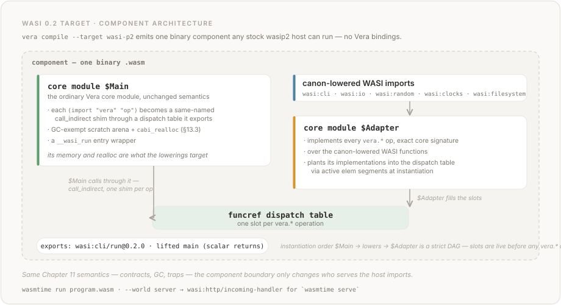

# Chapter 13: WASI Preview 2 Target

## 13.1 Overview

The `wasi-p2` compilation target packages a Vera program as a
**WebAssembly component** whose host imports are implemented on top of
WASI 0.2 interfaces.  The artifact runs under any stock wasip2 host —
`wasmtime run`, wasmtime-py's `component.Linker.add_wasip2()` — with no
Vera-specific host bindings.

```bash
vera compile --target wasi-p2 program.vera   # write a binary component
vera compile --target wasi-p2 --wat program.vera  # print component text
vera run --target wasi-p2 program.vera       # execute under the built-in wasip2 host
```

**Status: experimental.**  The target covers the **IO and Random host
families** (Section 13.4).  It is not a blanket "WASI 0.2 compliant"
mode: a program using any other host family (Http, Map, Set, Decimal,
Json, Html, Md, Regex, Math, Inference, State, Async) is rejected with
a diagnostic naming the unsupported family — never silently compiled
against the core target instead.

The core `wasm` target (Chapters 11–12) remains the default and the
canonical compilation model; the browser runtime (Section 12.9) is
unaffected.  The `wasi-p2` component embeds the **unchanged core
module** — post-processed only at the WAT level as described below —
so all Chapter 11 semantics (contract insertion, GC, traps) are
inherited, not reimplemented.

## 13.2 Component Architecture

The emitter (`vera/codegen/wasi.py`) produces a single component
wrapping two core modules:



<details>
<summary>Text version</summary>

```text
component
├── core module $Main      — the ordinary Vera core module, with:
│     · each (import "vera" "op") replaced by a same-named
│       call_indirect shim through a funcref dispatch table
│       that $Main defines and exports
│     · a GC-exempt scratch arena + cabi_realloc (Section 13.3)
│     · a __wasi_run entry wrapper
├── canon-lowered WASI imports (against $Main's memory + realloc)
├── core module $Adapter   — implements every vera.* op with its
│     exact core signature over the lowered WASI functions, and
│     plants itself into the dispatch table via active elem
│     segments at instantiation time
└── exports: wasi:cli/run@0.2.0 (+ a plain lifted `main` when the
    return type is scalar — Section 13.5)
```

</details>

Instantiation order `$Main` → lowers → `$Adapter` is a strict DAG (the
component model forbids instantiation cycles); dispatch-table slots are
written by `$Adapter`'s elem segments strictly before any lifted export
can run, so the shims never call through an unfilled slot.  The
dispatch table is defined *after* the closure table so existing
`call_indirect` sites keep table index 0.

Only the WASI interfaces an op-dependency closure actually needs are
imported: a print-only program imports exactly
`wasi:io/error`, `wasi:io/streams`, and `wasi:cli/stdout`.

## 13.3 The GC-Exempt Arena

Canonical-ABI lowering requires a `cabi_realloc` the host can call to
place lists and strings into guest memory.  Routing those allocations
through the Vera GC heap would be unsound: a collection between two
host writes inside one lowered call could move or sweep the
half-written block (the same use-after-free class as #593/#695, on the
host side).

Instead, `$Main` reserves a fixed 64 KiB scratch arena in linear
memory **below `gc_heap_start`**, so the mark-sweep collector never
scans or sweeps it:

- `cabi_realloc` is a bump allocator over the arena, reset at every
  op entry;
- a 128-byte slab at the arena base holds the fixed-size canonical-ABI
  return areas (retptrs);
- data crossing back into Vera (an `IO.read_file` payload, the
  `IO.args` array) is copied out into ordinary GC-heap blocks with
  explicit shadow-stack rooting, mirroring the host runtime's
  `_ShadowGuard` discipline.

Host data larger than the arena (for example an argv list over
64 KiB) traps cleanly rather than overflowing into the GC heap.


## 13.4 Supported Host Surface

| Vera operation | WASI 0.2 backing |
|---|---|
| `IO.print` / `IO.stderr` | `wasi:cli/stdout`, `wasi:cli/stderr` + `wasi:io/streams` (chunked at the 4096-byte `blocking-write-and-flush` cap) |
| `IO.read_line` / `IO.read_char` | `wasi:cli/stdin` + `wasi:io/streams` |
| `IO.read_file` / `IO.write_file` | `wasi:filesystem/types` + `wasi:filesystem/preopens` (paths resolve against the first preopened directory) |
| `IO.args` | `wasi:cli/environment.get-arguments` (skips `argv[0]`) |
| `IO.get_env` | `wasi:cli/environment.get-environment` |
| `IO.exit` | `wasi:cli/exit` (Section 13.6) |
| `IO.sleep` | `wasi:clocks/monotonic-clock` + `wasi:io/poll.subscribe-duration` |
| `IO.time` | `wasi:clocks/wall-clock.now` |
| `Random.random_int` / `random_float` / `random_bool` | `wasi:random/random.get-random-u64` (rejection-sampled for unbiased ranges) |

The runtime trap channels (`contract_fail`, `overflow_trap`) are also
implemented by the adapter: a contract-violation message is written to
WASI stderr before the trap fires, and integer-overflow traps keep
their classification (Section 13.6).

## 13.5 Entry Points

Every component exports `wasi:cli/run@0.2.0` — the world entry stock
`wasmtime run` invokes — whose `run` drives the program's `main`.

When `main` returns a scalar (`Int`/`Nat` as `s64`, `Float64` as
`float64`, or `Unit`), the component additionally exports a plain
lifted `main` returning that value; `vera run --target wasi-p2` calls
it and reports the value exactly as the core target does.  A `main`
returning `String` or a heap value (arrays, ADTs) has no scalar lift —
the pointer would be meaningless outside the instance — so execution
falls back to `wasi:cli/run` and no value is reported.

The target requires a public zero-argument `main`; `vera run --fn`
selects other exports on the core target only.

## 13.6 Divergences from the Core Target

These are inherent to WASI 0.2, not implementation gaps, and each is
pinned by tests:

- **Exit codes degrade to 0/1.**  `wasi:cli/exit@0.2.0` carries only
  ok/err, so `IO.exit(3)` surfaces as exit status 1 under *any* stock
  wasip2 host, including `vera run --target wasi-p2`.
- **No structured trap frames.**  A trap's backtrace does not cross
  the component boundary as data (spike check 5 in `WASI.md`); the
  trap *kind* and message are preserved — contract violations
  classify as `contract_violation` with the full violation text,
  overflow as `overflow` — but the `frames` list in the JSON trap
  envelope is empty.
- **Environment is a launch-time snapshot.**  The component receives
  its environment once via `get-environment`; the core target reads
  `os.environ` live.  Observable only if the host environment mutates
  mid-run.
- **String-returning `main` reports no value** (Section 13.5).
- **A lone `\r` is not a line terminator for `IO.read_line`.**  The
  adapter strips `\n` and a `\r` immediately before it (CRLF input —
  what Windows pipes actually contain — matches the core host, whose
  Python text layer does the same), but a bare `\r` *separator*
  (classic-Mac line endings) is returned as content where the core
  host treats it as a line break.  `IO.read_char` reads raw UTF-8
  codepoints, so it sees the `\r` of a CRLF pair that the core host's
  text layer collapses.

## 13.7 The Server World (`--world server`)

`vera compile --target wasi-p2 --world server` packages an
`<HttpServer>` program (Section 9.5.6) as a component exporting
`wasi:http/incoming-handler@0.2.0#handle` — the same handler contract
`vera serve` drives natively runs under stock `wasmtime serve`
unmodified:

```bash
vera compile --target wasi-p2 --world server examples/http_server.vera
wasmtime serve examples/http_server.wasm
```

The program must export a public `handle(@Request -> @Response)` (the
Section 9.5.6 validation rules).  A generated adapter wrapper reads
the incoming request's method, path-with-query, headers, and body
through the wasi:http interfaces, constructs the `Request` ADT in the
guest heap (using the compilation's own constructor layouts), calls
`handle`, decodes the returned `Response`, and drives the
outgoing-response resource sequence.  Guest traps map to a 500 from
the host.


**Headers without a host.**  `Request`/`Response` headers are
`Map<String, String>`, and Map operations are host imports on the
core target.  A Vera Map's representation is two plain guest-heap
blocks, so the server world implements the String-keyed Map
operations **in guest code** with the host's exact semantics
(position-preserving update, later-insert-wins, capacity growth) —
handlers use `map_new` / `map_insert` / `map_get` etc. unchanged.
Non-String Map instantiations, and every other host collection
family, are rejected by the family gate.

**Server-world surface.**  Alongside the in-guest String maps, the
handler may use `IO.print` / `IO.stderr` (routed to the serve host's
console), `IO.time` / `IO.sleep`, the `Random` family, and the pure
language.  `IO.read_line` / `read_char` /
`read_file` / `write_file` / `get_env` / `args` / `exit` are rejected
with a diagnostic: the wasi:http proxy world provides no stdin,
filesystem, or environment (verified by negative probe — the imports
do not link under stock `wasmtime serve`).

**v1 limits** (each a diagnostic or documented cap, never silent):
request and response bodies are buffered, not streamed; request
headers share the fixed arena (roughly 63 KiB combined); a response
status outside 0–65535 or a forbidden header answers 500 rather than
trapping the server.  Handler `IO.print` output is line-buffered by
the `wasmtime serve` host — a print whose content has no trailing
newline is held until a subsequent newline is written (and is lost on
shutdown if none ever is), so end each log line with `\n`.  (The
native `vera serve` driver does not buffer this way.)

`vera run` cannot execute a server-world artifact (wasmtime-py's
built-in host has no wasi:http support); it fails with a message
pointing at `wasmtime serve`.  The native `vera serve` driver
(Section 9.5.6) remains the Python-side way to run the same handler.

## 13.8 Conformance

The dual-target differential in `tests/test_wasi_target.py` runs every
deterministic run-level conformance program under both targets and
requires byte-identical stdout/stderr: 71 of the 88 run-level programs
execute identically (the remainder use host families outside the
target's surface, have no `main`, or depend on wall-clock time).  A
stock-host smoke test additionally runs the compiled artifact under
the `wasmtime` CLI where installed.
