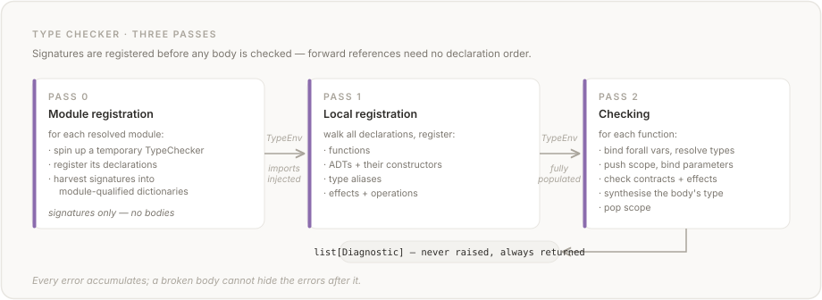
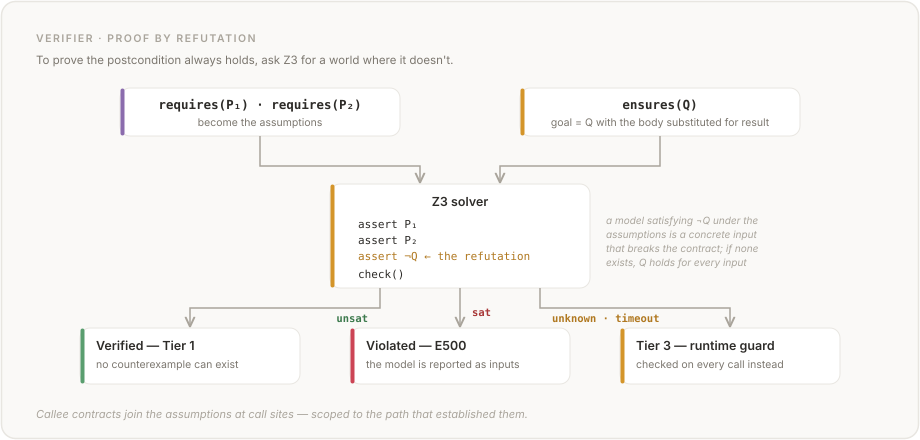
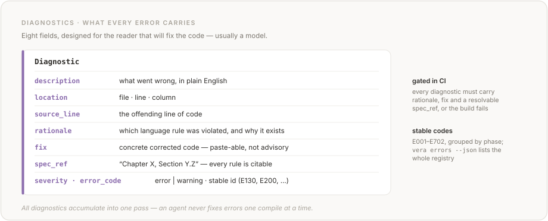

# Vera Reference Compiler

Architecture documentation for the Vera compiler (`vera/` package). This is for humans who want to understand, modify, or extend the reference implementation.

For other documentation:
- [Root README](../README.md) — project overview, getting started, language examples
- [SKILL.md](../SKILL.md) — language reference for LLM agents writing Vera code
- [spec/](../spec/) — formal language specification (13 chapters, 0-12)
- [CONTRIBUTING.md](../CONTRIBUTING.md) — contributor workflow and conventions

## Pipeline Overview

The compiler is a seven-stage pipeline. Each stage consumes the output of the previous one. Each stage has a single public entry point and is independently testable.


<details>
<summary>Text version</summary>

```text
Source (.vera)
  |
  v
1   Parse        grammar.lark + parser.py     -> Lark parse tree (LALR(1))
2   Transform    transform.py + ast.py        -> typed AST
2b  Resolve      resolver.py                  -> transitive module closure
3   Type Check   checker/ + environment.py    -> list[Diagnostic]
  |              (two passes: register every signature, then check bodies)
  |
  +--- vera verify ------------->  4  Verify   verifier.py + smt.py (Z3)
  |                                   each obligation proved (Tier 1) or
  |                                   deferred to a runtime guard (Tier 3)
  |                                   -> ok / diagnostics / tier counts
  |                                   sidecar: obligations/ + lsp/ -- warm
  |                                   incremental re-verification (LSP)
  v    vera compile / vera run
5   Compile      codegen/ + wasm/             -> WAT + .wasm
  |              monomorphize generics / insert contract guards
  +------------------------------>  Browser bundle   (--target browser)
  +------------------------------>  WASI 0.2 component (--target wasi-p2)
  v
6   Execute      runtime/ + wasmtime          vera run / test / serve

Cross-cutting: cli.py (orchestrates every stage) / errors.py (Diagnostic,
E-codes) / formatter.py (vera fmt) / tester.py (vera test).
Nothing exits early -- every stage accumulates diagnostics, so an agent
gets all feedback in one pass.
```

</details>

Errors never cause early exit. Parse errors raise exceptions (the tree is incomplete), but the type checker and verifier **accumulate** all diagnostics and return them as a list. This is critical for LLM consumption — the model gets all feedback in one pass.

Public entry points (from `parser.py` and `codegen/`):

```python
parse(source, file=None)        # → Lark Tree
parse_file(path)                # → Lark Tree (from disk)
parse_to_ast(source, file=None) # → Program AST
typecheck_file(path)            # → list[Diagnostic]
verify_file(path)               # → VerifyResult
compile(program, verify_result) # → CompileResult (WAT + WASM bytes)
execute(compile_result, ...)    # → run WASM via wasmtime
```

## Module Map

| Module | Lines | Stage | Purpose | Key API |
|--------|------:|-------|---------|---------|
| `grammar.lark` | 343 | Parse | LALR(1) grammar definition | *(consumed by Lark)* |
| `parser.py` | 153 | Parse | Lark frontend, error diagnosis | `parse()`, `parse_file()` |
| `transform.py` | 1,390 | Transform | Lark tree → AST transformer | `transform()` |
| `ast.py` | 875 | Transform | Frozen dataclass AST nodes, source formatting | `Program`, `Node`, `Expr`, `format_expr` |
| `types.py` | 533 | Type check | Semantic type representation | `Type`, `is_subtype()` |
| `environment.py` | 2,002 | Type check | Type environment, scope stacks, ability registry, all built-in registrations | `TypeEnv`, `AbilityInfo` |
| `checker/` | 4,745 | Type check | Two-pass type checker (mixin package) | `typecheck()` |
| `  core.py` | 395 | | TypeChecker class, orchestration, contracts, constraint validation | |
| `  resolution.py` | 217 | | AST TypeExpr → semantic Type, inference | |
| `  modules.py` | 153 | | Cross-module registration (C7b/C7c) | |
| `  registration.py` | 376 | | Pass 1 forward declarations, ability registration | |
| `  expressions.py` | 624 | | Expression synthesis (bidirectional), operators, statements | |
| `  eq_ability.py` | 199 | | Eq ability derivation checks | |
| `  calls.py` | 610 | | Function/constructor/module/ability calls | |
| `  control.py` | 508 | | If/match, patterns, effect handlers | |
| `resolver.py` | 332 | Resolve | Module path resolution, parse cache | `ModuleResolver` |
| `smt.py` | 2,809 | Verify | Z3 translation layer | `SmtContext`, `SlotEnv` |
| `verifier.py` | 6,582 | Verify | Contract verification | `verify()` |
| `wasm/` | 23,463 | Compile | WASM translation layer (package) | `WasmContext`, `WasmSlotEnv`, `StringPool` |
| ` ├ context.py` | 829 | | Composed WasmContext, expression dispatcher, block translation | |
| ` ├ helpers.py` | 421 | | WasmSlotEnv, StringPool, type mapping, array element helpers | |
| ` ├ inference.py` | 1,747 | | Type inference, slot/type utilities, operator tables | |
| ` ├ operators.py` | 1,581 | | Binary/unary operators, if, quantifiers, assert/assume, old/new | |
| ` ├ calls.py` | 847 | | Core dispatcher for `_translate_call` / `_translate_qualified_call`, generic resolution, shared element-type inference (domain mixins below) | |
| ` ├ calls_arrays.py` | 2,535 | | `array_length` / `append` / `range` / `concat` / `slice` / `map` / `filter` / `fold` / `mapi` / `reverse` / `find` / `any` / `all` / `flatten` / `sort_by` | |
| ` ├ calls_containers.py` | 1,127 | | Map, Set, Decimal (opaque-handle types) | |
| ` ├ calls_encoding.py` | 2,210 | | Base64 and URL encoding/decoding/parsing | |
| ` ├ calls_handlers.py` | 406 | | Show/Hash ability dispatch, `handle[State<T>]` and `handle[Exn<E>]` | |
| ` ├ calls_markup.py` | 396 | | JSON, HTML, Markdown, Regex, async/await (#841: fused concurrent lowering for `async(Http.get/post)`, identity otherwise) | |
| ` ├ async_fusion.py` | 218 | | #841 fusion predicates — the single source of truth shared by the `_scan_io_ops` import pre-scan and the `WasmContext` async/await lowering | `fused_async_target()`, `await_needs_check()`, `compute_future_ret_fns()` |
| ` ├ calls_math.py` | 635 | | `abs`, `min`, `max`, `floor`, `ceil`, `round`, `sqrt`, `pow`, Float64 predicates, numeric conversions | |
| ` ├ calls_parsing.py` | 1,035 | | `parse_nat` / `parse_int` / `parse_bool` / `parse_float64` state machines | |
| ` ├ calls_strings.py` | 4,067 | | All string ops (length, concat, slice, search, transform, split, join, chars/lines/words, reverse, trim_start/end, pad_start/end, char_to_upper/lower, classifiers) + to-string conversions; `_translate_strip` delegates to the trim helper to keep the whitespace predicate consistent | |
| ` ├ closures.py` | 516 | | Closures, anonymous functions, free variable analysis | |
| ` ├ data.py` | 969 | | Constructors, match expressions (incl. nested patterns), arrays, indexing | |
| ` ├ markdown.py` | 651 | | WASM memory marshalling for MdInline/MdBlock ADTs | |
| ` ├ json_serde.py` | 265 | | WASM memory marshalling for Json ADT | |
| ` └ html_serde.py` | 261 | | WASM memory marshalling for HtmlNode ADT | |
| `markdown.py` | 651 | Compile | Python Markdown parser/renderer (§9.7.3 subset) | `parse_markdown()`, `render_markdown()`, `has_heading()`, `has_code_block()`, `extract_code_blocks()` |
| `obligations/` | 729 | Verify | Reified proof obligations + warm incremental session (#222 A/B) | `ProofObligation`, `VerificationSession` |
| `  core.py` | 109 | | ProofObligation record: identity (content_key) + discharge outcome | |
| `  cache.py` | 219 | | Invalidation keys (structural/callee/context hashes), DischargeCache | |
| `  session.py` | 252 | | Warm-Z3 daemon: per-function replay vs re-verify in declaration order | |
| `lsp/` | 1,397 | Serve | Language Server Protocol over stdio (#222 C/D/E/F) | `create_server()`, `vera lsp` |
| `  convert.py` | 144 | | Span/SourceLocation/LSP coordinate conversions, UTF-16 transcoding | |
| `  documents.py` | 69 | | URI-keyed document store, full-text sync | |
| `  features.py` | 292 | | Diagnostics + tier hints, hover, slot goto, hole completion | |
| `  extensions.py` | 146 | | vera/speculativeEdit proof-delta | |
| `  server.py` | 169 | | pygls wiring, single-session serialisation | |
| `codegen/` | 14,608 | Compile | Codegen orchestrator (mixin package) | `compile()`, `execute()` |
| `  api.py` | 1,306 | | Public API, dataclasses, `compile()`/`execute()` orchestration, core IO host bindings (#421) | |
| `  memory.py` | 77 | | Compile-time ADT layout helpers (`ConstructorLayout`, alignment) (#421) | |
| `  core.py` | 1,354 | | CodeGenerator class, orchestration, ability op rewriting (Pass 1.6) | |
| `  modules.py` | 620 | | Cross-module registration + call detection (C7e) | |
| `  registration.py` | 457 | | Pass 1 forward declarations, ADT layout | |
| `  monomorphize.py` | 1,132 | | Generic instantiation, type inference, ability constraint checking (Pass 1.5) | |
| `  functions.py` | 687 | | Function body compilation, GC prologue/epilogue (Pass 2) | |
| `  tail_position.py` | 106 | | Tail-position analysis for the function body compiler | |
| `  closures.py` | 622 | | Closure lifting, GC instrumentation | |
| `  contracts.py` | 768 | | Runtime pre/postconditions, old state snapshots | |
| `  assembly.py` | 1,406 | | WAT module assembly, `$alloc`, `$gc_collect` | |
| `  compilability.py` | 529 | | Compilability checks, state handler scanning | |
| `  wasi.py` | 4,819 | | WASI Preview 2 component/adapter emitter — `--target wasi-p2` / `--world server` (#237, #853) | |
| `runtime/` | 4,426 | Execute | wasmtime host layer (#421): traps + per-effect host-binding families | `register_*()`, `WasmTrapError` |
| `  traps.py` | 493 | | `WasmTrapError`, `_classify_trap`, source-backtrace resolution | |
| `  heap.py` | 1,197 | | WASM memory marshalling primitives, ADT/Option/Array/bucket codecs, `_ShadowGuard`, shared collection helpers | |
| `  collections.py` | 16 | | `_VAL_WASM_TYPES` value-type dispatch table (shared by Map/Set) | |
| `  text.py` | 34 | | `safe_utf8_decode` — the single lossy-decode site (#592) | |
| `  <effect>.py` ×13 | 2,207 | | one `register_<effect>(linker, …)` per family: random, math, md, json, regex, html, map, set, decimal, http, async_http (#841 fused-async: worker-thread submit + blocking await + kind-4 cancel/evict decref), inference, state | |
| `  wasi_host.py` | 213 | | Built-in `wasi-p2` runner via `add_wasip2` — `vera run --target wasi-p2` (#237, #853) | |
| `  server.py` | 150 | | `vera serve` HTTP driver for `handle(Request -> Response)` (#305) | |
| `tester.py` | 956 | Test | Z3-guided input generation, WASM execution, tier classification | `test()` |
| `formatter.py` | 1,122 | Format | Canonical code formatter | `format_source()` |
| `errors.py` | 582 | All | Diagnostic class, error hierarchy, error code registry | `Diagnostic`, `VeraError`, `ERROR_CODES` |
| `browser/` | 138 | Execute | Browser runtime for compiled WASM (package) | `emit_browser_bundle()` |
| ` ├ emit.py` | 137 | | Browser bundle emission (wasm + runtime + html) | `emit_browser_bundle()` |
| ` ├ runtime.mjs` | 2,750 | | Self-contained JS runtime: IO, State, Http, Inference, contracts, Markdown, Json, Html | |
| ` └ harness.mjs` | 106 | | Node.js test harness for parity testing | |
| `cli.py` | 1,705 | All | CLI commands | `main()` |
| `registration.py` | 95 | Type check | Shared function registration | `register_fn()` |

Total: ~72,000 lines of Python + 343 lines of grammar + 3,378 lines of JavaScript.

## Parsing

**Files:** `grammar.lark` (343 lines), `parser.py` (147 lines)

The grammar is a Lark LALR(1) grammar derived from the formal EBNF in spec Chapter 10. It uses:

- **String literals** for keywords (`"fn"`, `"let"`, `"match"`, etc.)
- **`?rule` prefix** to inline single-child nodes (cleaner parse trees)
- **`UPPER_CASE`** for terminal rules (`INT_LIT`, `UPPER_IDENT`, etc.)
- **Precedence climbing** for operators: pipe > implies > or > and > eq > cmp > add > mul > unary > postfix

The parser is **lazily constructed and cached** — `_get_parser()` builds the Lark parser on first call and reuses it. Lark's `propagate_positions=True` attaches source locations to every tree node, which the transformer carries through to AST `Span` objects.

**Error diagnosis:** When Lark raises an `UnexpectedToken` or `UnexpectedCharacters`, `diagnose_lark_error()` pattern-matches on the expected token set to produce LLM-oriented diagnostics. For example, if the expected set includes `"requires"` but the parser got `"{"`, the diagnostic is "missing contract block" with a concrete fix showing the `requires()`/`ensures()`/`effects()` structure.

## AST

**Files:** `ast.py` (690 lines), `transform.py` (1,000 lines)

### Node hierarchy

The AST is a shallow class hierarchy. Every node is a frozen dataclass carrying an optional source `Span`.

```
Node
├── Expr                                    Expressions
│   ├── IntLit, FloatLit, StringLit         Literals
│   ├── BoolLit, UnitLit, ArrayLit, InterpolatedString
│   ├── SlotRef(@Type.n)                    Typed De Bruijn reference
│   ├── ResultRef(@Type.result)             Return value reference
│   ├── BinaryExpr, UnaryExpr              Operators
│   ├── FnCall, ConstructorCall            Calls
│   ├── QualifiedCall, ModuleCall          Qualified calls
│   ├── NullaryConstructor                 Enum-like constructors
│   ├── IfExpr, MatchExpr                  Control flow
│   ├── Block                              Block expression (stmts + expr)
│   ├── HandleExpr                         Effect handlers
│   ├── AnonFn                             Anonymous functions
│   ├── ForallExpr, ExistsExpr             Quantifiers (contracts only)
│   ├── OldExpr, NewExpr                   State snapshots (contracts only)
│   ├── AssertExpr, AssumeExpr             Assertions
│   └── IndexExpr, PipeExpr                Postfix operations
│
├── TypeExpr                                Type expressions (syntactic)
│   ├── NamedType                          Simple and parameterised types
│   ├── FnType                             Function types
│   └── RefinementType                     { @T | predicate }
│
├── Pattern                                 Match patterns
│   ├── ConstructorPattern                 Some(@Int)
│   ├── NullaryPattern                     None, Red
│   ├── BindingPattern                     @Type (binds a value)
│   ├── LiteralPattern                     0, "x", true
│   └── WildcardPattern                    _
│
├── Stmt                                    Statements
│   ├── LetStmt                            let @T = expr;
│   ├── LetDestruct                        let Ctor<@T> = expr;
│   └── ExprStmt                           expr; (side-effect)
│
├── Decl                                    Declarations
│   ├── FnDecl                             Function
│   ├── DataDecl                           ADT
│   ├── TypeAliasDecl                      Type alias
│   └── EffectDecl                         Effect
│
├── Contract                                Contract clauses
│   ├── Requires, Ensures                  Pre/postconditions
│   ├── Decreases                          Termination metric
│   └── Invariant                          Data type invariant
│
└── EffectRow                               Effect specifications
    ├── PureEffect                         effects(pure)
    └── EffectSet                          effects(<IO, State<Int>>)
```

### Transformation

`transform.py` is a Lark `Transformer` — its methods are named after grammar rules and called bottom-up. Each method receives already-transformed children and returns an AST node. Sentinel types (`_ForallVars`, `_Signature`, `_TypeParams`, `_WhereFns`, `_TupleDestruct`) aggregate intermediate results during transformation but are never exported in the final AST.

**Immutability:** All fields use tuples, not lists. All dataclasses are frozen. This means compiler phases never mutate the AST — they produce new data or collect diagnostics.

## Type Checking

**Files:** `checker/` (2,248 lines across 8 modules), `types.py` (307 lines), `environment.py` (302 lines)

This is the most architecturally complex stage.

### Three-pass architecture



<details>
<summary>Text version</summary>

```text
 Pass 0: Module Registration       Pass 1: Local Registration         Pass 2: Checking
  ┌──────────────────────┐          ┌────────────────────────┐          ┌──────────────────────────┐
  │  For each resolved   │          │  Walk all declarations │          │  Walk all declarations   │
  │  module:             │          │                        │          │                          │
  │   • create temp      │          │  Register into TypeEnv:│          │  For each function:      │
  │     TypeChecker      │  TypeEnv │   • functions           │  TypeEnv │   • bind forall vars    │
  │   • register decls   │ ───────▶ │   • ADTs + constructors│ ───────▶ │   • resolve param types  │
  │   • harvest into     │ imports  │   • type aliases       │ populated│   • push scope, bind     │
  │     module-qual dicts│ injected │   • effects + ops      │          │   • check contracts      │
         │                        │          │   • synthesise body type │
         │  (signatures only,     │          │   • check effects        │
         │   no bodies checked)   │          │   • pop scope            │
         └────────────────────────┘          └──────────────────────────┘
```

</details>

**Why two passes:** Forward references and mutual recursion. A function declared on line 50 can call a function declared on line 10, or vice versa. Pass 1 makes all signatures visible before any bodies are checked.

### Syntactic vs semantic types

The compiler maintains two distinct type representations:

- **`ast.TypeExpr`** — what the programmer wrote. `NamedType("PosInt")`, `FnType(...)`, `RefinementType(...)`. These are AST nodes with source spans.
- **`types.Type`** — resolved canonical form. `PrimitiveType("Int")`, `AdtType("Option", (INT,))`, `FunctionType(...)`. These are semantic objects used for type compatibility.

`_resolve_type()` in the checker bridges them: it looks up type aliases, expands parameterised types, and resolves type variables from `forall` bindings.

**Why this matters:** Type aliases are **opaque** for slot reference matching. If `type PosInt = { @Int | @Int.0 > 0 }`, then `@PosInt.0` counts `PosInt` bindings and `@Int.0` counts `Int` bindings — they are separate namespaces. But for type compatibility, `PosInt` resolves to a refined `Int` and subtypes accordingly.

### De Bruijn slot resolution

See [`DE_BRUIJN.md`](../DE_BRUIJN.md) for the conceptual background and worked examples. In brief: Vera uses typed De Bruijn indices instead of variable names. `@Int.0` means "the most recent `Int` binding", `@Int.1` means "the one before that".


<details>
<summary>Text version</summary>

```text
private fn add(@Int, @Int -> @Int) {        Parameters bind left-to-right.
  let @Int = @Int.0 + @Int.1;       @Int.0 = param₂ (rightmost), @Int.1 = param₁
  @Int.0                             @Int.0 = let binding (shadows param₂)
}

Scope stack after the let binding:
┌──────────────────────────────┐
│ scope 0 (fn params)          │
│   Int: [param₁, param₂]     │  ← bound left-to-right
├──────────────────────────────┤
│ scope 1 (fn body)            │
│   Int: [let_binding]         │  ← most recent
└──────────────────────────────┘

resolve("Int", 0) → let_binding    (index 0 = most recent)
resolve("Int", 1) → param₂         (index 1 = one before)
resolve("Int", 2) → param₁         (index 2 = two before)
```

</details>

The resolver walks scopes **innermost to outermost**, counting backwards within each scope. This is implemented in `TypeEnv.resolve_slot()`.

Each binding tracks its **source** (`"param"`, `"let"`, `"match"`, `"handler"`, `"destruct"`) and its **canonical type name** — the syntactic name used for slot reference matching, which respects alias opacity.

### Subtyping

The subtyping rules (in `types.py`) are:

- `Nat <: Int` — naturals are integers
- `Never <: T` — bottom type subtypes everything
- `{ T | P } <: T` — refinement types subtype their base
- `TypeVar("T") <: TypeVar("T")` — reflexive equality only; TypeVars are not compatible with concrete types
- `AdtType` — structural: same name + covariant subtyping on type arguments

### Error accumulation

The type checker **never raises exceptions** for type errors. All errors are collected as `Diagnostic` objects in a list. When a subexpression has an error, `UnknownType` is returned instead — this prevents cascading errors (e.g., one wrong type causing ten downstream mismatches).

Context flags (`in_ensures`, `in_contract`, `current_return_type`, `current_effect_row`) control context-sensitive checks: `@T.result` is only valid inside `ensures`, `old()`/`new()` only in postconditions, etc.

### Built-ins

`TypeEnv._register_builtins()` registers the built-in types and operations. Function names follow the `domain_verb` convention (see spec §9.1.1): `string_` prefix for string ops, `float_` prefix for float predicates, `source_to_target` for conversions, prefix-less for math universals only (`abs`, `min`, `max`, etc.). New built-in functions must follow these patterns.

The **standard prelude** automatically provides `Option<T>`, `Result<T, E>`, `Ordering`, and `UrlParts` in every program without explicit `data` declarations, along with Option/Result combinators and the array built-ins (including `array_length`, `array_append`, `array_range`, `array_concat`, `array_slice`, `array_map`, `array_filter`, `array_fold`, `array_mapi`, `array_reverse`, `array_find`, `array_any`, `array_all`, `array_flatten`, `array_sort_by`). User-defined `data` declarations with the same name shadow the prelude.

| Built-in | Kind | Details |
|----------|------|---------|
| `Option<T>` | ADT | `None`, `Some(T)` constructors |
| `Result<T, E>` | ADT | `Ok(T)`, `Err(E)` constructors |
| `Future<T>` | ADT | `Future(T)` constructor — WASM-transparent wrapper |
| `MdInline` | ADT | `MdText(String)`, `MdCode(String)`, `MdEmph(Array<MdInline>)`, `MdStrong(Array<MdInline>)`, `MdLink(Array<MdInline>, String)`, `MdImage(String, String)` |
| `MdBlock` | ADT | `MdParagraph(Array<MdInline>)`, `MdHeading(Nat, Array<MdInline>)`, `MdCodeBlock(String, String)`, `MdBlockQuote(Array<MdBlock>)`, `MdList(Bool, Array<Array<MdBlock>>)`, `MdThematicBreak`, `MdTable(Array<Array<Array<MdInline>>>)`, `MdDocument(Array<MdBlock>)` |
| `State<T>` | Effect | `get(Unit) → T`, `put(T) → Unit` operations |
| `IO` | Effect | `print`, `read_line`, `read_file`, `write_file`, `args`, `exit`, `get_env` |
| `Async` | Effect | No operations — marker for async computation |
| `Diverge` | Effect | No operations — marker for non-termination |
| `array_length` | Function | `forall<T> Array<T> → Int`, pure |
| `array_append` | Function | `forall<T> Array<T>, T → Array<T>`, pure |
| `array_range` | Function | `Int, Int → Array<Int>`, pure |
| `array_concat` | Function | `forall<T> Array<T>, Array<T> → Array<T>`, pure |
| `array_slice` | Function | `forall<T> Array<T>, Int, Int → Array<T>`, pure |
| `array_map` | Function | `forall<A, B> Array<A>, fn(A → B) pure → Array<B>`, pure |
| `array_filter` | Function | `forall<T> Array<T>, fn(T → Bool) pure → Array<T>`, pure |
| `array_fold` | Function | `forall<T, U> Array<T>, U, fn(U, T → U) pure → U`, pure |
| `array_mapi` | Function | `forall<A, B> Array<A>, fn(A, Nat → B) pure → Array<B>`, pure |
| `array_reverse` | Function | `forall<T> Array<T> → Array<T>`, pure |
| `array_find` | Function | `forall<T> Array<T>, fn(T → Bool) pure → Option<T>`, pure |
| `array_any` | Function | `forall<T> Array<T>, fn(T → Bool) pure → Bool`, pure |
| `array_all` | Function | `forall<T> Array<T>, fn(T → Bool) pure → Bool`, pure |
| `array_flatten` | Function | `forall<T> Array<Array<T>> → Array<T>`, pure |
| `array_sort_by` | Function | `forall<T> Array<T>, fn(T, T → Ordering) pure → Array<T>`, pure |
| `string_length` | Function | `String → Nat`, pure |
| `string_concat` | Function | `String, String → String`, pure |
| `string_slice` | Function | `String, Nat, Nat → String`, pure |
| `string_char_code` | Function | `String, Int → Nat`, pure |
| `string_from_char_code` | Function | `Nat → String`, pure |
| `string_repeat` | Function | `String, Nat → String`, pure |
| `parse_nat` | Function | `String → Result<Nat, String>`, pure |
| `parse_int` | Function | `String → Result<Int, String>`, pure |
| `parse_float64` | Function | `String → Result<Float64, String>`, pure |
| `parse_bool` | Function | `String → Result<Bool, String>`, pure |
| `base64_encode` | Function | `String → String`, pure (RFC 4648) |
| `base64_decode` | Function | `String → Result<String, String>`, pure |
| `url_encode` | Function | `String → String`, pure (RFC 3986 percent-encoding) |
| `url_decode` | Function | `String → Result<String, String>`, pure |
| `url_parse` | Function | `String → Result<UrlParts, String>`, pure (RFC 3986 decomposition) |
| `url_join` | Function | `UrlParts → String`, pure (reassemble URL) |
| `md_parse` | Function | `String → Result<MdBlock, String>`, pure (Markdown → typed AST) |
| `md_render` | Function | `MdBlock → String`, pure (typed AST → canonical Markdown) |
| `md_has_heading` | Function | `MdBlock, Nat → Bool`, pure (query heading level) |
| `md_has_code_block` | Function | `MdBlock, String → Bool`, pure (query code block language) |
| `md_extract_code_blocks` | Function | `MdBlock, String → Array<String>`, pure (extract code by language) |
| `async` | Function | `T → Future<T>`, `effects(<Async>)` (generic, eager evaluation) |
| `await` | Function | `Future<T> → T`, `effects(<Async>)` (generic, identity unwrap) |
| `to_string` | Function | `Int → String`, pure |
| `int_to_string` | Function | `Int → String`, pure (alias for `to_string`) |
| `bool_to_string` | Function | `Bool → String`, pure |
| `nat_to_string` | Function | `Nat → String`, pure |
| `byte_to_string` | Function | `Byte → String`, pure |
| `float_to_string` | Function | `Float64 → String`, pure |
| `string_strip` | Function | `String → String`, pure (zero-copy) |
| `abs` | Function | `Int → Nat`, pure |
| `min` | Function | `Int, Int → Int`, pure |
| `max` | Function | `Int, Int → Int`, pure |
| `floor` | Function | `Float64 → Int`, pure |
| `ceil` | Function | `Float64 → Int`, pure |
| `round` | Function | `Float64 → Int`, pure |
| `sqrt` | Function | `Float64 → Float64`, pure |
| `pow` | Function | `Float64, Int → Float64`, pure |
| `int_to_float` | Function | `Int → Float64`, pure |
| `float_to_int` | Function | `Float64 → Int`, pure |
| `nat_to_int` | Function | `Nat → Int`, pure |
| `int_to_nat` | Function | `Int → Option<Nat>`, pure |
| `byte_to_int` | Function | `Byte → Int`, pure |
| `int_to_byte` | Function | `Int → Option<Byte>`, pure |
| `float_is_nan` | Function | `Float64 → Bool`, pure |
| `float_is_infinite` | Function | `Float64 → Bool`, pure |
| `nan` | Function | `→ Float64`, pure |
| `infinity` | Function | `→ Float64`, pure |
| `string_contains` | Function | `String, String → Bool`, pure |
| `string_starts_with` | Function | `String, String → Bool`, pure |
| `string_ends_with` | Function | `String, String → Bool`, pure |
| `string_index_of` | Function | `String, String → Option<Nat>`, pure |
| `string_upper` | Function | `String → String`, pure |
| `string_lower` | Function | `String → String`, pure |
| `string_replace` | Function | `String, String, String → String`, pure |
| `string_split` | Function | `String, String → Array<String>`, pure |
| `string_join` | Function | `Array<String>, String → String`, pure |

Additionally, `resume` is bound as a temporary function inside handler clause bodies (in `_check_handle()`). Its type is derived from the operation: for `op(params) → ReturnType`, `resume` has type `fn(ReturnType) → Unit effects(pure)`. The binding is added to `env.functions` before checking the clause body and removed afterward.

## Contract Verification

**Files:** `verifier.py` (703 lines), `smt.py` (547 lines)

### Tiered model

The spec defines three verification tiers. The compiler implements Tiers 1 and 3:

| Tier | What | How | Status |
|------|------|-----|--------|
| **1** | Decidable fragment: QF_LIA + Booleans + comparisons + if/else + let + match + constructors + `array_length` + decreases | Z3 proves automatically | Implemented |
| **2** | Extended: quantifiers, function call reasoning, array access | Z3 with hints/timeouts | Future |
| **3** | Everything else | Runtime assertion fallback | Warning emitted |

When a contract or function body contains constructs that can't be translated to Z3, the verifier **does not error** — it classifies the contract as Tier 3 and emits a warning. This means every valid program can be verified (at least partially).

### Verification condition generation



<details>
<summary>Text version</summary>

```text
 requires(P₁), requires(P₂)           ensures(Q)
         │                                 │
         ▼                                 ▼
  assumptions = [P₁, P₂]          goal = Q[result ↦ body_expr]
         │                                 │
         └────────────┬────────────────────┘
                      ▼
               ┌─────────────┐
               │  Z3 Solver  │
               │             │
               │  assert P₁  │   Refutation: if ¬Q is satisfiable
               │  assert P₂  │   under the assumptions, there's a
               │  assert ¬Q  │   counterexample. If unsatisfiable,
               │             │   the postcondition always holds.
               │  check()    │
               └──────┬──────┘
                      │
            ┌─────────┼──────────┐
            ▼         ▼          ▼
         unsat       sat      unknown
        Verified   Violated    Tier 3
                  + counter-
                   example
```

</details>

**Forward symbolic execution:** The function body is translated to a Z3 expression, and `@T.result` in postconditions is substituted with this expression. This is simpler than weakest-precondition calculus and equivalent for the non-recursive straight-line code that Tier 1 handles.

**Trivial contract fast path:** `requires(true)` and `ensures(true)` are detected syntactically (`BoolLit(true)`) and counted as Tier 1 verified without invoking Z3. Most example programs use `requires(true)`, so this avoids unnecessary solver overhead.

### SMT translation

`SmtContext` in `smt.py` translates AST expressions to Z3 formulas. It returns `None` for any construct it can't handle — this triggers Tier 3 gracefully.

`SlotEnv` mirrors the De Bruijn scope stack with Z3 variables. It's immutable: `push()` returns a new environment. `resolve(T, n)` computes `stack[len - 1 - n]`.

| AST construct | Z3 translation |
|---------------|----------------|
| `IntLit(v)` | `z3.IntVal(v)` |
| `BoolLit(v)` | `z3.BoolVal(v)` |
| `SlotRef(T, n)` | `env.resolve(T, n)` |
| `ResultRef(T)` | `result_var` |
| `+`, `-`, `*`, `/`, `%` | Z3 integer arithmetic |
| `==`, `!=`, `<`, `>`, `<=`, `>=` | Z3 comparison |
| `&&`, `\|\|`, `==>` | `z3.And`, `z3.Or`, `z3.Implies` |
| `!`, `-` (unary) | `z3.Not`, negation |
| `if c then t else e` | `z3.If(c, t, e)` |
| `array_length(arr)` | Uninterpreted function, constrained `>= 0` |
| `abs(x)` | `z3.If(x >= 0, x, -x)` |
| `min(a, b)` | `z3.If(a <= b, a, b)` |
| `max(a, b)` | `z3.If(a >= b, a, b)` |
| `nat_to_int(x)` | Identity (both IntSort) |
| `byte_to_int(x)` | Identity (both IntSort) |
| `let @T = v; body` | Push `v` onto `SlotEnv`, translate body |
| `match ... { arms }` | Nested `z3.If` chain with recognizer conditions |
| `Nil`, `Cons(a, b)` | Z3 ADT sort constructor applications |
| `decreases(e)` | Verified via `e_callee < e_caller` (Nat) or rank function (ADT) |
| Handle, lambda, quantifier, old/new | `None` (Tier 3) |

### Counterexample extraction

When Z3 finds a satisfying assignment to the negated postcondition (= a counterexample), the verifier extracts concrete values from the Z3 model and includes them in the diagnostic:

```
Error at line 3, column 3:
  Postcondition may not hold: @Int.result > @Int.0

  Counterexample: @Int.0 = 0, @Int.1 = -5
  The Z3 solver found concrete inputs where the postcondition fails.

  Fix: strengthen the requires() clause or weaken the ensures() clause.
  See: Chapter 6, Section 6.4 "Verification Conditions"
```

## Code Generation

**Files:** `codegen/` (12,991 lines across 13 modules), `wasm/` (20,716 lines across 19 modules, split into domain mixins — see the module table above)

### Compilation pipeline

`compile()` in `codegen/api.py` takes a `Program` AST and optional `VerifyResult`, and produces a `CompileResult` containing WAT text, WASM bytes, export names, and diagnostics.

```
Program AST → CodeGenerator._register_functions()  (pass 1)
            → CodeGenerator._compile_functions()   (pass 2)
            → WAT module text
            → wasmtime.wat2wasm() → WASM bytes
```

The two-pass architecture mirrors the type checker: pass 1 registers all function signatures so forward references and mutual recursion work, pass 2 compiles bodies.

### WASM translation

`WasmContext` in `wasm/` mirrors `SmtContext` in `smt.py`. It translates AST expressions to WAT instructions via `translate_expr()`, which dispatches on AST node type. Returns `None` for unsupported constructs (graceful degradation, same pattern as SMT translation).

`WasmSlotEnv` mirrors `SlotEnv` — it maps typed De Bruijn indices (`@T.n`) to WASM local indices. Immutable: `push()` returns a new environment.

### String pool

`StringPool` manages string constants in the WASM data section. Identical strings are deduplicated. Each string gets an `(offset, length)` pair. `StringLit` compiles to two `i32.const` instructions pushing the pointer and length.

### IO host bindings

`IO.print` compiles to a call to an imported host function. The `execute()` function in `codegen/api.py` provides the host implementation via wasmtime's `Linker`: it reads UTF-8 bytes from WASM linear memory and writes to stdout (or a capture buffer for testing). The IO host functions stay inline in `execute()` — unlike the other effects, which are factored into `vera/runtime/`. See **Host-binding families** below for the rationale.

### Host-binding families (`vera/runtime/`)

Before #421, `execute()` and every effect's host bindings lived in one ~4,358-line `codegen/api.py`. The wasmtime host layer is now factored into `vera/runtime/`: trap classification (`traps.py`), WASM memory marshalling (`heap.py`, `collections.py`), and **one module per optional effect family**, each exposing a single `register_<family>(linker, …)` that defines and registers its host callbacks. `execute()` calls these in sequence instead of inlining ~3,000 lines of branches. The compiled `.wasm` import interface is unchanged — this is an internal refactor, not a contract change.


**What counts as a "family" module.** Each of the thirteen (`random`, `math`, `md`, `json`, `regex`, `html`, `map`, `set`, `decimal`, `http`, `async_http`, `inference`, `state`) is a *pluggable adapter* with minimal coupling to `execute()`. Map/Set/Decimal marshal opaque handles; Json/Html/Markdown/Regex bridge Python parsers; Http/Inference wrap network calls; Random/Math/State are thin shims. Most are stateless and registered conditionally (`if result.<effect>_ops_used`). The two stateful ones — Decimal and State — keep a single Python-side store that `execute()` creates and reads back (Decimal's handle store feeds the GC decref hook and `host_store_sizes`; State's cell stacks feed `ExecuteResult.state`), passed as one explicit parameter (e.g. `register_decimal(linker, ops, decimal_store, host_store_refs)`), keeping each family a clean unit. `heap.py` holds the marshalling primitives they all call.

**Why IO is *not* a family module.** IO stays inline in `execute()` by design. Unlike the twelve adapters, IO is execute()'s **observation channel**: its host callbacks write into state that *becomes the return value* — `output_buf`/`stderr_buf` → `ExecuteResult.stdout`/`stderr`, `last_violation` → the trap diagnostic via `_classify_trap`, `tee_stdout` → the live-streaming decision — and it shares the `_VeraExit` Ctrl-C exception with execute()'s exit handling. Extracting the twelve adapters *reduced* coupling (each became self-contained); extracting IO would not — it would relocate a naturally cohesive unit across a file boundary behind a 7-field context object that both the host callbacks and the result-building code would thread through. Cohesion of a genuinely-coupled unit outweighs uniform "every effect lives in `runtime/`" placement. (By Vera's *surface* model IO is an effect like any other; by the *compiler's* internal structure it is execute()'s I/O substrate. The decomposition follows the compiler's structure — the principle that each module be a cohesive, independently-testable unit.)

### Markdown host bindings

`markdown.py` implements a hand-written Python Markdown parser and renderer (§9.7.3 subset). This is the **first set of pure functions implemented as host bindings** rather than inline WASM. The architectural rationale:

- Markdown parsing is too complex for inline WASM (recursive tree construction, regex-based tokenization)
- Functions are genuinely pure (deterministic, referentially transparent) — the host implementation is part of the trusted computing base
- No external dependency — the parser handles ATX headings, fenced code blocks, paragraphs, lists, block quotes, GFM tables, thematic breaks, and inline formatting (emphasis, strong, code, links, images)

`wasm/markdown.py` provides bidirectional WASM memory marshalling for the `MdInline` and `MdBlock` ADT trees. Write direction (`write_md_inline`, `write_md_block`) allocates ADT nodes in WASM linear memory using the same `$alloc` + tag-dispatch layout as user-defined ADTs. Read direction (`read_md_inline`, `read_md_block`) reconstructs Python objects from WASM memory. Helper functions `_read_i32`, `_read_i64`, and `_write_i64` handle raw memory access for struct fields.

The WASM import interface is the portability contract: the compiled `.wasm` binary declares `(import "vera" "md_parse" ...)` etc., and any host runtime provides matching implementations. The Python implementation in `api.py` is the reference; the browser runtime in `browser/runtime.mjs` provides JavaScript host bindings with the same WASM memory allocation protocol.

### Browser runtime

`browser/runtime.mjs` is a self-contained JavaScript runtime (~3,272 lines) that provides JavaScript implementations of all Vera host bindings. It works with **any** compiled Vera `.wasm` module — no code generation needed.

**Dynamic import introspection:** Instead of generating per-program glue code, the runtime uses `WebAssembly.Module.imports(module)` at initialization to discover which host functions the module actually needs, then builds the import object dynamically. State\<T\> types are pattern-matched from `state_get_*`/`state_put_*` import names.

**Browser adaptations:** IO operations have browser-appropriate implementations. `IO.print` captures output in a buffer (flushed via `getStdout()`). `IO.read_line` reads from a pre-queued input array or falls back to `prompt()`. File IO returns `Result.Err("File I/O not available in browser")`. `IO.exit` throws a `VeraExit` error. `Inference.complete` returns `Result.Err(...)` with an explanation — embedding API keys in client-side JavaScript exposes them in page source and network requests; the recommended pattern is a server-side proxy called via the `Http` effect.

**Bundled Markdown parser:** The runtime includes a JavaScript Markdown parser (~400 lines, bundled inline) matching the Python §9.7.3 subset. Zero external dependencies.

**GC reachability discipline (JS host side):** JS host functions that allocate multiple WASM heap blocks and hold intermediates in JS locals must root those intermediates on the shadow stack — otherwise EAGER_GC (and, under pressure, normal GC) reclaims them mid-walk. The runtime exports two helpers: `gcShadowPush(ptr)` writes a pointer to `$gc_sp` and advances it (throws if `$gc_sp` / `$gc_stack_limit` aren't exported, since that means the module was built without GC support but is calling allocators that can trigger GC), and `gcGuard(fn)` saves `$gc_sp` at entry and restores it on exit (success or exception). This is the browser parallel of the CLI-side `_ShadowGuard` context manager added in v0.0.158 (#692). The walkers `writeJson` / `writeHtml` and the parsers `json_parse` / `html_parse` wrap their bodies in `gcGuard` and push intermediates (`arrPtr`, `wrapperPtr`, `jsonPtr`) as soon as each is allocated — see `runtime.mjs` for the canonical pattern. Without this, `Map<K, Json>` / `Set<Json>` and similar heap-pointer-keyed collections drop values under GC pressure (#708).

**Parity enforcement:** 56 mandatory parity tests in `tests/test_browser.py` run every compilable example through both Python/wasmtime and Node.js/JS-runtime, asserting identical stdout. Pre-commit hooks and CI trigger these tests on any change to the host binding surface.

`browser/emit.py` provides `emit_browser_bundle()` for the `vera compile --target browser` CLI command, which produces a ready-to-serve directory (module.wasm + vera-runtime.mjs + index.html).

### Runtime contracts

The code generator does **not** consult the verifier: `vera compile` emits the module — with its contract guards — whether or not `vera verify` ever ran. Tier classification is `vera verify`'s *reporting*, not a codegen input:
- **Trivial (`requires(true)`, `ensures(true)`):** omitted — recognised syntactically, no meaningful check
- **Everything else:** compiled as runtime assertions using `unreachable` traps, whether Z3 proved it (Tier 1) or deferred it (Tier 3)

Omitting statically-proven guards is the spec §11.8 aspiration tracked in [#958](https://github.com/aallan/vera/issues/958) — it must wait on the soundness guarantees noted there.

Preconditions are checked at function entry. Postconditions store the return value in a temporary local, check the condition, and trap or return.

**Informative violation messages:** Before each `unreachable`, the codegen emits a call to the `vera.contract_fail` host import with a pre-interned message string describing which contract failed (function name, contract kind, expression text). The host callback stores the message; when the trap is caught, `execute()` raises a `RuntimeError` with the stored message instead of a raw WASM trap. `format_expr()` and `format_fn_signature()` in `ast.py` reconstruct source text from AST nodes for the message.

### Memory management

Memory is managed automatically. The allocator and garbage collector are implemented entirely in WASM — no host-side GC logic.

**Memory layout** (when the program allocates):

```
[0, data_end)            String constants (data section)
[data_end, +16K)         GC shadow stack (4096 root slots)
[data_end+16K, +32K)     GC mark worklist (4096 entries)
[data_end+32K, ...)      Heap (objects with 4-byte headers)
```

**Allocator** (`$alloc` in `assembly.py`): Bump allocator with free-list overlay. Each allocation prepends a 4-byte header (`mark_bit | size << 1`). Allocation tries free-list first-fit, then bump, triggers GC on OOM, falls back to `memory.grow`.

**Garbage collector** (`$gc_collect` in `assembly.py`): Conservative mark-sweep in three phases:
1. **Clear** — walk heap linearly, clear all mark bits
2. **Mark** — seed worklist from shadow stack roots, drain iteratively; any i32 word that looks like a valid heap pointer (in heap range, properly aligned, below `$heap_ptr`) is treated as one (no type descriptors needed). Because those guards don't prove the word at `val - 4` is actually an object header, the marker also bounds the conservative scan against `$heap_ptr` at two layers — early-skip if `obj_ptr + obj_size > heap_ptr` before marking, plus a per-iteration check inside the scan loop — so a non-pointer payload value that happens to satisfy the seeding guards (e.g. a bit-packed `Nat` row) cannot cause the collector to walk past the heap and trap (#515)
3. **Sweep** — walk heap, link unmarked objects into free list

**Shadow stack** (`gc_shadow_push` in `helpers.py`): WASM has no stack scanning, so the compiler pushes live heap pointers explicitly. `_compile_fn` in `functions.py` emits a prologue (save `$gc_sp`, push pointer params) and epilogue (save return, restore `$gc_sp`, push return back). Allocation sites in `data.py`, `closures.py`, and `calls.py` push newly allocated pointers after each `call $alloc`. An overflow guard (`$gc_sp >= $gc_stack_limit`) traps if the shadow stack would overflow into the worklist region — this prevents silent GC corruption during deep recursion (#464).

**Zero overhead:** The GC infrastructure (globals, shadow stack, worklist, `$gc_collect`) is only emitted when `needs_alloc` is True. Programs that perform no heap allocation have no GC overhead.

## Error System

**File:** `errors.py` (459 lines)

```
VeraError (exception hierarchy)
├── ParseError       ← raised, stops pipeline
├── TransformError   ← raised, stops pipeline
├── TypeError        ← accumulated as Diagnostic, never raised
└── VerifyError      ← accumulated as Diagnostic, never raised
```

Every diagnostic includes eight fields designed for LLM consumption:



<details>
<summary>Text version</summary>

```text
┌──────────────────────────────────────────────────────┐
│  Diagnostic                                          │
│                                                      │
│  description   "what went wrong" (plain English)     │
│  location      file, line, column                    │
│  source_line   the offending line of code            │
│  rationale     which language rule was violated       │
│  fix           concrete corrected code               │
│  spec_ref      "Chapter X, Section Y.Z"              │
│  severity      "error" or "warning"                  │
│  error_code    stable identifier ("E130", "E200")    │
└──────────────────────────────────────────────────────┘
```

</details>

`Diagnostic.format()` produces the multi-section natural language output shown in the root README's "What Errors Look Like" section. The format is designed so the compiler's output can be fed directly back to the model that wrote the code.

**Parse error patterns:** `diagnose_lark_error()` in `parser.py` maps common Lark exception patterns to specific diagnostics. It checks expected token sets to distinguish "missing contract block" from "missing effects clause" from "malformed slot reference", producing targeted fix suggestions for each.

## Design Patterns

These patterns pervade the codebase. Understanding them makes the code easier to navigate.

### 1. Frozen dataclasses

All AST nodes, type objects, and environment data structures are frozen dataclasses. Fields use tuples, not lists. Compiler phases never mutate their input — they produce new data or collect diagnostics. This prevents accidental state sharing between phases and makes reasoning about data flow straightforward.

### 2. Syntactic vs semantic type separation

`ast.TypeExpr` nodes represent what the programmer wrote. `types.Type` objects represent the resolved canonical form. The `_resolve_type()` method in the checker bridges them. This distinction enables **alias opacity**: `@PosInt.0` matches `PosInt` bindings syntactically, while `PosInt` resolves to `Int` semantically for type compatibility.

### 3. Error accumulation

The type checker and verifier never stop at the first error. All diagnostics are collected and returned at once. `UnknownType` propagates silently through expressions to prevent cascading — one wrong type won't generate ten downstream errors. This is critical for LLM workflows where the model needs all feedback in a single pass.

### 4. Tiered verification with graceful degradation

`SmtContext.translate_expr()` returns `None` for any construct it can't handle. The verifier interprets `None` as "Tier 3: warn and assume runtime check". This means **no valid program ever fails verification** — contracts that Z3 can't prove get warnings, not errors. As the SMT translation grows (Tier 2, quantifiers, etc.), constructs graduate from Tier 3 to Tier 1.

The same pattern applies to code generation: `WasmContext.translate_expr()` returns `None` for unsupported expressions, and the code generator skips those functions with a warning. As codegen support grows, more functions become compilable.

### 5. Lark Transformer bottom-up

Methods in `transform.py` are named after grammar rules and receive already-transformed children. Sentinel types (`_ForallVars`, `_Signature`, `_TypeParams`, `_WhereFns`) carry intermediate results between grammar rules during transformation but are never part of the exported AST. The `__default__()` method catches any unhandled grammar rule and raises `TransformError`.

### 6. Effect row infrastructure

The type system includes open effect rows (`row_var` field in `ConcreteEffectRow`) for row polymorphism (`forall<E> fn(...) effects(<E>)`). Effect checking enforces subeffecting (Spec Section 7.8): `effects(pure) <: effects(<IO>) <: effects(<IO, State<Int>>)`. A function can only be called from a context whose effect row contains all of the callee's effects (`is_effect_subtype` in `types.py`, call-site check in `checker/calls.py`, error code E125). Handlers discharge their declared effect by temporarily adding it to the context. Row variable unification for `forall<E>` polymorphism is permissive; full bidirectional type checking is not yet implemented.

### 7. De Bruijn indices and monomorphization

De Bruijn slot references and generic monomorphization interact non-trivially. When distinct type variables collapse to the same concrete type (e.g. `A→Int, B→Int`), formerly separate slot namespaces (`@Array<A>` and `@Array<B>`) merge into one (`@Array<Int>`), and De Bruijn indices must be recomputed. The `_build_reindex_map` method in `monomorphize.py` detects these collisions during substitution and adjusts indices so that `@Array<A>.0` (the only `Array<A>` binding) correctly becomes `@Array<Int>.1` (the second `Array<Int>` binding). Without this, the monomorphized function silently reads the wrong parameter values — a correctness bug that compiles and runs but produces wrong results.

The WASM type inference system (`inference.py`) must also handle all expression types that can appear as arguments to builtins. Missing cases (e.g. `IndexExpr`, `IfExpr`, `apply_fn` calls) return `None`, which cascades to E602 (unsupported expressions) or incorrect type inference. When adding new builtins or inference paths, check `_infer_vera_type`, `_infer_fncall_vera_type`, and `_infer_expr_wasm_type` for completeness.

### 8. LLM-oriented diagnostics

Every diagnostic includes a description (what went wrong), rationale (which language rule), fix (corrected code), spec reference, and a stable error code (`E001`–`E702`). The compiler's output is designed to be fed directly back to the model as corrective context. See spec Chapter 0, Section 0.5 "Diagnostics as Instructions" for the philosophy.

### 9. Stable error code taxonomy

Every diagnostic has a unique code grouped by compiler phase:

| Range | Phase | Source |
|-------|-------|--------|
| E001–E008 | Parse | `errors.py` factory functions |
| E009 | Transform: string escapes | `transform.py` |
| E010 | Transform: unhandled rule | `transform.py` |
| E1xx | Type check: core + expressions | `checker/core.py`, `checker/expressions.py` |
| E2xx | Type check: calls | `checker/calls.py` |
| E3xx | Type check: control flow | `checker/control.py` |
| E5xx | Verification | `verifier.py` |
| E6xx | Codegen | `codegen/` |

The `ERROR_CODES` dict in `errors.py` maps every code to a short description (123 entries). Codes are stable across versions — they can be used for programmatic filtering, suppression, and documentation lookups. Formatted output shows the code in brackets: `[E130] Error at line 5, column 3:`.

## Test Suite

Testing spans a **pytest suite** of 6,821 tests across 104 files — compiler-internals unit tests plus a **conformance suite** (143 programs in `tests/conformance/` validating every language feature against the spec) and **example programs** (37 end-to-end demos). The conformance suite is the definitive specification artifact — each program tests one feature and serves as a minimal working example.

See **[TESTING.md](../TESTING.md)** for the comprehensive testing reference -- test file table, conformance suite details, compiler code coverage, language feature coverage, helper conventions, validation scripts, CI pipeline, and guidelines for adding tests.

## Current Limitations

Honest inventory of what the compiler cannot do, and where each limitation is addressed in the roadmap.

| Limitation | Why | Planned |
|-----------|-----|---------|
| **Verification gaps that downgrade silently** | the effect-operation argument and the generic-instantiated constructor field have no codegen runtime guard, so an unverified compile can store a negative `@Nat` at one of those sites — every narrowing **binding site** is still statically obligated (#552, #747), but a narrowing at a function **return** position or in a value-position tuple/constructor component is not obligated even statically (#758) | [#754](https://github.com/aallan/vera/issues/754), [#757](https://github.com/aallan/vera/issues/757), [#758](https://github.com/aallan/vera/issues/758) |
| **No effect row variable unification** | Subeffecting implemented; `forall<E>` row variables permissive (full row-variable unification deferred) | [#294](https://github.com/aallan/vera/issues/294) |
| **No incremental compilation** | Full file processed from scratch each time | [#56](https://github.com/aallan/vera/issues/56) |
| **No REPL** | No interactive evaluation; all code must be written to files | [#224](https://github.com/aallan/vera/issues/224) |
| **No date/time, crypto, CSV** | Standard library limited to core types, strings, and arrays | [#233](https://github.com/aallan/vera/issues/233), [#235](https://github.com/aallan/vera/issues/235), [#236](https://github.com/aallan/vera/issues/236) |
| **Http: GET/POST only** | No custom headers, no PUT/DELETE/PATCH, no status codes, no timeouts, no streaming, no cookies | [#351](https://github.com/aallan/vera/issues/351)–[#356](https://github.com/aallan/vera/issues/356) |
| **Inference: complete only** | No `embed` (vector embeddings), no streaming, no system prompt; `embed` blocked on [#373](https://github.com/aallan/vera/issues/373) (float array host-alloc infrastructure) | [#371](https://github.com/aallan/vera/issues/371) |
| **No float array host-alloc** | Host functions cannot return `Array<Float64>`; `_alloc_result_ok_float_array` helper not yet implemented | [#373](https://github.com/aallan/vera/issues/373) |
| **Inference: no token/temperature controls** | `max_tokens` hardcoded to 1024 for Anthropic; no temperature override | [#370](https://github.com/aallan/vera/issues/370) |
| **Inference: no user handlers** | `handle[Inference]` blocks not supported; host-backed only in this release | [#372](https://github.com/aallan/vera/issues/372) |
| **Partial WASI support** | The experimental `--target wasi-p2` routes IO/clocks/random through standard component interfaces and `--world server` serves `wasi:http`, but the surface is IO + Random only — Http and every other host family are rejected under wasi-p2, and the default `wasm` target still uses ad-hoc `vera.*` host imports | [#853](https://github.com/aallan/vera/issues/853) |
| **No resource limits** | No built-in fuel, memory, or timeout controls for untrusted code | [#239](https://github.com/aallan/vera/issues/239) |
| **Browser target: `IO.sleep` freezes the tab** | Busy-waits the main thread instead of yielding to the event loop; the JSPI-based suspend/resume fix needs no language change | [#609](https://github.com/aallan/vera/issues/609) |
| **Browser target: ANSI escapes render as literal text** | No escape-sequence interpretation in `runtime.mjs`; a minimal ANSI-subset interpreter closes it without a language change | [#610](https://github.com/aallan/vera/issues/610) |

## Extending the Compiler

Practical recipes for common extensions.

### New AST node

1. Add a frozen dataclass to `ast.py` under the appropriate category base (`Expr`, `Stmt`, etc.)
2. Add a grammar rule to `grammar.lark`
3. Add a transformer method to `transform.py` with the same name as the grammar rule
4. The transformer method receives already-transformed children and returns the new node
5. **If you added a new `Expr` subclass**: every walker function carrying a `# WALKER_COVERAGE:` checklist comment must be updated to either add an `isinstance` branch or document a disposition (Handled / Intentionally ignored / Cannot occur) for the new subclass.  The pre-commit hook `walker-coverage` (which runs `scripts/check_walker_coverage.py`) enforces this and will reject the commit if any walker is incomplete.  See the section "Walker-completeness convention" below.

### Walker-completeness convention

Several functions in the compiler dispatch on `Expr` subclasses via `isinstance(expr, ast.X)` chains.  Historical bugs in this codebase (`#588`, `#604`, `#559`, `#648`) all had the same shape: a walker handled N of the N+1 subclasses, the missing case fell through to the default (`None` / `False` / no-op), and the enclosing function silently produced wrong output.  The walker-coverage convention (introduced by `#597`) prevents the bug class by making "did you handle every subclass?" a mechanically checkable contract.

Every walker function carries a `# WALKER_COVERAGE:` checklist comment listing every `Expr` subclass with one of four dispositions:

- **Handled** — explicit `isinstance` branch in the walker body.
- **Intentionally ignored** — default fall-through is correct (e.g. literals in a sub-expression-recursing walker: literals have no sub-exprs).
- **Cannot occur** — structurally impossible (e.g. `OldExpr` in a body-only walker; `HoleExpr` post-typecheck).
- **MISSING** — open bug, branch should exist but does not yet.  Filed as a separate issue.

`scripts/check_walker_coverage.py` parses each walker's `isinstance(expr, ast.X)` calls AND its `# WALKER_COVERAGE:` checklist text, then verifies the union covers every `Expr` subclass declared in `vera/ast.py`.  Wired into pre-commit, so a new `Expr` subclass added to `ast.py` forces every walker to either handle it or explicitly document its disposition.

The script is intentionally permissive about disposition text — it only enforces *coverage*, not correctness of the chosen disposition.  Disposition correctness is human-reviewer territory.

### New semantic type

1. Add a `Type` subclass to `types.py`
2. Update `is_subtype()`, `types_equal()`, `substitute()`, and `pretty_type()` in `types.py`
3. Update `_resolve_type()` in `checker/resolution.py` to handle the new `TypeExpr` → `Type` mapping

### New built-in function or effect

Add entries to `TypeEnv._register_builtins()` in `environment.py`:

```python
# Built-in function:
self.functions["name"] = FunctionInfo(
    name="name", forall_vars=..., param_types=...,
    return_type=..., effect=PureEffectRow(),
)

# Built-in effect:
self.effects["Name"] = EffectInfo(
    name="Name", type_params=...,
    operations={"op": OpInfo("op", param_types, return_type, "Name")},
)
```

### Extending SMT translation

Add a case to `SmtContext.translate_expr()` in `smt.py`. Return a Z3 expression for supported constructs. **Return `None`** for anything that can't be translated — this triggers Tier 3 gracefully rather than causing an error.

### Extending WASM compilation

Add a case to `WasmContext.translate_expr()` in `wasm/context.py` (or the appropriate submodule). Return a list of WAT instruction strings for supported constructs. **Return `None`** for anything that can't be compiled — this triggers a "function skipped" warning rather than a compilation error.

To add a new WASM type mapping, update `wasm_type()` in `wasm/helpers.py` and the type mapping table in `codegen/core.py`.

### New CLI command

1. Add a `cmd_*` function to `cli.py` following the existing pattern (try/except VeraError)
2. Wire it into `main()` dispatch
3. Update the `USAGE` string

## Dependencies

### Runtime

| Package | Version | Purpose |
|---------|---------|---------|
| `lark` | ≥1.1 | LALR(1) parser generator. Chosen for its Python-native implementation, deterministic parsing, and built-in Transformer pattern. |
| `z3-solver` | ≥4.12 | SMT solver for contract verification. Industry-standard solver supporting QF_LIA and Boolean logic. Note: does not ship `py.typed` — mypy override configured in `pyproject.toml`. |
| `wasmtime` | ≥15.0 | WebAssembly runtime. Used for WAT→WASM compilation and execution via `vera compile` / `vera run`. Note: does not ship complete type stubs — mypy override configured in `pyproject.toml`. |

### Development

`pytest`, `pytest-cov` (testing), `mypy` (strict type checking), `pre-commit` (commit hooks).

---

**See also:** [Project README](../README.md) · [Language spec](../spec/) · [SKILL.md](../SKILL.md) · [CONTRIBUTING.md](../CONTRIBUTING.md) · [VeraBench](https://github.com/aallan/vera-bench)
